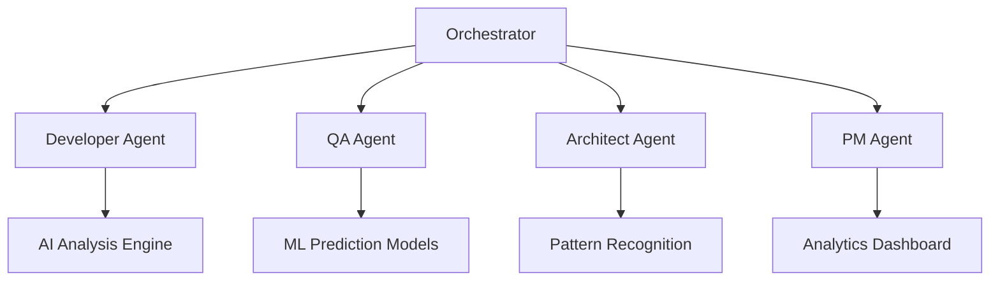

# Sub-Agents Training Materials

## 🎓 Comprehensive Learning Path for APM to Sub-Agents Migration

Welcome to your personalized training journey! This comprehensive program will transform you from an APM user to a Sub-Agents power user in {{TRAINING_DURATION}}.

---

## 🎯 Training Overview

### Learning Objectives
By completing this training, you will:
- **Master Sub-Agents fundamentals** and core concepts
- **Utilize AI-powered features** for {{PRODUCTIVITY_GAIN_PERCENTAGE}}% productivity gains
- **Implement parallel processing** workflows effectively
- **Leverage predictive analytics** for improved decision-making
- **Coordinate multi-agent workflows** seamlessly

### Training Structure
- **Duration**: {{TRAINING_DURATION}} total
- **Format**: Interactive, hands-on learning
- **Progression**: Beginner → Intermediate → Advanced → Expert
- **Validation**: Skills assessment and certification
- **Support**: {{TRAINING_SUPPORT_CONTACT}}

---

## 📚 Module 1: Sub-Agents Fundamentals ({{FUNDAMENTALS_DURATION}})

### 1.1 Understanding the Revolution

#### Core Concepts
**From Legacy APM to AI-Powered Sub-Agents**

```markdown
Legacy APM Limitations:
❌ Sequential processing only
❌ Manual task coordination  
❌ Basic rule-based responses
❌ Limited analytics capabilities
❌ Single-agent workflows

Sub-Agents Advantages:
✅ Parallel processing (3-5x faster)
✅ AI-powered coordination
✅ ML-based insights and predictions
✅ Advanced analytics and reporting
✅ Multi-agent orchestration
```

#### Hands-On Exercise 1.1: Basic Command Comparison
```bash
# Practice Exercise: Compare legacy vs Sub-Agents
# Legacy APM workflow (simulation)
echo "Legacy: /dev → /qa → /architect (sequential)"

# Sub-Agents enhanced workflow
/developer              # Enhanced with AI analysis
/parallel-qa           # Simultaneous testing
/architect             # Automated validation
```

**Expected Outcome**: Understand the fundamental shift from sequential to parallel, rule-based to AI-powered workflows.

### 1.2 Architecture Overview

#### Sub-Agents System Components



#### Interactive Exercise 1.2: System Exploration
```bash
# Explore the Sub-Agents ecosystem
/orchestrator                    # Central coordination hub
/help system-overview           # System architecture
/list-agents                    # Available sub-agents
/capabilities-matrix            # Feature comparison
```

### 1.3 Installation and Setup

#### Environment Preparation Checklist
- [ ] **System Requirements**: {{SYSTEM_REQUIREMENTS}}
- [ ] **Prerequisites**: {{PREREQUISITES_LIST}}
- [ ] **Legacy APM Backup**: {{BACKUP_INSTRUCTIONS}}
- [ ] **Network Configuration**: {{NETWORK_SETUP}}

#### Guided Installation Exercise
```bash
# Step-by-step installation (practice environment)
./install-sub-agents.sh --training-mode
./configure-user-profile.sh --role={{USER_PERSONA_TYPE}}
./validate-installation.sh --comprehensive
./run-initial-tests.sh --training-scenarios
```

**Validation Checkpoint**: System successfully installed with all agents responding correctly.

---

## 🔬 Module 2: AI-Powered Features ({{AI_FEATURES_DURATION}})

### 2.1 Machine Learning Integration

#### Understanding ML-Powered Capabilities

**QA Prediction Engine** (92% Accuracy)
```python
# Example: Test failure prediction
prediction_result = qa_agent.predict_test_failure(
    code_changes=recent_commits,
    historical_data=test_history,
    complexity_metrics=code_analysis
)

print(f"Failure Risk: {prediction_result.risk_score}")
print(f"Recommended Actions: {prediction_result.recommendations}")
```

#### Hands-On Exercise 2.1: ML Prediction Practice
```bash
# Practice with ML-powered QA predictions
/qa-agent
predict_failures --project=sample_project
analyze_risk_factors --historical-depth=30days
generate_recommendations --priority=high
```

**Learning Objective**: Understand how ML models provide predictive insights for proactive quality management.

### 2.2 Code Optimization Intelligence

#### AI-Driven Code Analysis

**Performance Optimization Engine**
```javascript
// Example: Before optimization
function processData(data) {
    let result = [];
    for(let i = 0; i < data.length; i++) {
        if(data[i].active) {
            result.push(transform(data[i]));
        }
    }
    return result;
}

// After AI optimization suggestion
const processData = (data) => 
    data.filter(item => item.active)
        .map(transform);
```

#### Interactive Exercise 2.2: Code Optimization Workshop
```bash
# Practice AI-powered code optimization
/developer
analyze_code sample_project/
identify_bottlenecks --performance-focus
suggest_optimizations --auto-apply=false
validate_improvements --metrics=speed,memory
```

**Success Metric**: Achieve {{CODE_OPTIMIZATION_TARGET}}% performance improvement in practice exercises.

### 2.3 Pattern Recognition Systems

#### Design Pattern Intelligence
```bash
# Advanced pattern recognition exercise
/architect
analyze_patterns codebase/
detect_antipatterns --severity=medium+
suggest_refactoring --design-patterns
validate_architecture --compliance-rules
```

**Learning Goal**: Leverage AI to identify and recommend architectural improvements automatically.

---

## ⚡ Module 3: Parallel Processing Mastery ({{PARALLEL_PROCESSING_DURATION}})

### 3.1 Multi-Agent Coordination

#### Understanding Parallel Workflows

**Traditional Sequential Approach**:
```
Step 1: Development (2 hours)
  ↓
Step 2: Testing (1 hour)  
  ↓
Step 3: Architecture Review (30 min)
  ↓
Total: 3.5 hours
```

**Sub-Agents Parallel Approach**:
```
Parallel Execution:
├── Development Agent (2 hours)
├── QA Agent (1 hour)      
└── Architect Agent (30 min)

Total: 2 hours (42% time savings)
```

#### Hands-On Exercise 3.1: Parallel Sprint Simulation
```bash
# Practice parallel development coordination
/parallel-sprint-setup
configure_agents --count=3 --roles=dev,qa,architect
simulate_sprint --duration=2hours --stories=4
monitor_coordination --real-time
analyze_performance --efficiency-metrics
```

### 3.2 Advanced Multi-Stream Development

#### Coordinated Development Streams

**Scenario**: Multiple features developed simultaneously
```bash
# Stream 1: User Authentication
/developer-stream-1
work_on feature/user-auth
coordinate_with qa-stream-1

# Stream 2: Data Processing  
/developer-stream-2
work_on feature/data-processing
coordinate_with qa-stream-2

# Integration Coordination
/integration-coordinator
monitor_dependencies --real-time
resolve_conflicts --automated
synthesize_results --comprehensive
```

#### Practice Exercise 3.2: Multi-Stream Coordination
```bash
# Simulate coordinated development
/setup-parallel-development --streams=2
/stream-1 work_on story-a
/stream-2 work_on story-b  
/coordinate-integration --automated
/monitor-progress --dashboard
```

**Success Criteria**: Successfully coordinate 2+ parallel development streams with <5% integration conflicts.

---

## 🎭 Module 4: Role-Specific Advanced Training ({{ROLE_SPECIFIC_DURATION}})

### 4.1 Developer Advanced Workflows

#### AI-Powered Development Lifecycle
```bash
# Complete AI-enhanced development cycle
/developer
create_feature --ai-assisted
generate_tests --ml-powered
optimize_performance --automated
validate_quality --comprehensive
coordinate_deployment --intelligent
```

#### Advanced Exercise 4.1: Full-Stack AI Development
**Project**: Build a complete feature using AI assistance
- **Duration**: 4 hours
- **Objective**: Demonstrate 50%+ productivity improvement
- **Validation**: Code quality, test coverage, performance metrics

### 4.2 QA Engineer ML-Powered Testing

#### Predictive Testing Mastery
```bash
# Advanced QA workflows with ML
/qa-agent
setup_prediction_models --accuracy-target=92%
configure_test_optimization --strategy=risk-based
implement_parallel_execution --streams=4
generate_quality_insights --comprehensive
```

#### Master Exercise 4.2: Predictive QA Implementation
**Challenge**: Implement predictive testing for complex application
- **Goal**: Achieve 90%+ prediction accuracy
- **Metrics**: Test efficiency, defect detection rate, false positive rate

### 4.3 Architect Intelligence-Enhanced Design

#### AI-Powered Architecture Review
```bash
# Advanced architectural analysis
/architect
analyze_system_design --deep-learning
identify_scalability_issues --predictive
suggest_patterns --ai-recommended
validate_performance --ml-analysis
generate_documentation --automated
```

#### Expert Exercise 4.3: Architecture Intelligence
**Task**: Complete architecture review using AI assistance
- **Scope**: Large-scale system architecture
- **Objective**: Identify and resolve 95% of potential issues
- **Validation**: Architecture quality score improvement

---

## 🚀 Module 5: Expert-Level Integration ({{EXPERT_INTEGRATION_DURATION}})

### 5.1 Advanced Analytics and Insights

#### Business Intelligence Integration
```bash
# Expert-level analytics workflow
/analytics-dashboard
configure_kpis --business-objectives
setup_predictive_models --strategic-planning
generate_executive_reports --automated
create_optimization_roadmap --ai-powered
```

#### Mastery Project 5.1: Analytics Implementation
**Objective**: Create comprehensive analytics system
- **Metrics**: ROI measurement, productivity tracking, quality assessment
- **Integration**: Business objectives, technical metrics, team performance
- **Automation**: Real-time reporting, predictive insights, recommendations

### 5.2 Custom Workflow Optimization

#### Personalized Sub-Agents Configuration
```bash
# Create custom workflows optimized for your role
/workflow-optimizer
analyze_current_patterns --personal-data
identify_optimization_opportunities --ai-analysis
generate_custom_workflows --role-specific
implement_automation_rules --intelligent
validate_improvements --performance-metrics
```

### 5.3 Advanced Team Coordination

#### Multi-Team Sub-Agents Orchestration
```bash
# Expert coordination across multiple teams
/team-orchestrator
configure_team_profiles --capabilities-matrix
setup_cross_team_workflows --dependency-aware
implement_coordination_protocols --intelligent
monitor_team_performance --real-time
optimize_collaboration --ai-enhanced
```

---

## 🏆 Module 6: Certification and Assessment ({{CERTIFICATION_DURATION}})

### 6.1 Skills Validation Framework

#### Competency Assessment Areas
1. **Fundamental Understanding** (25% weight)
   - Sub-Agents architecture comprehension
   - AI/ML concepts mastery
   - Parallel processing principles

2. **Practical Application** (35% weight)
   - Command usage proficiency
   - Workflow optimization skills
   - Problem-solving effectiveness

3. **Advanced Integration** (25% weight)
   - Multi-agent coordination
   - Analytics utilization
   - Custom configuration

4. **Innovation and Optimization** (15% weight)
   - Creative workflow solutions
   - Performance improvements
   - Best practices development

### 6.2 Certification Levels

#### Bronze Certification: Sub-Agents Practitioner
**Requirements**:
- [ ] Complete Modules 1-3 with 80%+ scores
- [ ] Demonstrate basic Sub-Agents usage
- [ ] Show 25%+ productivity improvement
- [ ] Pass practical skills assessment

#### Silver Certification: Sub-Agents Specialist  
**Requirements**:
- [ ] Complete Modules 1-4 with 85%+ scores
- [ ] Master role-specific advanced features
- [ ] Achieve 50%+ productivity improvement
- [ ] Complete advanced project successfully

#### Gold Certification: Sub-Agents Expert
**Requirements**:
- [ ] Complete all modules with 90%+ scores
- [ ] Demonstrate expert-level integration
- [ ] Achieve 75%+ productivity improvement
- [ ] Lead team training and implementation

#### Platinum Certification: Sub-Agents Master
**Requirements**:
- [ ] All Gold requirements met
- [ ] Contribute to Sub-Agents improvement
- [ ] Mentor other users effectively
- [ ] Innovate new usage patterns

### 6.3 Assessment Methods

#### Practical Skills Test
```bash
# Comprehensive skills assessment
/assessment-mode
complete_development_scenario --time-limit=2hours
demonstrate_parallel_coordination --complexity=high
show_ai_utilization --efficiency-target=60%
explain_optimization_decisions --detailed
```

#### Performance Metrics Validation
- **Productivity Gain**: Target {{PRODUCTIVITY_TARGET}}%
- **Quality Improvement**: Target {{QUALITY_TARGET}}%
- **Efficiency Score**: Target {{EFFICIENCY_TARGET}}/100
- **Feature Mastery**: Target {{MASTERY_TARGET}}% features utilized

---

## 📖 Interactive Learning Resources

### 📺 Video Training Library

#### Beginner Series ({{BEGINNER_VIDEO_DURATION}})
- **"Welcome to Sub-Agents"** - Overview and motivation
- **"Installation Walkthrough"** - Step-by-step setup
- **"First Commands"** - Basic usage demonstration
- **"Understanding AI Features"** - ML capabilities introduction

#### Intermediate Series ({{INTERMEDIATE_VIDEO_DURATION}})
- **"Parallel Processing Mastery"** - Multi-agent coordination
- **"Advanced Analytics"** - Insights and reporting
- **"Role-Specific Workflows"** - Customized training
- **"Integration Strategies"** - Team implementation

#### Advanced Series ({{ADVANCED_VIDEO_DURATION}})  
- **"Expert Optimization"** - Advanced configuration
- **"Custom Workflow Creation"** - Personalization
- **"Performance Tuning"** - System optimization
- **"Innovation Techniques"** - Creative usage patterns

### 🛠️ Hands-On Labs

#### Lab Environment Access
- **Training Sandbox**: {{TRAINING_SANDBOX_URL}}
- **Practice Scenarios**: {{PRACTICE_SCENARIOS_COUNT}} available
- **Reset Capability**: Fresh environment every session
- **Progress Tracking**: Automatic skills progression

#### Lab Exercises by Module
```bash
# Module 1 Labs
/lab/fundamentals/basic-commands
/lab/fundamentals/system-exploration
/lab/fundamentals/installation-practice

# Module 2 Labs  
/lab/ai-features/ml-prediction
/lab/ai-features/code-optimization
/lab/ai-features/pattern-recognition

# Module 3 Labs
/lab/parallel/multi-agent-coordination
/lab/parallel/stream-management
/lab/parallel/integration-synthesis
```

### 📋 Interactive Checklists

#### Daily Learning Checklist
- [ ] **Watch designated video** ({{DAILY_VIDEO_DURATION}})
- [ ] **Complete hands-on exercise** ({{DAILY_EXERCISE_DURATION}})
- [ ] **Practice commands** ({{DAILY_PRACTICE_DURATION}})
- [ ] **Review concepts** ({{DAILY_REVIEW_DURATION}})
- [ ] **Update progress tracker** (5 minutes)

#### Weekly Assessment Checklist
- [ ] **Module completion validation**
- [ ] **Skills assessment test**
- [ ] **Performance metrics review**
- [ ] **Peer learning session**
- [ ] **Instructor feedback integration**

---

## 🤝 Community Learning

### 👥 Peer Learning Groups

#### Study Groups by Role
- **Developer Circle**: {{DEV_STUDY_GROUP_INFO}}
- **QA Collective**: {{QA_STUDY_GROUP_INFO}}
- **Architecture Forum**: {{ARCH_STUDY_GROUP_INFO}}
- **Management Network**: {{PM_STUDY_GROUP_INFO}}

#### Learning Partnerships
- **Buddy System**: Paired learning with mentor
- **Project Teams**: Collaborative learning projects
- **Cross-Functional Groups**: Multi-role learning
- **Innovation Labs**: Experimental feature exploration

### 💬 Support Channels

#### Training Support
- **Chat Support**: {{TRAINING_CHAT_SUPPORT}}
- **Office Hours**: {{TRAINING_OFFICE_HOURS}}
- **Q&A Forums**: {{TRAINING_FORUM_URL}}
- **Video Calls**: {{TRAINING_VIDEO_SUPPORT}}

#### Technical Assistance
- **Installation Help**: {{INSTALLATION_SUPPORT}}
- **Configuration Support**: {{CONFIG_SUPPORT}}
- **Performance Issues**: {{PERFORMANCE_SUPPORT}}
- **Bug Reports**: {{BUG_REPORT_SUPPORT}}

---

## 📊 Progress Tracking

### 🎯 Learning Metrics Dashboard

#### Personal Progress Indicators
```markdown
Training Progress: {{CURRENT_PROGRESS}}% Complete
├── Module 1: {{MODULE_1_PROGRESS}}% 
├── Module 2: {{MODULE_2_PROGRESS}}%
├── Module 3: {{MODULE_3_PROGRESS}}%
├── Module 4: {{MODULE_4_PROGRESS}}%
├── Module 5: {{MODULE_5_PROGRESS}}%
└── Module 6: {{MODULE_6_PROGRESS}}%

Skills Assessment: {{SKILLS_SCORE}}/100
Performance Metrics: {{PERFORMANCE_IMPROVEMENT}}% improvement
Certification Level: {{CURRENT_CERTIFICATION_LEVEL}}
```

#### Competency Matrix
| Skill Area | Current Level | Target Level | Progress |
|------------|---------------|--------------|----------|
| **Command Mastery** | {{COMMAND_CURRENT}} | Expert | {{COMMAND_PROGRESS}}% |
| **AI Utilization** | {{AI_CURRENT}} | Advanced | {{AI_PROGRESS}}% |
| **Parallel Processing** | {{PARALLEL_CURRENT}} | Expert | {{PARALLEL_PROGRESS}}% |
| **Analytics Usage** | {{ANALYTICS_CURRENT}} | Advanced | {{ANALYTICS_PROGRESS}}% |
| **Team Coordination** | {{COORDINATION_CURRENT}} | Expert | {{COORDINATION_PROGRESS}}% |

### 📈 Performance Analytics

#### Productivity Measurements
- **Task Completion Speed**: {{SPEED_IMPROVEMENT}}% faster
- **Quality Metrics**: {{QUALITY_IMPROVEMENT}}% better
- **Error Reduction**: {{ERROR_REDUCTION}}% fewer mistakes
- **Feature Adoption**: {{FEATURE_ADOPTION}}% utilization

#### Learning Velocity Tracking
- **Concepts Mastered**: {{CONCEPTS_MASTERED}}/{{TOTAL_CONCEPTS}}
- **Exercises Completed**: {{EXERCISES_COMPLETED}}/{{TOTAL_EXERCISES}}
- **Labs Finished**: {{LABS_COMPLETED}}/{{TOTAL_LABS}}
- **Assessments Passed**: {{ASSESSMENTS_PASSED}}/{{TOTAL_ASSESSMENTS}}

---

## 🏁 Training Completion & Next Steps

### 🎉 Graduation Requirements

#### Final Validation Checklist
- [ ] **All modules completed** with minimum 80% scores
- [ ] **Certification level achieved** (Bronze minimum)
- [ ] **Performance improvement demonstrated** ({{MIN_PERFORMANCE_IMPROVEMENT}}% minimum)
- [ ] **Practical project completed** successfully
- [ ] **Peer evaluation** completed positively

#### Post-Training Support
- **Continued Learning Path**: {{ADVANCED_LEARNING_PATH}}
- **Mentorship Program**: {{MENTORSHIP_PROGRAM_INFO}}
- **Innovation Opportunities**: {{INNOVATION_PROGRAM_INFO}}
- **Community Leadership**: {{LEADERSHIP_PROGRAM_INFO}}

### 🚀 Advanced Opportunities

#### Specialization Tracks
- **AI/ML Specialist**: Deep dive into machine learning features
- **Parallel Processing Expert**: Advanced coordination mastery
- **Analytics Professional**: Business intelligence specialization
- **Integration Architect**: Cross-system coordination expertise

#### Leadership Development  
- **Team Training Leader**: Mentor new Sub-Agents users
- **Innovation Champion**: Drive new feature adoption
- **Process Optimizer**: Improve team workflows
- **Community Builder**: Foster learning culture

---

## 📞 Training Support Contacts

### 🆘 Get Help When You Need It

#### Primary Training Support
- **Email**: {{TRAINING_SUPPORT_EMAIL}}
- **Phone**: {{TRAINING_SUPPORT_PHONE}}
- **Chat**: {{TRAINING_SUPPORT_CHAT}}
- **Response Time**: {{TRAINING_RESPONSE_TIME}}

#### Specialized Support Teams
- **Technical Issues**: {{TECHNICAL_SUPPORT_CONTACT}}
- **Content Questions**: {{CONTENT_SUPPORT_CONTACT}}
- **Certification Help**: {{CERTIFICATION_SUPPORT_CONTACT}}
- **Career Guidance**: {{CAREER_SUPPORT_CONTACT}}

#### Emergency Training Support
- **Critical Blockers**: {{EMERGENCY_TRAINING_SUPPORT}}
- **Urgent Questions**: {{URGENT_SUPPORT_CONTACT}}
- **Escalation Process**: {{ESCALATION_PROCESS}}

---

*Your journey from APM user to Sub-Agents expert starts here. With comprehensive training, hands-on practice, and expert support, you'll unlock the full potential of AI-powered development. Welcome to the future!*