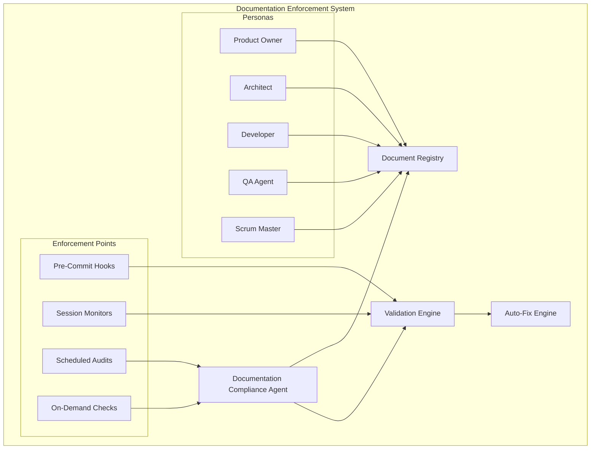

# APM Document Structure Enforcement Proposal
**Version**: 1.0
**Date**: 2025-01-06
**Author**: Architecture Team
**Status**: PROPOSAL

## Executive Summary

This proposal outlines a comprehensive system for enforcing project document structure using the APM framework's agentic personas. By creating a **Documentation Compliance Agent** and integrating enforcement mechanisms into existing personas, we can transform the current excellent-but-unenforced standards into an active, self-maintaining documentation system.

## Current State Analysis

### Strengths
- **Excellent Standards Defined**: 324 lines of validation rules in `doc-standards.yaml`
- **Strong Partial Enforcement**: Session notes and backlog updates work well
- **Rich Persona System**: 9 specialized agents available for enforcement
- **Automation Capabilities**: Hooks, voice notifications, and parallel execution

### Weaknesses
- **No Active Enforcement**: Standards exist but aren't automatically applied
- **Template Synchronization Issues**: 2,781 template files with duplication
- **Multiple Archive Systems**: 7 different archive locations
- **Documentation Scatter**: Same content in 3-4 different locations

## Proposed Solution: Multi-Agent Document Enforcement System

### 1. New Documentation Compliance Agent (DCA)

#### Purpose
A specialized agent persona dedicated to enforcing documentation standards, maintaining structure, and ensuring compliance across all project documentation.

#### Core Responsibilities
```yaml
Documentation_Compliance_Agent:
  primary_role: "Documentation Structure Enforcement"
  
  responsibilities:
    - Validate document placement and naming
    - Enforce content standards and templates
    - Synchronize templates with active implementations
    - Manage archive consolidation
    - Generate compliance reports
    - Auto-fix correctable issues
    
  activation_triggers:
    - Pre-commit hooks for documentation changes
    - Post-session documentation review
    - Weekly compliance audits
    - On-demand validation via /doc-compliance command
```

#### Implementation
```markdown
# /doc-compliance - Documentation Compliance Agent Command

## Activation Protocol
1. Load documentation standards from .apm/rules/doc-standards.yaml
2. Scan all documentation directories in parallel
3. Validate against defined rules
4. Generate compliance report
5. Execute auto-fixes where configured
6. Update compliance dashboard

## Enforcement Modes
- **validate**: Check compliance without changes
- **fix**: Auto-fix correctable issues
- **enforce**: Block non-compliant changes
- **report**: Generate detailed compliance metrics
```

### 2. Enhanced Persona Documentation Protocols

#### Universal Documentation Requirements
Every persona must implement these documentation protocols:

```markdown
## Documentation Enforcement Protocol (ALL PERSONAS)

### Pre-Action Documentation Check
Before executing any task:
1. Verify target documentation directory exists
2. Check if similar documentation already exists
3. Validate naming convention compliance
4. Ensure proper template is being used

### During-Action Documentation
While executing tasks:
1. Create documents in designated structure only
2. Use standardized templates for consistency
3. Update cross-references automatically
4. Maintain document metadata (author, date, version)

### Post-Action Documentation Validation
After completing tasks:
1. Run documentation compliance check
2. Update document registry
3. Archive superseded documents properly
4. Sync templates if changes were made
```

#### Persona-Specific Enforcement

##### Product Owner Enhanced
```markdown
## PO Documentation Enforcement

### Backlog Management
- ENFORCE: All stories must link to supporting documentation
- VALIDATE: Epic documentation exists before story creation
- REQUIRE: Acceptance criteria include documentation deliverables
- AUDIT: Weekly backlog documentation completeness check

### Document Ownership
- planning/*.md files
- requirements/*.md files
- user-stories/*.md files
```

##### Architect Enhanced
```markdown
## Architect Documentation Enforcement

### Architecture Documentation
- ENFORCE: All architectural decisions documented in ADR format
- VALIDATE: Diagrams stored in architecture/diagrams/
- REQUIRE: Technical specifications for all components
- AUDIT: Architecture-code alignment monthly

### Document Ownership
- architecture/*.md files
- architecture/decisions/*.md (ADRs)
- architecture/diagrams/* files
```

##### Developer Enhanced
```markdown
## Developer Documentation Enforcement

### Code Documentation
- ENFORCE: All code changes require documentation updates
- VALIDATE: API documentation matches implementation
- REQUIRE: Test documentation for all test suites
- AUDIT: Code-documentation sync on each PR

### Document Ownership
- api/*.md files
- implementation/*.md files
- testing/*.md files
```

##### QA Enhanced
```markdown
## QA Documentation Enforcement

### Test Documentation
- ENFORCE: Test plans required before test execution
- VALIDATE: Test results documented with evidence
- REQUIRE: Defect documentation with reproduction steps
- AUDIT: Test coverage documentation weekly

### Document Ownership
- qa/*.md files
- test-plans/*.md files
- test-results/*.md files
- defects/*.md files
```

### 3. Automated Enforcement Mechanisms

#### Pre-Commit Hook System
```python
# .apm/hooks/pre_commit_doc_validation.py

import yaml
import re
from pathlib import Path

class DocumentationValidator:
    def __init__(self):
        self.standards = self.load_standards()
        self.violations = []
        
    def load_standards(self):
        with open('.apm/rules/doc-standards.yaml', 'r') as f:
            return yaml.safe_load(f)
    
    def validate_commit(self, changed_files):
        """Validate documentation changes before commit"""
        doc_files = [f for f in changed_files if f.endswith('.md')]
        
        for file in doc_files:
            self.validate_file(file)
        
        if self.violations:
            self.block_commit()
        else:
            self.allow_commit()
    
    def validate_file(self, filepath):
        """Validate individual file against standards"""
        # Check naming convention
        if not self.check_naming(filepath):
            self.violations.append(f"Naming violation: {filepath}")
        
        # Check structure
        if not self.check_structure(filepath):
            self.violations.append(f"Structure violation: {filepath}")
        
        # Check content
        if not self.check_content(filepath):
            self.violations.append(f"Content violation: {filepath}")
    
    def block_commit(self):
        """Block commit and provide feedback"""
        print("❌ Documentation Compliance Check Failed")
        print("\nViolations found:")
        for v in self.violations:
            print(f"  - {v}")
        print("\nRun '/doc-compliance fix' to auto-fix issues")
        exit(1)
```

#### Session-Based Enforcement
```markdown
## Session Documentation Enforcement

### Session Start Protocol
1. Documentation Compliance Agent performs initial scan
2. Identifies any existing violations
3. Creates compliance baseline
4. Sets up monitoring for session

### During Session Monitoring
- Real-time validation of document creation
- Automatic template application
- Path correction for misplaced documents
- Metadata injection for tracking

### Session End Protocol
1. Final compliance check
2. Auto-fix correctable issues
3. Generate session documentation report
4. Archive session documentation properly
```

### 4. Document Structure Registry

#### Centralized Document Registry
```yaml
# .apm/registry/document-registry.yaml

registry:
  version: "1.0"
  last_updated: "2025-01-06"
  
  document_types:
    backlog:
      primary_location: "project_docs/backlog.md"
      templates: 
        - "templates/project_documentation/backlog.md.template"
      owner: "Product Owner"
      update_frequency: "continuous"
      
    session_notes:
      primary_location: ".apm/session_notes/"
      pattern: "YYYY-MM-DD-HH-mm-ss-*.md"
      archive_location: ".apm/session_notes/archive/"
      owner: "All Personas"
      retention: "30 days active, permanent archive"
      
    architecture:
      primary_location: "project_docs/architecture/"
      subdirectories:
        - decisions/  # ADRs
        - diagrams/   # Architecture diagrams
        - specs/      # Technical specifications
      owner: "Architect"
      review_cycle: "monthly"
      
    test_documentation:
      primary_location: "project_docs/qa/"
      subdirectories:
        - test-plans/
        - test-results/
        - defects/
        - metrics/
      owner: "QA Agent"
      compliance: "mandatory before release"
      
  cross_references:
    - from: "backlog.md"
      to: ["user-stories/*.md", "epics/*.md"]
      validation: "bidirectional links required"
      
    - from: "architecture/decisions/*.md"
      to: ["implementation/*.md"]
      validation: "implementation must reference ADR"
```

### 5. Progressive Enforcement Strategy

#### Phase 1: Awareness (Week 1-2)
- Deploy Documentation Compliance Agent in "report-only" mode
- Generate baseline compliance metrics
- Identify top violation patterns
- Train personas on new requirements

#### Phase 2: Assisted Compliance (Week 3-4)
- Enable auto-fix for simple violations
- Provide real-time guidance during document creation
- Generate daily compliance reports
- Implement template auto-selection

#### Phase 3: Active Enforcement (Week 5-6)
- Enable pre-commit hooks with warnings
- Block severely non-compliant changes
- Require compliance for new documents
- Implement cross-reference validation

#### Phase 4: Full Automation (Week 7+)
- Complete enforcement of all standards
- Automatic document organization
- Self-healing documentation structure
- Continuous compliance monitoring

### 6. Implementation Architecture

#### Component Architecture


#### Integration Points

##### 1. Git Hooks Integration
```bash
# .git/hooks/pre-commit
#!/bin/bash
# Documentation compliance check

echo "🔍 Running documentation compliance check..."

# Get list of changed files
changed_files=$(git diff --cached --name-only)

# Run validation
python .apm/hooks/pre_commit_doc_validation.py "$changed_files"

if [ $? -ne 0 ]; then
    echo "❌ Commit blocked due to documentation violations"
    echo "💡 Run '/doc-compliance fix' to auto-fix issues"
    exit 1
fi

echo "✅ Documentation compliance check passed"
```

##### 2. Claude Code Integration
```markdown
## CLAUDE.md Addition

### 📚 DOCUMENTATION COMPLIANCE (MANDATORY)

**CRITICAL**: All personas MUST comply with documentation standards.

#### Before Creating Any Document
1. Check document registry for proper location
2. Use appropriate template from registry
3. Validate naming convention
4. Ensure metadata is complete

#### Document Creation Protocol
```bash
# Always validate location first
/doc-compliance validate --path "proposed/document/path.md"

# Create with template
/doc-compliance create --type "architecture" --name "MY-COMPONENT-DESIGN.md"

# Post-creation validation
/doc-compliance check --file "path/to/new/document.md"
```

#### Non-Compliance Consequences
- ❌ Documents in wrong locations will be auto-moved
- ❌ Improperly named files will be auto-renamed
- ❌ Missing metadata will be auto-injected
- ❌ Non-compliant commits will be blocked
```

##### 3. Session Management Integration
```python
# .apm/hooks/session_doc_enforcement.py

class SessionDocumentationEnforcer:
    def __init__(self, session_id):
        self.session_id = session_id
        self.compliance_agent = DocumentationComplianceAgent()
        self.baseline = None
        
    def on_session_start(self):
        """Initialize documentation enforcement for session"""
        self.baseline = self.compliance_agent.scan_all()
        self.compliance_agent.set_monitoring(active=True)
        
    def on_document_created(self, filepath):
        """Validate and fix new documents in real-time"""
        violations = self.compliance_agent.validate(filepath)
        
        if violations:
            if self.compliance_agent.can_auto_fix(violations):
                self.compliance_agent.auto_fix(filepath, violations)
                print(f"✅ Auto-fixed {len(violations)} issues in {filepath}")
            else:
                print(f"⚠️ Manual fix required for {filepath}")
                self.compliance_agent.provide_guidance(violations)
    
    def on_session_end(self):
        """Final compliance check and reporting"""
        final_scan = self.compliance_agent.scan_all()
        report = self.compliance_agent.generate_report(
            self.baseline, 
            final_scan,
            self.session_id
        )
        
        # Archive session documentation properly
        self.compliance_agent.archive_session_docs(self.session_id)
        
        return report
```

### 7. Success Metrics

#### Quantitative Metrics
- **Compliance Rate**: % of documents meeting standards (Target: >95%)
- **Auto-Fix Success**: % of violations auto-corrected (Target: >80%)
- **Template Usage**: % of new documents using templates (Target: 100%)
- **Structure Violations**: Count of structure violations per week (Target: <10)
- **Archive Consolidation**: Reduction in archive locations (Target: 1 unified)

#### Qualitative Metrics
- **Developer Experience**: Reduced friction in documentation
- **Discoverability**: Easier to find relevant documentation
- **Consistency**: Uniform structure across all documentation
- **Maintenance**: Reduced time spent organizing documents
- **Quality**: Improved documentation completeness and accuracy

### 8. Risk Mitigation

#### Potential Risks and Mitigations

| Risk | Impact | Mitigation |
|------|--------|------------|
| Over-enforcement causing friction | High | Progressive rollout with feedback loops |
| Legacy document migration issues | Medium | Gradual migration with automation support |
| Performance impact from validation | Low | Efficient caching and incremental checks |
| Persona resistance to new requirements | Medium | Training and auto-assistance features |
| Template synchronization complexity | High | Single source of truth with validation |

### 9. Implementation Roadmap

#### Week 1-2: Foundation
- [ ] Deploy Documentation Compliance Agent
- [ ] Set up document registry
- [ ] Configure validation rules
- [ ] Create baseline metrics

#### Week 3-4: Integration
- [ ] Integrate with existing personas
- [ ] Implement pre-commit hooks
- [ ] Deploy auto-fix capabilities
- [ ] Begin progressive enforcement

#### Week 5-6: Enhancement
- [ ] Full template synchronization
- [ ] Archive consolidation
- [ ] Cross-reference validation
- [ ] Performance optimization

#### Week 7-8: Automation
- [ ] Complete automation deployment
- [ ] Self-healing capabilities
- [ ] Continuous monitoring
- [ ] Success metrics dashboard

### 10. Conclusion

This comprehensive document structure enforcement system leverages the APM framework's agentic personas to create a self-maintaining, compliant documentation ecosystem. By combining:

1. **Dedicated Documentation Compliance Agent**
2. **Enhanced persona protocols**
3. **Automated enforcement mechanisms**
4. **Centralized document registry**
5. **Progressive implementation strategy**

We can transform the current excellent-but-unenforced standards into an active system that ensures consistent, high-quality documentation across the entire project lifecycle.

The system is designed to be:
- **Non-disruptive**: Progressive rollout with auto-fix capabilities
- **Intelligent**: Context-aware validation and assistance
- **Comprehensive**: Covers all document types and personas
- **Maintainable**: Self-documenting and self-organizing
- **Measurable**: Clear success metrics and reporting

By implementing this proposal, the APM framework will achieve a new level of documentation excellence, making it easier for teams to maintain, discover, and utilize project documentation effectively.

---

**Next Steps**:
1. Review and approve proposal
2. Create Documentation Compliance Agent implementation
3. Begin Phase 1 rollout
4. Gather feedback and iterate