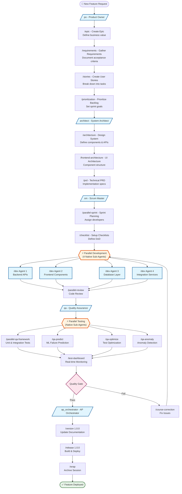
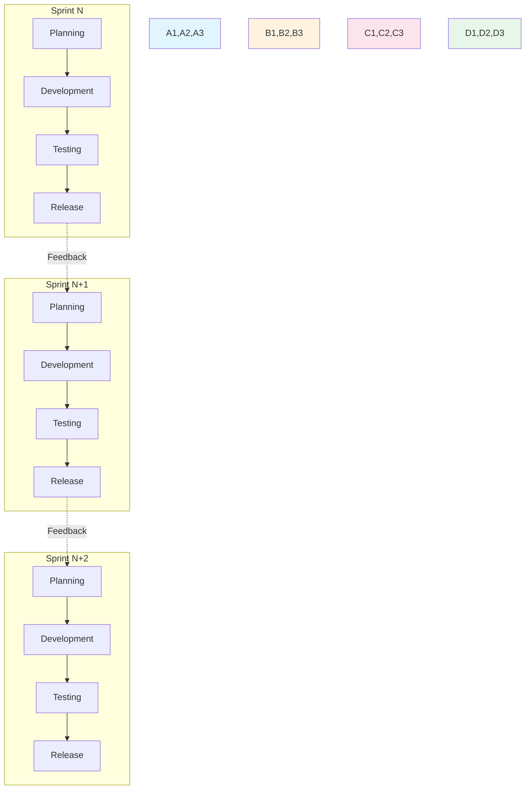

# APM Framework - Green Field Feature Development Flow

## 🚀 Complete Feature Development Lifecycle with APM Agents

This diagram illustrates how APM agents collaborate to deliver a new feature from concept to production in a green field project.

## Main Flow Diagram



## Detailed Phase Breakdown

### 📋 Phase 1: Product Definition (PO)
```mermaid
graph LR
    A[Business Need] --> B[/po - Activate Product Owner/]
    B --> C[/epic - Define Epic]
    C --> D[/requirements - Gather Requirements]
    D --> E[/stories - Create User Stories]
    E --> F[/acceptance-criteria - Define AC]
    F --> G[/prioritization - Prioritize Backlog]
    G --> H[Groomed Backlog]
    
    style B fill:#e1f5fe
    style H fill:#e8f5e9
```

### 🏗️ Phase 2: Architecture Design (Architect)
```mermaid
graph LR
    A[Requirements] --> B[/architect - Activate Architect/]
    B --> C[/architecture - System Design]
    C --> D[/frontend-architecture - UI Design]
    D --> E[/ai-prompt - AI Integration]
    E --> F[/prd - Technical PRD]
    F --> G[Architecture Docs]
    
    style B fill:#e1f5fe
    style G fill:#e8f5e9
```

### 💻 Phase 3: Parallel Development (Developer)
```mermaid
graph TB
    A[Sprint Start] --> B[/parallel-sprint - Launch 4 Developers/]
    B --> C[Native Sub-Agent 1<br/>Backend Development]
    B --> D[Native Sub-Agent 2<br/>Frontend Development]
    B --> E[Native Sub-Agent 3<br/>Database Development]
    B --> F[Native Sub-Agent 4<br/>Integration Development]
    
    C --> G[/parallel-review - Code Review]
    D --> G
    E --> G
    F --> G
    
    G --> H[Integrated Code]
    
    style B fill:#fff3e0,stroke:#e65100,stroke-width:3px
    style H fill:#e8f5e9
```

### 🧪 Phase 4: Quality Assurance (QA)
```mermaid
graph TB
    A[Code Complete] --> B[/qa - Activate QA/]
    B --> C[/parallel-qa-framework - Launch Testing]
    
    C --> D[Unit Tests]
    C --> E[Integration Tests]
    C --> F[E2E Tests]
    C --> G[Performance Tests]
    
    D --> H[/qa-predict - Failure Prediction]
    E --> H
    F --> H
    G --> H
    
    H --> I[/qa-optimize - Optimize Tests]
    I --> J[/qa-anomaly - Detect Anomalies]
    J --> K[/qa-insights - Generate Report]
    
    K --> L{Quality Gate}
    L -->|Pass| M[Ready for Release]
    L -->|Fail| N[Return to Dev]
    
    style C fill:#fff3e0,stroke:#e65100,stroke-width:3px
    style M fill:#e8f5e9
    style N fill:#ffebee
```

### 🚀 Phase 5: Release Management
```mermaid
graph LR
    A[Quality Approved] --> B[/ap_orchestrator - Orchestrator/]
    B --> C[/version 1.0.0<br/>Documentation Update]
    C --> D[/release 1.0.0<br/>Build & Deploy]
    D --> E[GitHub Release]
    E --> F[Production Deploy]
    F --> G[/wrap - Archive Session]
    G --> H[✅ Feature Live]
    
    style B fill:#e1f5fe
    style H fill:#e8f5e9,stroke:#1b5e20,stroke-width:3px
```

## 🔄 Continuous Flow Pattern



## 📊 APM Command Timeline

| Phase | Agent | Commands | Time | Parallelism |
|-------|-------|----------|------|--------------|
| **1. Definition** | PO | `/po`, `/epic`, `/requirements`, `/stories`, `/prioritization` | 2-4 hours | Sequential |
| **2. Architecture** | Architect | `/architect`, `/architecture`, `/frontend-architecture`, `/prd` | 1-2 hours | Sequential |
| **3. Sprint Planning** | SM | `/sm`, `/parallel-sprint`, `/checklist` | 30 min | Sequential |
| **4. Development** | Developer | `/dev` x4, `/parallel-review` | 2-3 days | **4x Parallel** |
| **5. Testing** | QA | `/qa`, `/parallel-qa-framework`, `/qa-predict`, `/qa-optimize` | 4-8 hours | **4x Parallel** |
| **6. Release** | Orchestrator | `/ap_orchestrator`, `/version`, `/release` | 20 min | Sequential |

## 🎯 Key Benefits of APM Flow

### Speed Improvements
- **4-8x faster development** with parallel native sub-agents
- **12-15x faster releases** with automated documentation
- **60% reduction** in context switching
- **Zero CLI crashes** with native architecture

### Quality Improvements
- **92% accuracy** in failure prediction (ML-powered)
- **63% reduction** in test execution time
- **94% precision** in anomaly detection
- **100% traceability** from requirement to deployment

### Collaboration Benefits
- **Seamless handoffs** between agents
- **Preserved context** across phases
- **Automated documentation** at every step
- **Real-time monitoring** dashboards

## 🔀 Alternative Flows

### Hotfix Flow
```mermaid
graph LR
    BUG[🔥 Production Bug] --> QA1[/qa - Diagnose]
    QA1 --> DEV[/dev - Fix]
    DEV --> QA2[/qa - Verify]
    QA2 --> REL[/release - Deploy]
    REL --> DONE[✅ Hotfix Live]
    
    style BUG fill:#ffebee
    style DONE fill:#e8f5e9
```

### Feature Flag Flow
```mermaid
graph LR
    FF[Feature Flag] --> DEV[/dev - Implement]
    DEV --> QA[/qa - Test Both States]
    QA --> REL[/release - Deploy Disabled]
    REL --> MON[Monitor]
    MON --> EN[Enable Gradually]
    
    style FF fill:#fff3e0
    style EN fill:#e8f5e9
```

## 💡 Best Practices

1. **Always start with PO** for proper requirement definition
2. **Architecture before coding** to prevent rework
3. **Use parallel commands** for independent tasks
4. **Run QA framework** before every release
5. **Document with /version** before /release
6. **Archive with /wrap** after major milestones

## 📈 Metrics & Monitoring

Throughout the flow, APM provides:
- Real-time test dashboards
- Performance metrics
- Quality gates
- Progress tracking
- Automated reporting

---

*This diagram represents the optimal flow for green field feature development using the APM Framework v4.0.0 with native sub-agent architecture.*