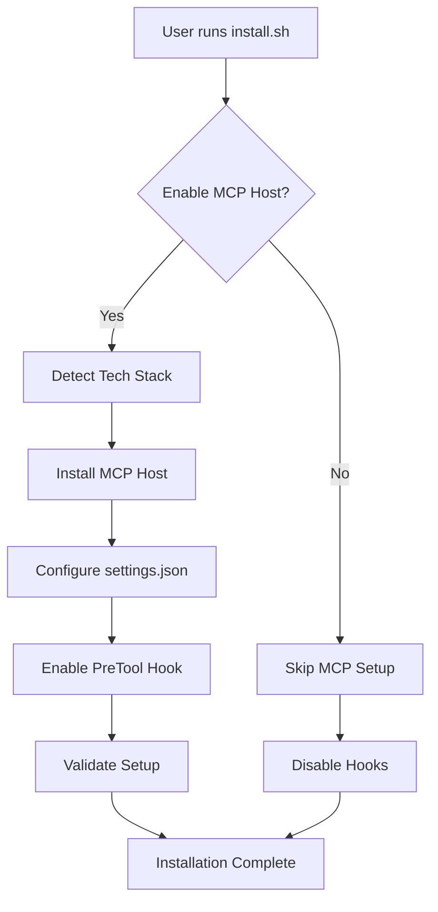

# MCP Plopdock Configurable Implementation Plan

## Executive Summary

This implementation plan outlines the development of a configurable MCP Plopdock integration that allows users to opt-in during installation, automatically configures the system based on their project's tech stack, and enforces MCP usage through intelligent hook interception.

## Architecture Overview

```
┌─────────────────────────────────────────────────────────────┐
│                    APM Installation Flow                      │
├─────────────────────────────────────────────────────────────┤
│                                                               │
│  1. User runs install.sh                                      │
│  2. Installer asks: "Enable MCP Plopdock? (Y/n)"          │
│  3. If YES:                                                   │
│     a. Install MCP Plopdock                                │
│     b. Detect project tech stack                             │
│     c. Configure settings.json                               │
│     d. Enable PreToolUse hook                                │
│     e. Validate MCP can run the project                      │
│  4. If NO:                                                    │
│     a. Skip MCP installation                                  │
│     b. Disable interception hooks                            │
│                                                               │
└─────────────────────────────────────────────────────────────┘
```

## Implementation Components

### 1. Installation Script Enhancement

**File**: `/installer/install.sh`

```bash
# Add to Step 8: MCP Plopdock Server Installation
echo "Step 8: MCP Plopdock Server Installation (Recommended)"
echo "=========================================="
echo ""
echo "The MCP Plopdock provides:"
echo "  • Persistent development servers across Claude sessions"
echo "  • Real-time monitoring dashboard at http://localhost:8080"
echo "  • Automatic tech stack detection and configuration"
echo "  • Prevents accidental multiple server instances"
echo ""
printf "${YELLOW}Enable MCP Plopdock Server? (Recommended) [Y/n]: ${NC}"
read -r ENABLE_MCP_HOST

# Set default to Yes if empty
ENABLE_MCP_HOST=${ENABLE_MCP_HOST:-Y}

if [[ "$ENABLE_MCP_HOST" =~ ^[Yy]$ ]]; then
    MCP_HOST_ENABLED="true"
    log_install "User enabled MCP Plopdock" "INFO"
    
    # Detect project tech stack
    echo "Detecting project technology stack..."
    TECH_STACK=$(detect_project_tech_stack "$TARGET_DIR")
    log_install "Detected tech stack: $TECH_STACK" "INFO"
    
    # Install MCP Plopdock
    install_mcp_debug_host "$TECH_STACK"
    
    # Configure hook interception
    configure_mcp_interception "true"
else
    MCP_HOST_ENABLED="false"
    log_install "User disabled MCP Plopdock" "INFO"
    configure_mcp_interception "false"
fi

# Save configuration to settings
update_claude_settings "MCP_HOST_ENABLED" "$MCP_HOST_ENABLED"
update_claude_settings "MCP_HOST_TECH_STACK" "$TECH_STACK"
```

### 2. Tech Stack Detection Function

**File**: `/installer/tech-stack-detector.sh`

```bash
#!/bin/bash

detect_project_tech_stack() {
    local project_dir="$1"
    local tech_stack=""
    
    # Node.js detection
    if [ -f "$project_dir/package.json" ]; then
        tech_stack="nodejs"
        
        # Detect specific frameworks
        if grep -q '"next"' "$project_dir/package.json"; then
            tech_stack="nodejs-nextjs"
        elif grep -q '"react"' "$project_dir/package.json"; then
            tech_stack="nodejs-react"
        elif grep -q '"@angular/core"' "$project_dir/package.json"; then
            tech_stack="nodejs-angular"
        elif grep -q '"vue"' "$project_dir/package.json"; then
            tech_stack="nodejs-vue"
        fi
        
    # Python detection
    elif [ -f "$project_dir/requirements.txt" ] || [ -f "$project_dir/setup.py" ] || [ -f "$project_dir/pyproject.toml" ]; then
        tech_stack="python"
        
        # Django detection
        if [ -f "$project_dir/manage.py" ]; then
            tech_stack="python-django"
        # Flask detection
        elif grep -q "flask" "$project_dir/requirements.txt" 2>/dev/null; then
            tech_stack="python-flask"
        # FastAPI detection
        elif grep -q "fastapi" "$project_dir/requirements.txt" 2>/dev/null; then
            tech_stack="python-fastapi"
        fi
        
    # PHP detection
    elif [ -f "$project_dir/composer.json" ]; then
        tech_stack="php"
        
        # Laravel detection
        if [ -f "$project_dir/artisan" ]; then
            tech_stack="php-laravel"
        fi
        
    # Ruby detection
    elif [ -f "$project_dir/Gemfile" ]; then
        tech_stack="ruby"
        
        # Rails detection
        if grep -q "rails" "$project_dir/Gemfile"; then
            tech_stack="ruby-rails"
        fi
        
    # Go detection
    elif [ -f "$project_dir/go.mod" ]; then
        tech_stack="go"
        
    # Rust detection
    elif [ -f "$project_dir/Cargo.toml" ]; then
        tech_stack="rust"
        
    else
        tech_stack="unknown"
    fi
    
    echo "$tech_stack"
}

# Validate MCP can run the detected tech stack
validate_mcp_compatibility() {
    local tech_stack="$1"
    
    case "$tech_stack" in
        nodejs*|python*|php*|ruby*|go|rust)
            return 0  # Compatible
            ;;
        unknown)
            echo "Warning: Unable to detect project tech stack"
            echo "MCP Plopdock will attempt auto-detection at runtime"
            return 0  # Allow with warning
            ;;
        *)
            echo "Error: Unsupported tech stack for MCP Plopdock"
            return 1
            ;;
    esac
}
```

### 3. Settings Configuration

**File**: `/installer/templates/claude/settings.json.template`

```json
{
  "mcpServers": {
    "apm-plopdock": {
      "command": "node",
      "args": ["{{MCP_HOME}}/src/index.js"],
      "env": {
        "CONFIG_PATH": "{{MCP_HOME}}/config.json",
        "PROJECT_ROOT": "{{PROJECT_ROOT}}"
      },
      "enabled": {{MCP_HOST_ENABLED}}
    }
  },
  "env": {
    "MCP_HOST_ENABLED": "{{MCP_HOST_ENABLED}}",
    "MCP_HOST_TECH_STACK": "{{MCP_HOST_TECH_STACK}}",
    "MCP_HOST_URL": "http://localhost:8080",
    "MCP_HOST_INTERCEPT_ENABLED": "{{MCP_HOST_ENABLED}}",
    "HOOK_PRE_TOOL_ENABLED": "{{MCP_HOST_ENABLED}}",
    "HOOK_POST_TOOL_ENABLED": "false",
    "HOOK_USER_PROMPT_SUBMIT_ENABLED": "false"
  },
  "hooks": {
    "PreToolUse": [{
      "matcher": "*",
      "hooks": [{
        "type": "command",
        "command": "python3 {{PROJECT_ROOT}}/.claude/hooks/pre_tool_use.py"
      }]
    }]
  }
}
```

### 4. Enhanced PreToolUse Hook

**File**: `/installer/templates/hooks/pre_tool_use_mcp.py`

```python
#!/usr/bin/env python3
"""
MCP Plopdock Interception Hook
Conditionally intercepts development server commands based on configuration
"""

import sys
import json
import re
import os
import logging
import subprocess
from datetime import datetime
from pathlib import Path

# Configure logging
log_dir = Path.home() / '.claude' / 'hooks' / 'logs'
log_dir.mkdir(parents=True, exist_ok=True)

logging.basicConfig(
    filename=log_dir / 'mcp_intercept.log',
    level=logging.INFO,
    format='%(asctime)s - %(levelname)s - %(message)s'
)
logger = logging.getLogger(__name__)

class MCPInterceptor:
    def __init__(self):
        # Check if MCP interception is enabled
        self.enabled = os.getenv('MCP_HOST_INTERCEPT_ENABLED', 'false').lower() == 'true'
        self.mcp_url = os.getenv('MCP_HOST_URL', 'http://localhost:8080')
        self.tech_stack = os.getenv('MCP_HOST_TECH_STACK', 'unknown')
        
        # Development server command patterns by tech stack
        self.patterns = {
            'nodejs': [
                r'npm\s+(run\s+)?(dev|start|serve)',
                r'yarn\s+(run\s+)?(dev|start|serve)',
                r'pnpm\s+(run\s+)?(dev|start|serve)',
                r'node\s+(server|app|index)\.js',
                r'nodemon'
            ],
            'python': [
                r'python\s+manage\.py\s+runserver',
                r'flask\s+run',
                r'uvicorn\s+\w+:app',
                r'python\s+-m\s+http\.server',
                r'streamlit\s+run'
            ],
            'php': [
                r'php\s+artisan\s+serve',
                r'php\s+-S\s+localhost',
                r'symfony\s+server:start'
            ],
            'ruby': [
                r'rails\s+server',
                r'bundle\s+exec\s+rails',
                r'rackup'
            ],
            'universal': [  # Always check these
                r'docker-compose\s+up',
                r'docker\s+run.*-p\s+\d+:\d+',
                r'make\s+(run|serve|dev)',
                r'cargo\s+run',
                r'go\s+run'
            ]
        }
    
    def is_dev_server_command(self, command):
        """Check if command is attempting to start a development server"""
        if not self.enabled:
            return False
            
        # Get patterns for detected tech stack
        tech_patterns = self.patterns.get(self.tech_stack.split('-')[0], [])
        all_patterns = tech_patterns + self.patterns['universal']
        
        for pattern in all_patterns:
            if re.search(pattern, command, re.IGNORECASE):
                logger.info(f"Matched pattern: {pattern} for command: {command}")
                return True
        return False
    
    def check_mcp_running(self):
        """Check if MCP Plopdock is running"""
        try:
            import urllib.request
            response = urllib.request.urlopen(f"{self.mcp_url}/api/health", timeout=2)
            return response.status == 200
        except:
            return False
    
    def generate_response(self, command):
        """Generate interception response"""
        mcp_running = self.check_mcp_running()
        
        response = {
            "intercepted": True,
            "reason": "Development server commands should use MCP Plopdock",
            "mcp_status": "running" if mcp_running else "not_running",
            "guidance": {
                "title": "🚨 Use MCP Plopdock Instead",
                "message": f"Detected {self.tech_stack} development server command.",
                "blocked_command": command,
                "instructions": [
                    "The MCP Plopdock provides persistent server management.",
                    "",
                    "Use the MCP tool 'server:start' with:",
                    f"  - cwd: {os.getcwd()}",
                    "  - sessionName: 'Development Server'",
                    "",
                    f"Dashboard: {self.mcp_url}",
                    "Status: " + ("✅ Running" if mcp_running else "❌ Not Running")
                ]
            }
        }
        
        if not mcp_running:
            response["guidance"]["instructions"].extend([
                "",
                "⚠️  MCP Plopdock is not running!",
                "Start it with: systemctl --user start apm-plopdock",
                "Or check installation: ~/.apm-plopdock/"
            ])
        
        return response
    
    def process_tool_call(self, input_data):
        """Process the tool call and decide whether to intercept"""
        tool_name = input_data.get('tool', 'Unknown')
        parameters = input_data.get('parameters', {})
        
        # Only process Bash tool calls
        if tool_name != 'Bash':
            return None
            
        command = parameters.get('command', '')
        
        # Check if this is a development server command
        if self.is_dev_server_command(command):
            logger.info(f"Intercepting dev server command: {command}")
            return self.generate_response(command)
        
        return None

def main():
    try:
        # Read input from stdin
        input_data = json.load(sys.stdin)
        
        # Create interceptor
        interceptor = MCPInterceptor()
        
        # Log the interception status
        logger.info(f"MCP Interceptor - Enabled: {interceptor.enabled}, Tech Stack: {interceptor.tech_stack}")
        
        # Process the tool call
        response = interceptor.process_tool_call(input_data)
        
        if response:
            # Output the interception response
            print(json.dumps(response, indent=2))
            # Exit with code 1 to block the command
            sys.exit(1)
        
        # Allow the command to proceed
        sys.exit(0)
        
    except Exception as e:
        logger.error(f"Hook error: {e}", exc_info=True)
        # On error, allow command to proceed to avoid blocking Claude
        sys.exit(0)

if __name__ == "__main__":
    main()
```

### 5. Installation Configuration Function

**File**: `/installer/configure-mcp-interception.sh`

```bash
#!/bin/bash

configure_mcp_interception() {
    local enabled="$1"
    local settings_file="$TARGET_DIR/.claude/settings.json"
    
    log_install "Configuring MCP interception: $enabled" "INFO"
    
    if [ "$enabled" == "true" ]; then
        # Copy the MCP-aware hook
        cp "$INSTALLER_DIR/templates/hooks/pre_tool_use_mcp.py" \
           "$TARGET_DIR/.claude/hooks/pre_tool_use.py"
        chmod +x "$TARGET_DIR/.claude/hooks/pre_tool_use.py"
        
        # Ensure hook is enabled in settings
        update_settings_value "$settings_file" "HOOK_PRE_TOOL_ENABLED" "true"
        update_settings_value "$settings_file" "MCP_HOST_INTERCEPT_ENABLED" "true"
        
        log_install "MCP interception hook installed and enabled" "SUCCESS"
    else
        # Use standard hook or disable
        update_settings_value "$settings_file" "HOOK_PRE_TOOL_ENABLED" "false"
        update_settings_value "$settings_file" "MCP_HOST_INTERCEPT_ENABLED" "false"
        
        log_install "MCP interception disabled" "INFO"
    fi
}

# Helper function to update JSON values
update_settings_value() {
    local file="$1"
    local key="$2"
    local value="$3"
    
    if command -v jq &> /dev/null; then
        # Use jq if available
        jq --arg key "$key" --arg value "$value" \
           '.env[$key] = $value' "$file" > "$file.tmp" && \
           mv "$file.tmp" "$file"
    else
        # Fallback to sed
        sed -i "s/\"$key\": \"[^\"]*\"/\"$key\": \"$value\"/g" "$file"
    fi
}
```

### 6. MCP Validation and Testing

**File**: `/installer/validate-mcp-setup.sh`

```bash
#!/bin/bash

validate_mcp_setup() {
    local tech_stack="$1"
    local project_dir="$2"
    
    echo "Validating MCP Plopdock setup..."
    
    # Check if MCP service is running
    if systemctl --user is-active apm-plopdock &>/dev/null; then
        echo "✅ MCP Plopdock service is running"
    else
        echo "⚠️  MCP Plopdock service is not running"
        echo "   Start with: systemctl --user start apm-plopdock"
    fi
    
    # Test MCP health endpoint
    if curl -s -f http://localhost:8080/api/health > /dev/null; then
        echo "✅ MCP Plopdock API is responding"
    else
        echo "❌ MCP Plopdock API is not responding"
        return 1
    fi
    
    # Test tech stack detection
    echo "Testing tech stack detection for: $tech_stack"
    
    case "$tech_stack" in
        nodejs*)
            test_nodejs_detection "$project_dir"
            ;;
        python*)
            test_python_detection "$project_dir"
            ;;
        php*)
            test_php_detection "$project_dir"
            ;;
        *)
            echo "⚠️  Manual verification needed for $tech_stack"
            ;;
    esac
    
    echo "✅ MCP Plopdock validation complete"
}

test_nodejs_detection() {
    local dir="$1"
    if [ -f "$dir/package.json" ]; then
        echo "✅ Node.js project detected correctly"
        
        # Check for common scripts
        if grep -q '"dev"' "$dir/package.json"; then
            echo "✅ Found 'dev' script"
        elif grep -q '"start"' "$dir/package.json"; then
            echo "✅ Found 'start' script"
        else
            echo "⚠️  No standard dev/start script found"
        fi
    fi
}

test_python_detection() {
    local dir="$1"
    if [ -f "$dir/manage.py" ]; then
        echo "✅ Django project detected"
    elif [ -f "$dir/requirements.txt" ]; then
        echo "✅ Python project with requirements.txt"
    fi
}

test_php_detection() {
    local dir="$1"
    if [ -f "$dir/artisan" ]; then
        echo "✅ Laravel project detected"
    elif [ -f "$dir/composer.json" ]; then
        echo "✅ PHP Composer project detected"
    fi
}
```

## Implementation Timeline

### Phase 1: Core Implementation (Week 1)
- [ ] Modify install.sh to add MCP configuration prompt
- [ ] Implement tech stack detection function
- [ ] Create configurable PreToolUse hook
- [ ] Update settings.json template

### Phase 2: Integration & Testing (Week 2)
- [ ] Test with various project types (Node.js, Python, PHP)
- [ ] Validate hook interception logic
- [ ] Ensure MCP service management
- [ ] Test enable/disable scenarios

### Phase 3: Polish & Documentation (Week 3)
- [ ] Add comprehensive error handling
- [ ] Create troubleshooting guide
- [ ] Update agent documentation
- [ ] Add configuration migration for existing users

## Configuration Flow



## User Experience

### Installation Prompts

```
===========================================
Step 8: MCP Plopdock Server Installation
===========================================

The MCP Plopdock provides intelligent development server management:
  ✓ Servers persist across Claude Code sessions
  ✓ Real-time monitoring at http://localhost:8080
  ✓ Automatic tech stack detection
  ✓ Prevents duplicate server instances

Would you like to enable MCP Plopdock? (Recommended) [Y/n]: Y

Detecting project technology stack...
✓ Detected: nodejs-react

Installing MCP Plopdock...
✓ MCP Host installed to ~/.apm-plopdock
✓ Service configured for automatic startup
✓ Dashboard available at http://localhost:8080

Configuring intelligent command interception...
✓ PreToolUse hook configured
✓ Will redirect server commands to MCP

Installation complete! MCP Plopdock is ready.
```

### Agent Interaction

When an agent tries to run a dev server with MCP enabled:

```
Agent: I'll start the development server now...
Command: npm run dev

🚨 Use MCP Plopdock Instead
Detected nodejs-react development server command.

The MCP Plopdock provides persistent server management.

Use the MCP tool 'server:start' with:
  - cwd: /path/to/project
  - sessionName: 'Development Server'

Dashboard: http://localhost:8080
Status: ✅ Running
```

## Success Metrics

1. **Installation Success Rate**: % of users who enable MCP
2. **Interception Accuracy**: % of dev commands correctly caught
3. **False Positive Rate**: % of non-dev commands incorrectly blocked
4. **Tech Stack Detection**: % accuracy across frameworks
5. **User Satisfaction**: Reduced "server not found" issues

## Risk Mitigation

1. **Graceful Degradation**: If MCP fails, allow manual commands
2. **Clear Messaging**: Explain why commands are blocked
3. **Easy Disable**: Simple way to turn off interception
4. **Compatibility**: Test with all major frameworks
5. **Performance**: Ensure hook doesn't slow down Claude

## Conclusion

This implementation provides a seamless, configurable integration of the MCP Plopdock that:
- Respects user choice during installation
- Automatically configures based on project tech stack
- Intelligently intercepts and redirects server commands
- Maintains flexibility for different workflows
- Provides clear value proposition to users

The configuration-driven approach ensures that users who don't want MCP integration can continue using Claude Code normally, while those who enable it get a significantly enhanced development experience with persistent, manageable servers.