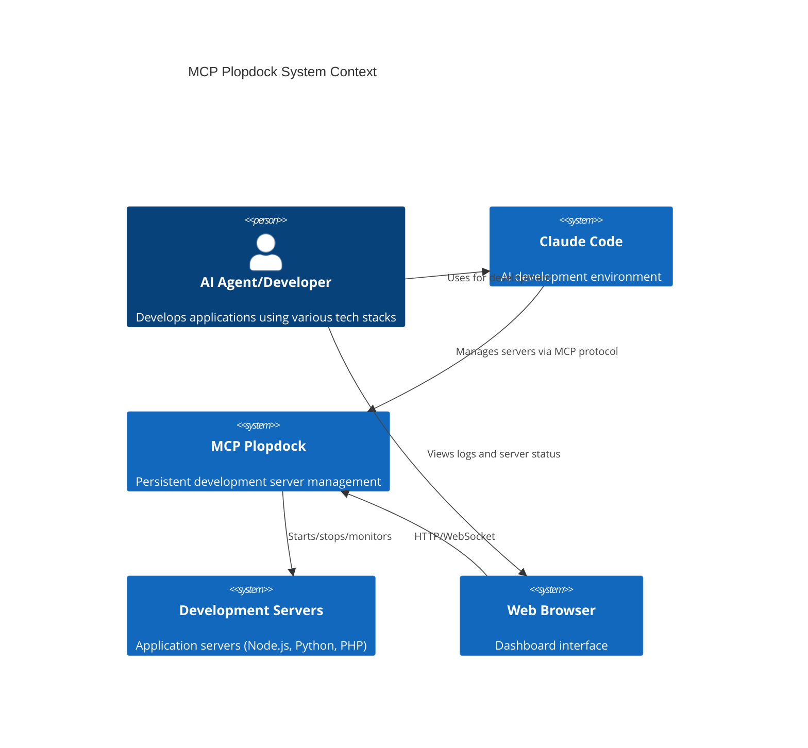
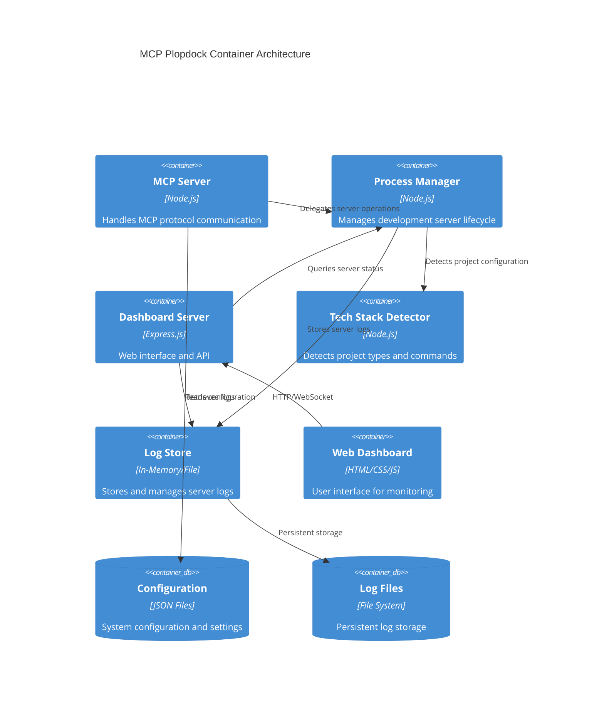
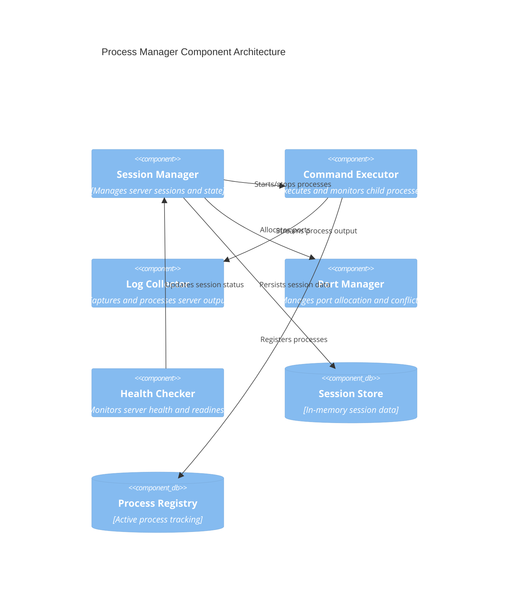
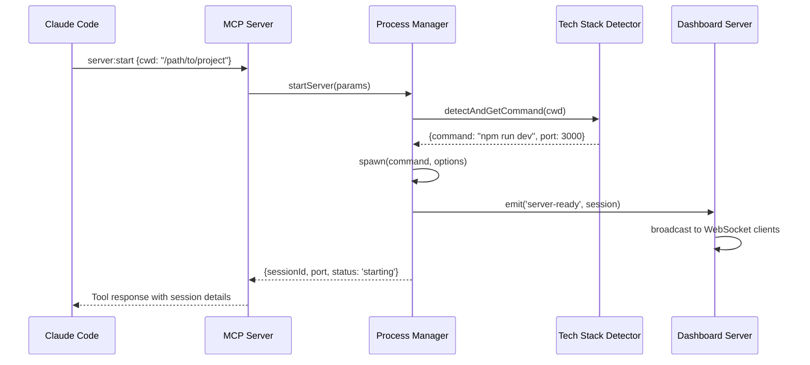
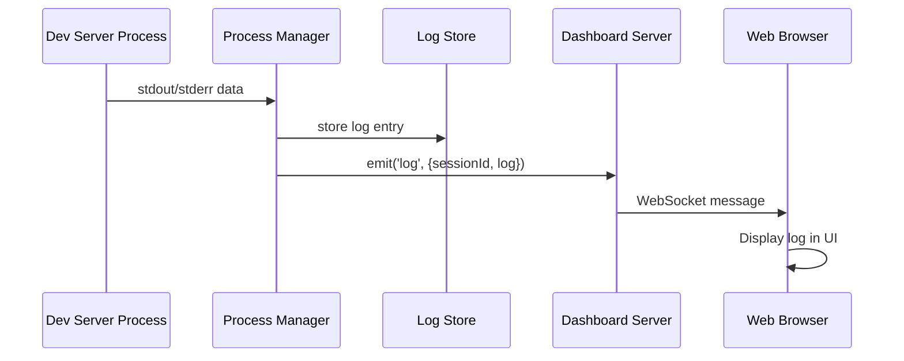
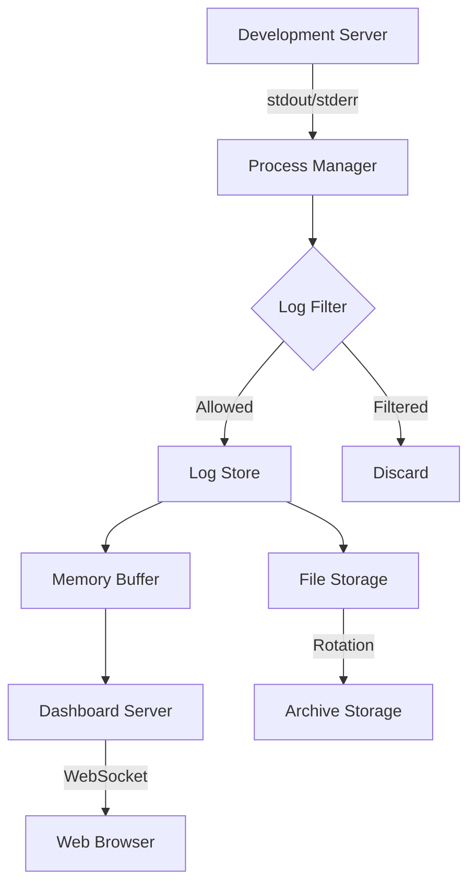
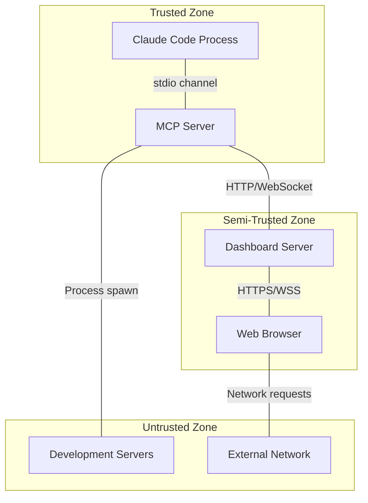

# MCP Architectural Documentation Guidelines

**Document Type**: Architectural Standards  
**Version**: 1.0.0  
**Last Updated**: 2025-08-01  
**Author**: System Architect  
**Status**: Active  

## 🎯 Overview

This document establishes comprehensive architectural documentation standards for Model Context Protocol (MCP) integrations within the APM Framework. These guidelines ensure consistent, maintainable, and scalable MCP-based solutions.

## 📋 Table of Contents

1. [Architectural Documentation Template](#architectural-documentation-template)
2. [Technical Design Document Structure](#technical-design-document-structure)
3. [System Architecture Diagrams Specifications](#system-architecture-diagrams-specifications)
4. [Integration Patterns Documentation](#integration-patterns-documentation)
5. [Security Architecture Guidelines](#security-architecture-guidelines)
6. [Performance and Scalability Documentation](#performance-and-scalability-documentation)
7. [API Documentation Requirements](#api-documentation-requirements)
8. [Deployment Architecture Guidelines](#deployment-architecture-guidelines)

---

## 1. Architectural Documentation Template

### 1.1 Document Structure Template

```markdown
# [MCP Integration Name] Architecture Document

**Document Type**: MCP Integration Architecture  
**Version**: [Major.Minor.Patch]  
**Last Updated**: [YYYY-MM-DD]  
**Author**: [Name/Role]  
**Status**: [Draft|Review|Active|Deprecated]  

## Executive Summary
Brief overview of the MCP integration purpose and architectural significance.

## Context and Scope
- Business requirements driving the integration
- Technical constraints and dependencies
- Integration boundaries and limitations
- Success criteria and metrics

## Architecture Overview
High-level system description and key architectural decisions.

## Component Architecture
Detailed breakdown of system components and their responsibilities.

## Integration Patterns
MCP-specific integration approaches and design patterns used.

## Security Architecture
Security considerations, authentication, authorization, and data protection.

## Performance Architecture
Performance requirements, optimization strategies, and scalability considerations.

## Deployment Architecture
Infrastructure requirements, deployment patterns, and operational considerations.

## Testing Strategy
Architectural testing approach and quality assurance measures.

## Monitoring and Observability
System monitoring, logging, and observability requirements.

## Risk Assessment
Identified risks and mitigation strategies.

## Future Considerations
Planned enhancements and architectural evolution.
```

### 1.2 Required Sections

Each MCP architectural document MUST include:

- **System Context Diagram**: C4 Level 1 overview
- **Container Diagram**: C4 Level 2 component breakdown
- **Component Diagram**: C4 Level 3 detailed architecture
- **Sequence Diagrams**: Key interaction flows
- **Data Flow Diagrams**: Information processing flows
- **Security Model**: Authentication and authorization flows
- **Deployment Topology**: Infrastructure and service mapping

---

## 2. Technical Design Document Structure

### 2.1 MCP Plopdock Technical Design Template

```markdown
# MCP Plopdock Technical Design Document

## 1. System Overview

### 1.1 Purpose
Provide persistent process management and console output visibility for development servers across AI agent sessions.

### 1.2 Key Capabilities
- Persistent server hosting
- Real-time log streaming
- Multi-technology stack support
- Web-based dashboard interface
- MCP protocol integration

### 1.3 Architecture Principles
- Separation of concerns
- Scalability by design
- Security by default
- Observability first
- Technology agnostic

## 2. Architecture Decisions

### 2.1 ADR-001: Node.js Runtime Selection
**Status**: Accepted  
**Context**: Need cross-platform runtime with excellent process management capabilities  
**Decision**: Use Node.js with child_process module  
**Consequences**: Enables cross-platform compatibility but requires Node.js 18+  

### 2.2 ADR-002: WebSocket for Real-time Communication
**Status**: Accepted  
**Context**: Need real-time log streaming to dashboard  
**Decision**: Use WebSocket protocol with ws library  
**Consequences**: Enables real-time updates but requires connection management  

### 2.3 ADR-003: Express.js for HTTP API
**Status**: Accepted  
**Context**: Need REST API for dashboard and management operations  
**Decision**: Use Express.js framework  
**Consequences**: Rapid development but additional dependency  

## 3. Component Architecture

### 3.1 Core Components

#### 3.1.1 MCP Server (index.js)
- **Responsibility**: MCP protocol handling and tool registration
- **Interfaces**: 
  - Stdin/stdout for MCP communication
  - Internal APIs to ProcessManager and LogStore
- **Dependencies**: @modelcontextprotocol/sdk

#### 3.1.2 Process Manager (process-manager.js)
- **Responsibility**: Development server lifecycle management
- **Interfaces**:
  - startServer(params): Start new development server
  - stopServer(sessionId): Stop running server
  - getLogs(sessionId, options): Retrieve server logs
  - getAllSessions(): Get status of all servers
- **Dependencies**: child_process, TechStackDetector

#### 3.1.3 Tech Stack Detector (tech-stack-detector.js)
- **Responsibility**: Automatic project type detection and command generation
- **Interfaces**: 
  - detectAndGetCommand(projectPath): Detect project and return start command
- **Supported Stacks**: Node.js, PHP, Python (Django/Flask/FastAPI)

#### 3.1.4 Dashboard Server (dashboard/server.js)
- **Responsibility**: Web interface for log viewing and server management
- **Interfaces**:
  - HTTP REST API for server operations
  - WebSocket for real-time log streaming
- **Dependencies**: express, ws

### 3.2 Data Models

#### 3.2.1 Session Object
```javascript
{
  id: string,           // Unique session identifier
  name: string,         // Human-readable session name
  command: string,      // Command used to start server
  cwd: string,          // Working directory
  port: number,         // Server port
  pid: number,          // Process ID
  startTime: number,    // Timestamp of server start
  status: string,       // 'starting'|'running'|'stopped'
  logs: LogEntry[],     // Array of log entries
  process: ChildProcess // Node.js child process
}
```

#### 3.2.2 Log Entry Object
```javascript
{
  timestamp: number,    // Unix timestamp
  type: string,         // 'stdout'|'stderr'
  data: string          // Log content
}
```

## 4. Integration Patterns

### 4.1 MCP Tool Pattern
```javascript
// Tool registration pattern
server.setRequestHandler('tools/call', async (request) => {
  const { name, arguments: args } = request.params;
  
  switch (name) {
    case 'server:start':
      return await handleServerStart(args);
    case 'server:stop':
      return await handleServerStop(args);
    // ... other tools
  }
});
```

### 4.2 Event-Driven Architecture Pattern
```javascript
// Component communication via events
processManager.on('log', ({ sessionId, log }) => {
  dashboardServer.broadcast({
    type: 'log',
    sessionId,
    log
  });
});
```

## 5. Security Model

### 5.1 Authentication Strategy
- API key-based authentication for REST endpoints
- No authentication for MCP stdio communication (secured by parent process)
- WebSocket connections inherit HTTP authentication

### 5.2 Authorization Model
- Single-tenant system (per user installation)
- No role-based access control required
- Process isolation via user permissions

### 5.3 Data Protection
- Logs stored in user home directory with restricted permissions
- No sensitive data logging (filtered by regex patterns)
- HTTPS optional for dashboard (dev tool context)

## 6. Performance Considerations

### 6.1 Scalability Limits
- Maximum 10 concurrent development servers (configurable)
- Log retention: 1000 entries per session in memory
- WebSocket client limit: 50 concurrent connections

### 6.2 Resource Management
- Automatic log rotation for persistent storage
- Memory-efficient log streaming using chunks
- CPU throttling for process management operations

## 7. Error Handling Strategy

### 7.1 Process Failure Handling
- Automatic retry for transient failures
- Graceful degradation when external processes fail
- Dead letter queue for failed MCP tool calls

### 7.2 Network Failure Handling
- WebSocket reconnection with exponential backoff
- HTTP endpoint timeout and circuit breaker patterns
- Dashboard offline mode with cached data

## 8. Testing Strategy

### 8.1 Unit Testing
- Component isolation with dependency injection
- Mock external dependencies (child_process, file system)
- 90%+ code coverage target

### 8.2 Integration Testing
- End-to-end MCP protocol testing
- Multi-technology stack validation
- Dashboard functionality testing

### 8.3 Performance Testing
- Concurrent server management stress testing
- Log streaming performance validation
- Memory leak detection over extended periods

## 9. Deployment Considerations

### 9.1 Installation Requirements
- Node.js 18+ runtime
- npm package manager
- System service management (systemd/launchd)

### 9.2 Configuration Management
- Environment variable-based configuration
- JSON configuration file support
- Runtime configuration updates

### 9.3 Monitoring and Logging
- Structured logging with Winston
- Health check endpoints
- Metrics collection for system performance
```

---

## 3. System Architecture Diagrams Specifications

### 3.1 C4 Model Implementation

#### 3.1.1 Level 1: System Context Diagram


#### 3.1.2 Level 2: Container Diagram


#### 3.1.3 Level 3: Component Diagram


### 3.2 Sequence Diagrams

#### 3.2.1 Server Start Sequence


#### 3.2.2 Log Streaming Sequence


### 3.3 Data Flow Diagrams

#### 3.3.1 Log Processing Flow


---

## 4. Integration Patterns Documentation

### 4.1 MCP Tool Integration Pattern

#### 4.1.1 Tool Definition Standard
```javascript
// Standard MCP tool definition structure
{
  name: string,                    // Tool identifier (kebab-case)
  description: string,             // Clear, actionable description
  inputSchema: {                   // JSON Schema for validation
    type: 'object',
    properties: {
      // Parameter definitions
    },
    required: string[]             // Required parameters
  }
}
```

#### 4.1.2 Tool Implementation Pattern
```javascript
// Consistent tool handler pattern
async function handleToolCall(toolName, args) {
  try {
    // 1. Validate input parameters
    const validation = validateInput(args, toolSchemas[toolName]);
    if (!validation.valid) {
      throw new Error(`Invalid parameters: ${validation.errors.join(', ')}`);
    }

    // 2. Execute tool logic
    const result = await executeToolLogic(toolName, args);

    // 3. Format response
    return {
      content: [{
        type: 'text',
        text: JSON.stringify(result, null, 2)
      }]
    };
  } catch (error) {
    // 4. Error handling and logging
    logger.error(`Tool ${toolName} failed:`, error);
    throw error;
  }
}
```

### 4.2 Event-Driven Integration Pattern

#### 4.2.1 Component Communication
```javascript
// Event emitter pattern for loose coupling
class ProcessManager extends EventEmitter {
  startServer(params) {
    const session = this.createSession(params);
    
    // Emit events for other components
    this.emit('session-created', session);
    this.emit('server-starting', session);
    
    // Setup process event handlers
    session.process.on('spawn', () => {
      this.emit('server-ready', session);
    });
  }
}
```

#### 4.2.2 Cross-Component Messaging
```javascript
// Centralized event bus for component communication
class EventBus extends EventEmitter {
  constructor() {
    super();
    this.setMaxListeners(50); // Prevent memory leaks
  }

  // Typed event methods for better developer experience
  emitServerReady(session) {
    this.emit('server:ready', session);
  }

  emitLogEntry(sessionId, log) {
    this.emit('log:entry', { sessionId, log });
  }

  onServerReady(callback) {
    this.on('server:ready', callback);
  }
}
```

### 4.3 Configuration Management Pattern

#### 4.3.2 Layered Configuration
```javascript
// Configuration precedence: env vars > config file > defaults
class ConfigManager {
  constructor() {
    this.config = {
      ...defaultConfig,
      ...this.loadConfigFile(),
      ...this.loadEnvironmentVariables()
    };
  }

  loadConfigFile() {
    try {
      return JSON.parse(fs.readFileSync('config.json', 'utf8'));
    } catch {
      return {};
    }
  }

  loadEnvironmentVariables() {
    return {
      port: process.env.PORT ? parseInt(process.env.PORT) : undefined,
      logLevel: process.env.LOG_LEVEL,
      maxProcesses: process.env.MAX_PROCESSES ? parseInt(process.env.MAX_PROCESSES) : undefined
    };
  }
}
```

---

## 5. Security Architecture Guidelines

### 5.1 MCP Security Model

#### 5.1.1 Trust Boundaries


#### 5.1.2 Authentication Strategy
```javascript
// API key-based authentication for HTTP endpoints
class AuthenticationMiddleware {
  constructor(apiKey) {
    this.apiKey = apiKey;
  }

  authenticate(req, res, next) {
    const providedKey = req.headers['x-api-key'] || req.query.apiKey;
    
    if (!providedKey || providedKey !== this.apiKey) {
      return res.status(401).json({ error: 'Invalid API key' });
    }
    
    next();
  }
}
```

#### 5.1.3 Input Validation and Sanitization
```javascript
// Comprehensive input validation
class InputValidator {
  static validateServerStartParams(params) {
    const schema = {
      type: 'object',
      properties: {
        cwd: { type: 'string', pattern: '^[a-zA-Z0-9/._-]+$' },
        command: { type: 'string', maxLength: 500 },
        port: { type: 'integer', minimum: 1024, maximum: 65535 },
        env: { type: 'object' }
      },
      required: ['cwd']
    };

    const ajv = new Ajv();
    const validate = ajv.compile(schema);
    const valid = validate(params);

    if (!valid) {
      throw new ValidationError(validate.errors);
    }

    return this.sanitizeParams(params);
  }

  static sanitizeParams(params) {
    return {
      cwd: path.resolve(params.cwd), // Resolve to absolute path
      command: params.command?.replace(/[;&|`$]/g, ''), // Remove shell metacharacters
      port: parseInt(params.port) || 3000,
      env: this.sanitizeEnvironment(params.env || {})
    };
  }
}
```

### 5.2 Process Isolation

#### 5.2.1 Sandboxing Strategy
```javascript
// Child process sandboxing
class SecureProcessManager {
  spawnProcess(command, options) {
    const secureOptions = {
      ...options,
      uid: process.getuid(), // Run as current user
      gid: process.getgid(),
      env: this.sanitizeEnvironment(options.env),
      cwd: this.validateWorkingDirectory(options.cwd),
      stdio: ['pipe', 'pipe', 'pipe'], // Controlled I/O
      detached: true // Process group isolation
    };

    return spawn(command, secureOptions);
  }

  sanitizeEnvironment(env) {
    // Whitelist safe environment variables
    const safeVars = ['PATH', 'NODE_ENV', 'PORT', 'NODE_OPTIONS'];
    return Object.keys(env)
      .filter(key => safeVars.includes(key))
      .reduce((acc, key) => ({ ...acc, [key]: env[key] }), {});
  }
}
```

### 5.3 Data Protection

#### 5.3.1 Log Sanitization
```javascript
// Sensitive data filtering for logs
class LogSanitizer {
  static sensitivePatterns = [
    /password[=:]\s*["']?([^"'\s]+)["']?/gi,
    /api[_-]?key[=:]\s*["']?([^"'\s]+)["']?/gi,
    /token[=:]\s*["']?([^"'\s]+)["']?/gi,
    /secret[=:]\s*["']?([^"'\s]+)["']?/gi
  ];

  static sanitize(logData) {
    let sanitized = logData;
    
    this.sensitivePatterns.forEach(pattern => {
      sanitized = sanitized.replace(pattern, (match, group) => {
        return match.replace(group, '*'.repeat(group.length));
      });
    });
    
    return sanitized;
  }
}
```

---

## 6. Performance and Scalability Documentation

### 6.1 Performance Requirements

#### 6.1.1 Response Time Targets
| Operation | Target | Maximum |
|-----------|--------|---------|
| MCP Tool Call | < 100ms | 500ms |
| Server Start | < 5s | 30s |
| Log Retrieval | < 50ms | 200ms |
| Dashboard Load | < 2s | 5s |
| WebSocket Message | < 10ms | 50ms |

#### 6.1.2 Throughput Requirements
| Metric | Target | Peak |
|--------|--------|------|
| Concurrent Servers | 10 | 25 |
| Log Entries/sec | 1000 | 5000 |
| WebSocket Clients | 10 | 50 |
| API Requests/min | 1000 | 5000 |

### 6.2 Scalability Architecture

#### 6.2.1 Resource Management
```javascript
// Resource-aware process management
class ResourceManager {
  constructor(limits) {
    this.limits = {
      maxProcesses: limits.maxProcesses || 10,
      maxMemoryMB: limits.maxMemoryMB || 512,
      maxCpuPercent: limits.maxCpuPercent || 80
    };
    this.monitor = new ResourceMonitor();
  }

  async canStartProcess() {
    const usage = await this.monitor.getCurrentUsage();
    
    return usage.processCount < this.limits.maxProcesses &&
           usage.memoryMB < this.limits.maxMemoryMB &&
           usage.cpuPercent < this.limits.maxCpuPercent;
  }

  async enforceResourceLimits() {
    const usage = await this.monitor.getCurrentUsage();
    
    if (usage.memoryMB > this.limits.maxMemoryMB) {
      await this.terminateOldestProcess();
    }
  }
}
```

#### 6.2.2 Log Management Optimization
```javascript
// Efficient log storage and retrieval
class OptimizedLogStore {
  constructor() {
    this.memoryBuffer = new Map(); // Fast access for recent logs
    this.compressionThreshold = 1000; // Entries before compression
    this.archiveThreshold = 10000; // Entries before archiving
  }

  addLog(sessionId, log) {
    const buffer = this.getOrCreateBuffer(sessionId);
    buffer.push(log);

    // Async compression for old entries
    if (buffer.length > this.compressionThreshold) {
      setImmediate(() => this.compressOldLogs(sessionId));
    }
  }

  async compressOldLogs(sessionId) {
    const buffer = this.memoryBuffer.get(sessionId);
    const toCompress = buffer.splice(0, buffer.length - 500); // Keep recent 500
    
    await this.writeCompressedLogs(sessionId, toCompress);
  }
}
```

### 6.3 Performance Monitoring

#### 6.3.1 Metrics Collection
```javascript
// Performance metrics tracking
class PerformanceMetrics {
  constructor() {
    this.metrics = {
      requestCount: 0,
      responseTime: [],
      errorCount: 0,
      processCount: 0,
      memoryUsage: [],
      cpuUsage: []
    };
    
    this.startCollection();
  }

  recordRequest(duration) {
    this.metrics.requestCount++;
    this.metrics.responseTime.push(duration);
    
    // Keep only recent 1000 measurements
    if (this.metrics.responseTime.length > 1000) {
      this.metrics.responseTime.shift();
    }
  }

  getStats() {
    const responseTime = this.metrics.responseTime;
    return {
      totalRequests: this.metrics.requestCount,
      averageResponseTime: responseTime.reduce((a, b) => a + b, 0) / responseTime.length,
      p95ResponseTime: this.percentile(responseTime, 0.95),
      errorRate: this.metrics.errorCount / this.metrics.requestCount,
      processCount: this.metrics.processCount
    };
  }
}
```

---

## 7. API Documentation Requirements

### 7.1 MCP Tools Documentation

#### 7.1.1 Tool Documentation Template
```markdown
### Tool: `server:start`

**Description**: Starts a new development server with automatic technology stack detection.

**Parameters**:
- `cwd` (string, required): Working directory containing the project
- `command` (string, optional): Explicit command to run (auto-detected if not provided)
- `port` (integer, optional): Port number for the server (auto-detected if not provided)
- `env` (object, optional): Environment variables to set
- `sessionName` (string, optional): Human-readable name for the session

**Returns**:
```json
{
  "sessionId": "uuid-string",
  "pid": 12345,
  "port": 3000,
  "status": "starting",
  "url": "http://localhost:3000"
}
```

**Examples**:
```json
// Basic usage - auto-detect everything
{
  "cwd": "/path/to/react-app"
}

// With explicit command
{
  "cwd": "/path/to/project",
  "command": "npm run dev",
  "port": 3000,
  "sessionName": "My React App"
}
```

**Error Conditions**:
- `INVALID_DIRECTORY`: The provided cwd does not exist
- `PORT_IN_USE`: The specified port is already in use
- `UNSUPPORTED_STACK`: Cannot detect project type and no command provided
- `SPAWN_FAILED`: Failed to start the process
```

#### 7.1.2 API Response Schema
```json
{
  "$schema": "http://json-schema.org/draft-07/schema#",
  "type": "object",
  "properties": {
    "success": {
      "type": "boolean",
      "description": "Indicates if the operation was successful"
    },
    "data": {
      "type": "object",
      "description": "Response data (structure varies by tool)"
    },
    "error": {
      "type": "object",
      "properties": {
        "code": {
          "type": "string",
          "description": "Error code for programmatic handling"
        },
        "message": {
          "type": "string",
          "description": "Human-readable error description"
        },
        "details": {
          "type": "object",
          "description": "Additional error context"
        }
      }
    }
  },
  "required": ["success"]
}
```

### 7.2 REST API Documentation

#### 7.2.1 OpenAPI Specification Template
```yaml
openapi: 3.0.3
info:
  title: MCP Plopdock API
  description: REST API for development server management
  version: 1.0.0
  contact:
    name: APM Framework
    url: https://github.com/your-org/agentic-persona-mapping

servers:
  - url: http://localhost:8080
    description: Local development server

security:
  - ApiKeyAuth: []

paths:
  /api/sessions:
    get:
      summary: List all server sessions
      responses:
        '200':
          description: Successful response
          content:
            application/json:
              schema:
                type: object
                properties:
                  sessions:
                    type: array
                    items:
                      $ref: '#/components/schemas/Session'

  /api/sessions/{sessionId}/logs:
    get:
      summary: Get logs for a specific session
      parameters:
        - name: sessionId
          in: path
          required: true
          schema:
            type: string
        - name: tail
          in: query
          schema:
            type: integer
            default: 100
        - name: filter
          in: query
          schema:
            type: string
      responses:
        '200':
          description: Successful response
          content:
            application/json:
              schema:
                type: object
                properties:
                  logs:
                    type: array
                    items:
                      $ref: '#/components/schemas/LogEntry'

components:
  securitySchemes:
    ApiKeyAuth:
      type: apiKey
      in: header
      name: X-API-Key

  schemas:
    Session:
      type: object
      properties:
        id:
          type: string
          format: uuid
        name:
          type: string
        command:
          type: string
        port:
          type: integer
        status:
          type: string
          enum: [starting, running, stopped]
        pid:
          type: integer
        startTime:
          type: integer
        uptime:
          type: integer

    LogEntry:
      type: object
      properties:
        timestamp:
          type: integer
        type:
          type: string
          enum: [stdout, stderr]
        data:
          type: string
```

### 7.3 WebSocket API Documentation

#### 7.3.1 Message Format Specification
```json
// Outbound messages (server to client)
{
  "type": "log",
  "sessionId": "uuid-string",
  "log": {
    "timestamp": 1641234567890,
    "type": "stdout",
    "data": "Server started on port 3000"
  }
}

{
  "type": "server-ready",
  "session": {
    "id": "uuid-string",
    "name": "My App",
    "port": 3000,
    "status": "running"
  }
}

{
  "type": "process-exit",
  "sessionId": "uuid-string",
  "code": 0
}

{
  "type": "initial-state",
  "sessions": [/* array of session objects */]
}
```

---

## 8. Deployment Architecture Guidelines

### 8.1 Infrastructure Requirements

#### 8.1.1 System Requirements Matrix
| Component | CPU | Memory | Disk | Network |
|-----------|-----|--------|------|---------|
| MCP Server | 0.1 cores | 64MB | 100MB | Low |
| Process Manager | 0.2 cores | 128MB | 1GB | Low |
| Dashboard Server | 0.1 cores | 32MB | 50MB | Medium |
| Development Servers | Variable | Variable | Variable | Variable |
| **Total** | 0.4+ cores | 224+ MB | 1.15+ GB | Medium |

#### 8.1.2 Port Allocation Strategy
```javascript
// Dynamic port allocation with conflict resolution
class PortManager {
  constructor() {
    this.allocatedPorts = new Set();
    this.portRange = { min: 3000, max: 8000 };
  }

  async allocatePort(preferred) {
    if (preferred && !this.allocatedPorts.has(preferred)) {
      const available = await this.isPortAvailable(preferred);
      if (available) {
        this.allocatedPorts.add(preferred);
        return preferred;
      }
    }

    // Find next available port in range
    for (let port = this.portRange.min; port <= this.portRange.max; port++) {
      if (!this.allocatedPorts.has(port)) {
        const available = await this.isPortAvailable(port);
        if (available) {
          this.allocatedPorts.add(port);
          return port;
        }
      }
    }

    throw new Error('No available ports in range');
  }
}
```

### 8.2 Service Management

#### 8.2.1 systemd Service Configuration
```ini
[Unit]
Description=MCP Plopdock Server
After=network.target
Wants=network-online.target

[Service]
Type=simple
User=mcpuser
Group=mcpuser
WorkingDirectory=/opt/mcp-plopdock
ExecStart=/usr/bin/node /opt/mcp-plopdock/src/index.js
ExecReload=/bin/kill -HUP $MAINPID
Restart=always
RestartSec=10
TimeoutStopSec=30

# Security
NoNewPrivileges=true
PrivateTmp=true
ProtectSystem=strict
ProtectHome=read-only
ReadWritePaths=/opt/mcp-plopdock/logs
CapabilityBoundingSet=CAP_NET_BIND_SERVICE

# Resource limits
LimitNOFILE=65536
LimitNPROC=4096
MemoryMax=1G
CPUQuota=80%

# Environment
Environment="NODE_ENV=production"
Environment="PATH=/usr/local/bin:/usr/bin:/bin"

[Install]
WantedBy=multi-user.target
```

#### 8.2.2 Docker Deployment Option
```dockerfile
# Multi-stage build for MCP Plopdock
FROM node:18-alpine AS builder

WORKDIR /app
COPY package*.json ./
RUN npm ci --only=production && npm cache clean --force

FROM node:18-alpine AS runtime

# Create non-root user
RUN addgroup -g 1001 -S mcpuser && \
    adduser -S mcpuser -u 1001

# Install system dependencies
RUN apk add --no-cache dumb-init

# Copy application
WORKDIR /app
COPY --from=builder /app/node_modules ./node_modules
COPY src ./src
COPY package.json ./

# Set permissions
RUN chown -R mcpuser:mcpuser /app
USER mcpuser

# Health check
HEALTHCHECK --interval=30s --timeout=3s --start-period=5s --retries=3 \
  CMD node -e "http.get('http://localhost:8080/api/health', (res) => process.exit(res.statusCode === 200 ? 0 : 1))"

EXPOSE 8080
ENTRYPOINT ["dumb-init", "--"]
CMD ["node", "src/index.js"]
```

### 8.3 Configuration Management

#### 8.3.1 Environment-Specific Configuration
```javascript
// Configuration per deployment environment
const configs = {
  development: {
    port: 8080,
    logLevel: 'debug',
    maxProcesses: 5,
    dashboard: {
      enabled: true,
      cors: '*'
    },
    security: {
      apiKeyRequired: false
    }
  },
  
  production: {
    port: process.env.PORT || 8080,
    logLevel: 'info',
    maxProcesses: 10,
    dashboard: {
      enabled: true,
      cors: process.env.ALLOWED_ORIGINS?.split(',') || []
    },
    security: {
      apiKeyRequired: true,
      apiKey: process.env.MCP_API_KEY
    }
  },
  
  testing: {
    port: 0, // Random available port
    logLevel: 'silent',
    maxProcesses: 3,
    dashboard: {
      enabled: false
    },
    security: {
      apiKeyRequired: false
    }
  }
};
```

### 8.4 Monitoring and Observability

#### 8.4.1 Health Check Implementation
```javascript
// Comprehensive health check endpoint
class HealthChecker {
  async checkHealth() {
    const checks = await Promise.allSettled([
      this.checkSystemResources(),
      this.checkDatabaseConnection(),
      this.checkExternalDependencies(),
      this.checkServiceHealth()
    ]);

    const results = checks.map((check, index) => ({
      name: ['system', 'database', 'external', 'service'][index],
      status: check.status === 'fulfilled' ? 'healthy' : 'unhealthy',
      details: check.status === 'fulfilled' ? check.value : check.reason
    }));

    const overall = results.every(r => r.status === 'healthy') ? 'healthy' : 'unhealthy';

    return {
      status: overall,
      timestamp: new Date().toISOString(),
      uptime: process.uptime(),
      checks: results
    };
  }

  async checkSystemResources() {
    const usage = process.memoryUsage();
    const cpuUsage = process.cpuUsage();
    
    return {
      memory: {
        used: Math.round(usage.heapUsed / 1024 / 1024),
        total: Math.round(usage.heapTotal / 1024 / 1024),
        external: Math.round(usage.external / 1024 / 1024)
      },
      cpu: cpuUsage
    };
  }
}
```

#### 8.4.2 Metrics Collection
```javascript
// Prometheus-compatible metrics
class MetricsCollector {
  constructor() {
    this.metrics = new Map();
    this.initialize();
  }

  initialize() {
    // Request metrics
    this.registerCounter('mcp_requests_total', 'Total MCP requests', ['tool', 'status']);
    this.registerHistogram('mcp_request_duration_seconds', 'MCP request duration', ['tool']);
    
    // Process metrics
    this.registerGauge('mcp_active_processes', 'Number of active development processes');
    this.registerCounter('mcp_process_starts_total', 'Total process starts', ['stack']);
    
    // System metrics
    this.registerGauge('mcp_memory_usage_bytes', 'Memory usage in bytes');
    this.registerGauge('mcp_cpu_usage_percent', 'CPU usage percentage');
  }

  recordRequest(tool, duration, success) {
    this.incrementCounter('mcp_requests_total', { tool, status: success ? 'success' : 'error' });
    this.observeHistogram('mcp_request_duration_seconds', duration, { tool });
  }

  updateProcessCount(count) {
    this.setGauge('mcp_active_processes', count);
  }

  export() {
    // Export metrics in Prometheus format
    return Array.from(this.metrics.entries())
      .map(([name, metric]) => metric.export())
      .join('\n');
  }
}
```

---

## 9. Implementation Checklist

### 9.1 Architecture Documentation Checklist

- [ ] **System Context Diagram**: C4 Level 1 created and reviewed
- [ ] **Container Diagram**: C4 Level 2 with all major components
- [ ] **Component Diagram**: C4 Level 3 for complex subsystems
- [ ] **Sequence Diagrams**: Key interaction flows documented
- [ ] **Data Flow Diagrams**: Information processing flows mapped
- [ ] **Security Model**: Authentication and authorization documented
- [ ] **Deployment Topology**: Infrastructure requirements specified
- [ ] **API Documentation**: All endpoints and tools documented
- [ ] **Performance Requirements**: SLAs and targets defined
- [ ] **Monitoring Strategy**: Health checks and metrics specified

### 9.2 Security Review Checklist

- [ ] **Input Validation**: All user inputs validated and sanitized
- [ ] **Authentication**: API authentication implemented
- [ ] **Authorization**: Access controls defined and implemented
- [ ] **Data Protection**: Sensitive data handling documented
- [ ] **Process Isolation**: Security boundaries enforced
- [ ] **Audit Logging**: Security events logged
- [ ] **Vulnerability Assessment**: Security scan completed
- [ ] **Penetration Testing**: Basic security testing performed

### 9.3 Performance Validation Checklist

- [ ] **Load Testing**: System tested under expected load
- [ ] **Stress Testing**: Breaking points identified
- [ ] **Resource Usage**: Memory and CPU usage profiled
- [ ] **Scalability Testing**: Horizontal scaling validated
- [ ] **Performance Monitoring**: Metrics collection implemented
- [ ] **Optimization**: Performance bottlenecks addressed
- [ ] **Capacity Planning**: Resource requirements documented

---

## 10. Conclusion

This architectural documentation framework provides comprehensive guidelines for MCP integration implementations within the APM Framework. Following these standards ensures:

- **Consistency**: Uniform documentation across all MCP integrations
- **Maintainability**: Clear architectural decisions and rationale
- **Scalability**: Performance and growth considerations built-in
- **Security**: Security-first design principles applied
- **Reliability**: Robust error handling and monitoring strategies

### 10.1 Next Steps

1. **Template Application**: Apply this framework to the MCP Plopdock implementation
2. **Team Training**: Educate development teams on these standards
3. **Review Process**: Establish architectural review checkpoints
4. **Continuous Improvement**: Gather feedback and refine guidelines
5. **Tool Integration**: Integrate with existing development workflows

### 10.2 Maintenance

This document should be reviewed and updated:
- **Quarterly**: Regular review for accuracy and completeness
- **On Major Changes**: When MCP protocol or APM Framework evolves
- **Post-Implementation**: After each new MCP integration
- **Feedback-Driven**: Based on developer and user feedback

---

**Document Control**:
- **Version**: 1.0.0
- **Classification**: Internal Use
- **Review Cycle**: Quarterly
- **Next Review**: 2025-11-01
- **Approver**: System Architect
- **Distribution**: Development Team, QA Team, DevOps Team