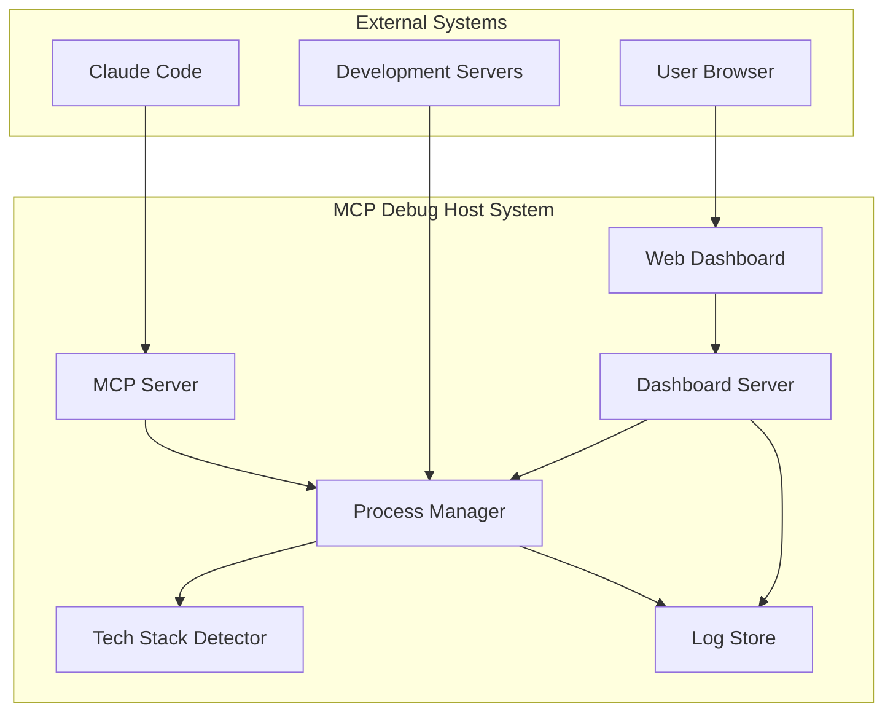

# MCP Debug Host Technical Design Document

**Document Type**: MCP Integration Technical Design  
**Version**: 1.0.0  
**Last Updated**: 2025-08-01  
**Author**: System Architect  
**Status**: Active  
**Related**: [MCP Debug Host Implementation Guide](../MCP-DEBUG-HOST-IMPLEMENTATION-GUIDE.md)

## Executive Summary

The MCP Debug Host Server provides persistent development server management and console output visibility for AI agents using the Model Context Protocol (MCP). This system solves the critical problem of invisible console output when AI agents start development servers, enabling real-time monitoring and management through a web-based dashboard.

## Context and Scope

### Business Requirements
- **Persistent Server Hosting**: Development servers must survive AI agent session transitions
- **Console Output Visibility**: Full visibility into server startup, runtime logs, and error messages
- **Multi-Technology Support**: Automatic detection and management of various tech stacks
- **Real-time Monitoring**: Live log streaming and server status updates
- **Zero-Configuration Setup**: Automatic integration with Claude Code via MCP protocol

### Technical Constraints
- **MCP Protocol Compliance**: Must implement MCP server specification correctly
- **Cross-Platform Compatibility**: Support for Windows (WSL), macOS, and Linux
- **Resource Efficiency**: Minimal system resource consumption
- **Node.js Runtime**: Requires Node.js 18+ for modern JavaScript features
- **System Service Integration**: Must integrate with systemd (Linux) and launchd (macOS)

### Integration Boundaries
- **Input**: MCP tool calls from Claude Code, HTTP requests from web dashboard
- **Output**: Server management responses, real-time log streams, process status updates
- **External Dependencies**: Node.js runtime, system process management, file system access
- **Security Boundary**: Single-user system with process-level isolation

### Success Criteria
1. **Functional**: Successfully start/stop development servers across multiple tech stacks
2. **Performance**: Handle up to 10 concurrent servers with <100ms MCP response times
3. **Reliability**: 99.9% uptime for core MCP services with automatic recovery
4. **Usability**: Zero-configuration setup with intuitive web dashboard interface

## Architecture Overview

### High-Level System Design

The MCP Debug Host follows a modular, event-driven architecture with clear separation of concerns:



### Key Architectural Decisions

#### ADR-001: Node.js Runtime Selection
**Status**: Accepted  
**Context**: Need cross-platform runtime with excellent process management capabilities  
**Decision**: Use Node.js with child_process module for spawning and managing development servers  
**Consequences**: 
- ✅ Cross-platform compatibility (Windows, macOS, Linux)
- ✅ Rich ecosystem for process management and monitoring
- ✅ Native JSON and async/await support for MCP protocol
- ❌ Requires Node.js 18+ runtime dependency
- ❌ Single-threaded event loop may limit concurrent operations

#### ADR-002: WebSocket for Real-time Communication
**Status**: Accepted  
**Context**: Dashboard requires real-time log streaming and server status updates  
**Decision**: Use WebSocket protocol with 'ws' library for bidirectional communication  
**Consequences**: 
- ✅ Real-time log streaming with minimal latency
- ✅ Automatic client reconnection on connection loss
- ✅ Event-driven architecture for loose coupling
- ❌ Requires connection state management
- ❌ Additional complexity for handling disconnections

#### ADR-003: Express.js for HTTP API
**Status**: Accepted  
**Context**: Need REST API for dashboard operations and health checks  
**Decision**: Use Express.js framework for HTTP server implementation  
**Consequences**: 
- ✅ Rapid development with extensive middleware ecosystem
- ✅ Well-established patterns for REST API design
- ✅ Good integration with WebSocket server
- ❌ Additional dependency and potential security vulnerabilities
- ❌ May be overkill for simple API requirements

#### ADR-004: In-Memory Log Storage with File Backup
**Status**: Accepted  
**Context**: Need fast log access for dashboard while maintaining persistence  
**Decision**: Primary storage in memory with asynchronous file backup  
**Consequences**: 
- ✅ Sub-millisecond log retrieval for dashboard
- ✅ Automatic log rotation and compression
- ✅ Survives system restarts through file persistence
- ❌ Memory usage grows with log volume
- ❌ Risk of log loss during unexpected shutdowns

## Component Architecture

### Core Components

#### 1. MCP Server (index.js)
**Responsibility**: MCP protocol handling, tool registration, and system lifecycle management

**Interfaces**:
- **Input**: stdin (MCP requests from Claude Code)
- **Output**: stdout (MCP responses), internal component events
- **Dependencies**: @modelcontextprotocol/sdk, ProcessManager, LogStore, DashboardServer

**Key Functions**:
```javascript
// Tool registration and handling
server.setRequestHandler('tools/call', async (request) => {
  const { name, arguments: args } = request.params;
  return await toolHandlers[name](args);
});

// Graceful shutdown handling
process.on('SIGINT', async () => {
  await processManager.stopAll();
  await dashboardServer.stop();
  process.exit(0);
});
```

#### 2. Process Manager (process-manager.js)
**Responsibility**: Development server lifecycle management and monitoring

**Interfaces**:
- **startServer(params)**: Launch new development server with auto-detection
- **stopServer(sessionId)**: Terminate specific server session
- **getLogs(sessionId, options)**: Retrieve filtered server logs
- **getAllSessions()**: Get status and metadata for all active sessions

**State Management**:
```javascript
// Session state model
const session = {
  id: uuidv4(),                    // Unique identifier
  name: sessionName || `Server on port ${port}`,
  command: detectedCommand,        // Actual command executed
  cwd: absolutePath,               // Working directory
  port: allocatedPort,             // Network port
  pid: process.pid,                // System process ID
  startTime: Date.now(),           // Creation timestamp
  status: 'starting|running|stopped', // Current state
  logs: [],                        // In-memory log buffer
  process: childProcess            // Node.js ChildProcess object
};
```

**Event Emission**:
- `session-created`: New server session initialized
- `server-ready`: Server successfully started and listening
- `log`: New log entry from server output
- `process-exit`: Server process terminated

#### 3. Tech Stack Detector (tech-stack-detector.js)
**Responsibility**: Automatic project type detection and start command generation

**Detection Logic**:
```javascript
async detectAndGetCommand(projectPath) {
  // Node.js project detection
  if (await this.fileExists(path.join(projectPath, 'package.json'))) {
    const pkg = JSON.parse(await fs.readFile('package.json', 'utf8'));
    return this.detectNodeJsCommand(pkg);
  }
  
  // PHP project detection
  if (await this.fileExists(path.join(projectPath, 'artisan'))) {
    return { command: 'php artisan serve', port: 8000, framework: 'laravel' };
  }
  
  // Python project detection
  if (await this.fileExists(path.join(projectPath, 'manage.py'))) {
    return { command: 'python manage.py runserver', port: 8000, framework: 'django' };
  }
  
  return null; // Unsupported project type
}
```

**Supported Technology Stacks**:
- **Node.js**: npm, yarn, pnpm with dev/start/serve scripts
- **PHP**: Laravel (artisan), generic PHP built-in server
- **Python**: Django, Flask, FastAPI with auto-detection
- **Future**: Ruby on Rails, .NET Core, Go, Rust planned

#### 4. Dashboard Server (dashboard/server.js)
**Responsibility**: Web interface for log viewing and server management

**HTTP Endpoints**:
- `GET /api/sessions`: List all server sessions with metadata
- `GET /api/sessions/:id/logs`: Retrieve logs with filtering and pagination
- `POST /api/sessions/:id/stop`: Terminate specific server session
- `GET /api/health`: System health check and metrics

**WebSocket Events**:
```javascript
// Outbound messages (server to client)
{
  type: 'log',
  sessionId: 'uuid',
  log: { timestamp: 1641234567890, type: 'stdout', data: 'Server started...' }
}

{
  type: 'server-ready',
  session: { id: 'uuid', name: 'My App', port: 3000, status: 'running' }
}

{
  type: 'process-exit',
  sessionId: 'uuid',
  code: 0
}
```

#### 5. Web Dashboard (dashboard/public/)
**Responsibility**: User interface for real-time monitoring and server management

**Key Features**:
- **Session Grid View**: Card-based layout showing all active servers
- **Real-time Log Viewer**: Live-streaming console output with filtering
- **Server Controls**: Start, stop, and restart server operations
- **Connection Status**: Visual indicator of WebSocket connectivity
- **Responsive Design**: Mobile-friendly interface for remote monitoring

**Technology Stack**:
- **Vanilla JavaScript**: No framework dependencies for minimal overhead
- **CSS Grid/Flexbox**: Modern layout techniques for responsive design
- **WebSocket API**: Native browser WebSocket for real-time communication
- **Fetch API**: Modern HTTP client for REST API calls

### Data Models

#### Session Object Schema
```json
{
  "id": "string (uuid)",
  "name": "string",
  "command": "string",
  "cwd": "string (absolute path)",
  "port": "number",
  "pid": "number",
  "startTime": "number (unix timestamp)",
  "status": "string (starting|running|stopped)",
  "uptime": "number (milliseconds)",
  "framework": "string (optional)",
  "exitCode": "number (optional)"
}
```

#### Log Entry Schema
```json
{
  "timestamp": "number (unix timestamp)",
  "type": "string (stdout|stderr)",
  "data": "string (log content)"
}
```

#### Configuration Schema
```json
{
  "version": "string",
  "port": "number",
  "apiKey": "string",
  "storage": {
    "logs": {
      "path": "string",
      "maxSize": "string",
      "rotation": "string"
    }
  },
  "processes": {
    "maxConcurrent": "number",
    "defaultTimeout": "number"
  }
}
```

## Integration Patterns

### MCP Tool Implementation Pattern

```javascript
// Standardized tool handler pattern
async function handleServerStart(args) {
  try {
    // 1. Input validation
    const validatedArgs = validateServerStartArgs(args);
    
    // 2. Business logic execution
    const result = await processManager.startServer(validatedArgs);
    
    // 3. Response formatting
    return {
      content: [{
        type: 'text',
        text: JSON.stringify(result, null, 2)
      }]
    };
  } catch (error) {
    logger.error('Server start failed:', error);
    throw error; // MCP framework handles error responses
  }
}

// Tool schema definition
const serverStartTool = {
  name: 'server:start',
  description: 'Start a development server with automatic stack detection',
  inputSchema: {
    type: 'object',
    properties: {
      cwd: { 
        type: 'string', 
        description: 'Working directory containing the project' 
      },
      command: { 
        type: 'string', 
        description: 'Explicit command (auto-detected if not provided)' 
      },
      port: { 
        type: 'number', 
        description: 'Port number (auto-detected if not provided)' 
      },
      env: { 
        type: 'object', 
        description: 'Environment variables' 
      },
      sessionName: { 
        type: 'string', 
        description: 'Human-readable session name' 
      }
    },
    required: ['cwd']
  }
};
```

### Event-Driven Communication Pattern

```javascript
// Publisher-subscriber pattern for loose coupling
class EventBus extends EventEmitter {
  constructor() {
    super();
    this.setMaxListeners(50); // Prevent memory leaks
  }

  // Type-safe event emission
  emitServerReady(session) {
    this.emit('server:ready', session);
  }

  emitLogEntry(sessionId, log) {
    this.emit('log:entry', { sessionId, log });
  }

  // Type-safe event subscription
  onServerReady(callback) {
    this.on('server:ready', callback);
  }

  onLogEntry(callback) {
    this.on('log:entry', callback);
  }
}

// Component integration via event bus
processManager.on('server-ready', (session) => {
  dashboardServer.broadcastToClients({
    type: 'server-ready',
    session: session.toPublicObject()
  });
});
```

### Configuration Management Pattern

```javascript
// Layered configuration with environment override
class ConfigurationManager {
  constructor() {
    this.config = this.buildConfiguration();
  }

  buildConfiguration() {
    const defaults = {
      port: 8080,
      logLevel: 'info',
      maxProcesses: 10,
      dashboard: { enabled: true }
    };

    const fileConfig = this.loadConfigFile();
    const envConfig = this.loadEnvironmentConfig();

    return {
      ...defaults,
      ...fileConfig,
      ...envConfig
    };
  }

  loadConfigFile() {
    try {
      const configPath = process.env.CONFIG_PATH || './config.json';
      return JSON.parse(fs.readFileSync(configPath, 'utf8'));
    } catch (error) {
      return {}; // Graceful fallback to defaults
    }
  }

  loadEnvironmentConfig() {
    return {
      port: process.env.PORT ? parseInt(process.env.PORT) : undefined,
      logLevel: process.env.LOG_LEVEL,
      maxProcesses: process.env.MAX_PROCESSES ? parseInt(process.env.MAX_PROCESSES) : undefined
    };
  }
}
```

## Security Architecture

### Trust Boundaries and Security Zones

```mermaid
graph TB
    subgraph "Trusted Zone"
        CC[Claude Code Process]
        MCP[MCP Server]
    end
    
    subgraph "Semi-Trusted Zone"
        DS[Dashboard Server]
        WB[Web Browser]
    end
    
    subgraph "Untrusted Zone"
        DEV[Development Servers]
        EXT[External Network]
    end
    
    CC ---|stdio (trusted channel)| MCP
    MCP ---|HTTP/WebSocket (authenticated)| DS
    DS ---|HTTPS/WSS (API key)| WB
    MCP ---|Process spawn (sandboxed)| DEV
    WB ---|Network requests| EXT
```

### Authentication and Authorization

#### API Key-Based Authentication
```javascript
class AuthenticationMiddleware {
  constructor(apiKey) {
    this.apiKey = apiKey;
    this.keyHash = crypto.createHash('sha256').update(apiKey).digest('hex');
  }

  authenticate(req, res, next) {
    const providedKey = req.headers['x-api-key'] || req.query.apiKey;
    
    if (!providedKey) {
      return res.status(401).json({ 
        error: 'API key required',
        code: 'AUTH_MISSING_KEY' 
      });
    }

    const providedHash = crypto.createHash('sha256').update(providedKey).digest('hex');
    
    if (!crypto.timingSafeEqual(Buffer.from(this.keyHash), Buffer.from(providedHash))) {
      return res.status(401).json({ 
        error: 'Invalid API key',
        code: 'AUTH_INVALID_KEY' 
      });
    }
    
    next();
  }
}
```

#### Input Validation and Sanitization
```javascript
class SecurityValidator {
  static validateServerStartParams(params) {
    // Path traversal prevention
    const safeCwd = path.resolve(params.cwd);
    if (!safeCwd.startsWith(process.env.HOME) && !safeCwd.startsWith('/tmp')) {
      throw new SecurityError('Invalid working directory');
    }

    // Command injection prevention
    const safeCommand = params.command?.replace(/[;&|`$()]/g, '');
    if (params.command && safeCommand !== params.command) {
      throw new SecurityError('Command contains unsafe characters');
    }

    // Port range validation
    const port = parseInt(params.port) || 3000;
    if (port < 1024 || port > 65535) {
      throw new SecurityError('Port must be between 1024 and 65535');
    }

    return {
      cwd: safeCwd,
      command: safeCommand,
      port: port,
      env: this.sanitizeEnvironment(params.env || {})
    };
  }

  static sanitizeEnvironment(env) {
    // Whitelist safe environment variables
    const allowedKeys = [
      'NODE_ENV', 'PORT', 'HOST', 'NODE_OPTIONS',
      'REACT_APP_', 'VITE_', 'NEXT_PUBLIC_'
    ];

    return Object.keys(env)
      .filter(key => allowedKeys.some(allowed => key.startsWith(allowed)))
      .reduce((safe, key) => {
        safe[key] = String(env[key]).slice(0, 1000); // Limit value length
        return safe;
      }, {});
  }
}
```

### Process Isolation and Sandboxing

```javascript
class SecureProcessManager {
  spawnSecureProcess(command, options) {
    const secureOptions = {
      cwd: path.resolve(options.cwd),
      env: this.buildSecureEnvironment(options.env),
      uid: process.getuid(), // Run as current user
      gid: process.getgid(),
      stdio: ['pipe', 'pipe', 'pipe'], // Controlled I/O
      detached: true, // Process group isolation
      timeout: options.timeout || 30000 // Prevent hanging processes
    };

    // Create new process group for clean termination
    const child = spawn(command, [], secureOptions);
    
    // Set process group ID for clean shutdown
    child.on('spawn', () => {
      process.kill(child.pid, 0); // Verify process exists
    });

    return child;
  }

  buildSecureEnvironment(userEnv = {}) {
    // Start with minimal environment
    const baseEnv = {
      PATH: process.env.PATH,
      HOME: process.env.HOME,
      USER: process.env.USER,
      LANG: process.env.LANG
    };

    // Add validated user environment
    const validatedEnv = SecurityValidator.sanitizeEnvironment(userEnv);

    return { ...baseEnv, ...validatedEnv };
  }
}
```

### Log Sanitization and Data Protection

```javascript
class LogSanitizer {
  static sensitivePatterns = [
    // Credentials
    /(?:password|pwd|pass)[=:\s]+["']?([^"'\s\n]+)["']?/gi,
    /(?:api[_-]?key|apikey)[=:\s]+["']?([^"'\s\n]+)["']?/gi,
    /(?:token|jwt|bearer)[=:\s]+["']?([^"'\s\n]+)["']?/gi,
    /(?:secret|key)[=:\s]+["']?([^"'\s\n]+)["']?/gi,
    
    // Database URLs
    /(?:mongodb|mysql|postgres|redis):\/\/[^:\s]+:[^@\s]+@[^\s]+/gi,
    
    // File paths
    /\/home\/[^\/\s]+\/[^\s]*/gi
  ];

  static sanitize(logData) {
    let sanitized = logData;
    
    this.sensitivePatterns.forEach(pattern => {
      sanitized = sanitized.replace(pattern, (match, capture) => {
        if (capture) {
          const masked = '*'.repeat(Math.min(capture.length, 8));
          return match.replace(capture, masked);
        }
        return '[REDACTED]';
      });
    });
    
    return sanitized;
  }

  static isLogSafe(logData) {
    return !this.sensitivePatterns.some(pattern => pattern.test(logData));
  }
}
```

## Performance Architecture

### Performance Requirements and SLAs

| Operation | Target Response Time | Maximum Response Time | Throughput Target |
|-----------|---------------------|----------------------|-------------------|
| MCP Tool Call | < 100ms | 500ms | 100 req/min |
| Server Start | < 5s | 30s | 10 concurrent |
| Log Retrieval | < 50ms | 200ms | 1000 entries/req |
| Dashboard Load | < 2s | 5s | 10 concurrent users |
| WebSocket Message | < 10ms | 50ms | 1000 msg/sec |

### Resource Management and Optimization

#### Memory Management
```javascript
class OptimizedLogStore {
  constructor(options = {}) {
    this.maxEntriesPerSession = options.maxEntries || 1000;
    this.compressionThreshold = options.compressionThreshold || 500;
    this.archiveThreshold = options.archiveThreshold || 5000;
    
    this.memoryBuffers = new Map(); // sessionId -> LogEntry[]
    this.compressedStorage = new Map(); // sessionId -> CompressedLogs
    this.accessTimes = new Map(); // sessionId -> timestamp
  }

  addLogEntry(sessionId, logEntry) {
    const buffer = this.getOrCreateBuffer(sessionId);
    buffer.push(logEntry);
    this.accessTimes.set(sessionId, Date.now());

    // Trigger compression if buffer is large
    if (buffer.length > this.compressionThreshold) {
      setImmediate(() => this.compressOldEntries(sessionId));
    }

    // Trigger cleanup if memory usage is high
    if (this.getTotalMemoryUsage() > this.maxMemoryUsage) {
      setImmediate(() => this.performMemoryCleanup());
    }
  }

  async compressOldEntries(sessionId) {
    const buffer = this.memoryBuffers.get(sessionId);
    if (!buffer || buffer.length < this.compressionThreshold) return;

    // Keep recent entries in memory, compress older ones
    const toCompress = buffer.splice(0, buffer.length - 100);
    const compressed = await this.compressLogs(toCompress);
    
    this.compressedStorage.set(sessionId, compressed);
  }

  performMemoryCleanup() {
    // Remove least recently accessed sessions
    const sortedSessions = Array.from(this.accessTimes.entries())
      .sort(([, a], [, b]) => a - b);

    const toRemove = sortedSessions.slice(0, Math.floor(sortedSessions.length * 0.1));
    
    toRemove.forEach(([sessionId]) => {
      this.archiveSession(sessionId);
    });
  }
}
```

#### CPU Optimization
```javascript
class ProcessManager {
  constructor() {
    this.processQueue = [];
    this.activeProcesses = new Map();
    this.maxConcurrentOperations = os.cpus().length;
    this.operationSemaphore = new Semaphore(this.maxConcurrentOperations);
  }

  async startServer(params) {
    // Use semaphore to limit concurrent process spawning
    return await this.operationSemaphore.acquire(async () => {
      return await this.performServerStart(params);
    });
  }

  async performServerStart(params) {
    // CPU-intensive operations in worker threads
    const detectionResult = await this.detectTechStackAsync(params.cwd);
    
    // Spawn process with resource limits
    const child = spawn(detectionResult.command, {
      ...params,
      stdio: ['pipe', 'pipe', 'pipe'],
      detached: true,
      // Limit child process resources
      killSignal: 'SIGTERM',
      timeout: 30000
    });

    return this.createSessionFromProcess(child, params);
  }

  // Offload CPU-intensive work to worker threads
  async detectTechStackAsync(projectPath) {
    return new Promise((resolve, reject) => {
      const worker = new Worker('./tech-stack-detector-worker.js', {
        workerData: { projectPath }
      });

      worker.on('message', resolve);
      worker.on('error', reject);
      worker.on('exit', (code) => {
        if (code !== 0) {
          reject(new Error(`Worker stopped with exit code ${code}`));
        }
      });
    });
  }
}
```

### Caching and Performance Optimization

#### Intelligent Caching Strategy
```javascript
class PerformanceOptimizer {
  constructor() {
    this.techStackCache = new Map(); // projectPath -> detection result
    this.logFilterCache = new LRU({ max: 100 }); // filter -> compiled regex
    this.sessionMetadataCache = new Map(); // sessionId -> metadata
    this.cacheHitRatio = 0;
    this.totalRequests = 0;
  }

  async detectTechStackCached(projectPath) {
    this.totalRequests++;
    
    // Check cache first
    if (this.techStackCache.has(projectPath)) {
      this.cacheHitRatio = (this.cacheHitRatio * (this.totalRequests - 1) + 1) / this.totalRequests;
      return this.techStackCache.get(projectPath);
    }

    // Perform detection and cache result
    const result = await this.detector.detectAndGetCommand(projectPath);
    this.techStackCache.set(projectPath, result);
    
    // Cache invalidation based on file system changes
    this.watchForChanges(projectPath);
    
    return result;
  }

  watchForChanges(projectPath) {
    const watcher = chokidar.watch(
      [
        path.join(projectPath, 'package.json'),
        path.join(projectPath, 'composer.json'),
        path.join(projectPath, 'requirements.txt'),
        path.join(projectPath, 'manage.py')
      ],
      { ignoreInitial: true }
    );

    watcher.on('change', () => {
      this.techStackCache.delete(projectPath);
      watcher.close();
    });
  }

  getCacheStats() {
    return {
      hitRatio: this.cacheHitRatio,
      totalRequests: this.totalRequests,
      cacheSize: this.techStackCache.size
    };
  }
}
```

## Testing Strategy

### Unit Testing Architecture

```javascript
// Test structure for MCP tools
describe('MCP Server Tools', () => {
  let mockProcessManager;
  let mcpServer;

  beforeEach(() => {
    mockProcessManager = {
      startServer: jest.fn(),
      stopServer: jest.fn(),
      getLogs: jest.fn(),
      getAllSessions: jest.fn()
    };
    
    mcpServer = new MCPServer(mockProcessManager);
  });

  describe('server:start tool', () => {
    test('should start server with valid parameters', async () => {
      // Arrange
      const params = {
        cwd: '/valid/project/path',
        port: 3000
      };
      const expectedResult = {
        sessionId: 'test-uuid',
        pid: 12345,
        port: 3000,
        status: 'starting'
      };
      
      mockProcessManager.startServer.mockResolvedValue(expectedResult);

      // Act
      const result = await mcpServer.handleToolCall('server:start', params);

      // Assert
      expect(mockProcessManager.startServer).toHaveBeenCalledWith(params);
      expect(result.content[0].text).toContain('"sessionId": "test-uuid"');
    });

    test('should reject invalid cwd parameter', async () => {
      // Arrange
      const params = { cwd: '../../../etc/passwd' };

      // Act & Assert
      await expect(mcpServer.handleToolCall('server:start', params))
        .rejects.toThrow('Invalid working directory');
    });
  });
});
```

### Integration Testing Strategy

```javascript
// End-to-end MCP protocol testing
describe('MCP Protocol Integration', () => {
  let mcpServer;
  let mockTransport;

  beforeEach(async () => {
    mockTransport = new MockStdioTransport();
    mcpServer = new Server({
      name: 'test-mcp-server',
      version: '1.0.0'
    });
    
    await mcpServer.connect(mockTransport);
  });

  test('should handle complete server lifecycle via MCP', async () => {
    // Test server start
    const startRequest = {
      method: 'tools/call',
      params: {
        name: 'server:start',
        arguments: { cwd: '/test/project' }
      }
    };

    const startResponse = await mockTransport.sendRequest(startRequest);
    expect(startResponse.result.content[0].text).toContain('"status": "starting"');

    // Extract session ID for subsequent operations
    const startResult = JSON.parse(startResponse.result.content[0].text);
    const sessionId = startResult.sessionId;

    // Test log retrieval
    const logsRequest = {
      method: 'tools/call',
      params: {
        name: 'server:logs',
        arguments: { sessionId, tail: 10 }
      }
    };

    const logsResponse = await mockTransport.sendRequest(logsRequest);
    expect(logsResponse.result.content[0].text).toContain('"logs":');

    // Test server stop
    const stopRequest = {
      method: 'tools/call',
      params: {
        name: 'server:stop',
        arguments: { sessionId }
      }
    };

    const stopResponse = await mockTransport.sendRequest(stopRequest);
    expect(stopResponse.result.content[0].text).toContain('"success": true');
  });
});
```

### Performance Testing Framework

```javascript
// Load testing for concurrent operations
describe('Performance Tests', () => {
  test('should handle 10 concurrent server starts', async () => {
    const concurrentStarts = Array.from({ length: 10 }, (_, i) => ({
      cwd: `/test/project-${i}`,
      port: 3000 + i
    }));

    const startTime = performance.now();
    
    const results = await Promise.allSettled(
      concurrentStarts.map(params => processManager.startServer(params))
    );

    const endTime = performance.now();
    const duration = endTime - startTime;

    // Verify all succeeded
    const successful = results.filter(r => r.status === 'fulfilled');
    expect(successful).toHaveLength(10);

    // Verify performance target
    expect(duration).toBeLessThan(10000); // 10 seconds max
  });

  test('should maintain response time under load', async () => {
    // Start background load
    const loadGenerator = new LoadGenerator({
      rps: 50, // 50 requests per second
      duration: 30000 // 30 seconds
    });

    loadGenerator.start();

    // Measure response times during load
    const responseTimes = [];
    
    for (let i = 0; i < 100; i++) {
      const start = performance.now();
      await mcpServer.handleToolCall('server:status', {});
      const end = performance.now();
      
      responseTimes.push(end - start);
      await new Promise(resolve => setTimeout(resolve, 100));
    }

    loadGenerator.stop();

    // Verify 95th percentile is under target
    const p95 = percentile(responseTimes, 0.95);
    expect(p95).toBeLessThan(200); // 200ms target
  });
});
```

## Monitoring and Observability

### Health Check Implementation

```javascript
class HealthCheckService {
  constructor(dependencies) {
    this.processManager = dependencies.processManager;
    this.dashboardServer = dependencies.dashboardServer;
    this.logStore = dependencies.logStore;
  }

  async performHealthCheck() {
    const checks = await Promise.allSettled([
      this.checkSystemResources(),
      this.checkProcessManager(),
      this.checkDashboardServer(),
      this.checkLogStore(),
      this.checkExternalDependencies()
    ]);

    const results = checks.map((check, index) => {
      const names = ['system', 'processes', 'dashboard', 'logs', 'external'];
      return {
        name: names[index],
        status: check.status === 'fulfilled' ? 'healthy' : 'unhealthy',
        details: check.status === 'fulfilled' ? check.value : {
          error: check.reason.message,
          timestamp: new Date().toISOString()
        }
      };
    });

    const overallStatus = results.every(r => r.status === 'healthy') ? 'healthy' : 'unhealthy';

    return {
      status: overallStatus,
      timestamp: new Date().toISOString(),
      uptime: process.uptime(),
      version: process.env.npm_package_version || '1.0.0',
      checks: results
    };
  }

  async checkSystemResources() {
    const usage = process.memoryUsage();
    const cpuUsage = process.cpuUsage();
    const loadAvg = os.loadavg();

    // Check memory usage (warning at 80%, critical at 90%)
    const memoryUsagePercent = (usage.heapUsed / usage.heapTotal) * 100;
    const status = memoryUsagePercent > 90 ? 'critical' : 
                  memoryUsagePercent > 80 ? 'warning' : 'healthy';

    return {
      status,
      memory: {
        used: Math.round(usage.heapUsed / 1024 / 1024),
        total: Math.round(usage.heapTotal / 1024 / 1024),
        external: Math.round(usage.external / 1024 / 1024),
        usagePercent: Math.round(memoryUsagePercent)
      },
      cpu: {
        user: cpuUsage.user,
        system: cpuUsage.system,
        loadAverage: loadAvg
      }
    };
  }

  async checkProcessManager() {
    try {
      const sessions = this.processManager.getAllSessions();
      const runningCount = sessions.filter(s => s.status === 'running').length;
      const totalCount = sessions.length;

      return {
        status: 'healthy',
        activeSessions: runningCount,
        totalSessions: totalCount,
        maxCapacity: this.processManager.maxConcurrentProcesses
      };
    } catch (error) {
      return {
        status: 'unhealthy',
        error: error.message
      };
    }
  }
}
```

### Metrics Collection and Monitoring

```javascript
class MetricsCollector {
  constructor() {
    this.metrics = {
      counters: new Map(),
      gauges: new Map(),
      histograms: new Map()
    };
    
    this.startCollection();
  }

  // Counter metrics (always increasing)
  incrementCounter(name, labels = {}) {
    const key = this.buildMetricKey(name, labels);
    const current = this.metrics.counters.get(key) || 0;
    this.metrics.counters.set(key, current + 1);
  }

  // Gauge metrics (can increase or decrease)
  setGauge(name, value, labels = {}) {
    const key = this.buildMetricKey(name, labels);
    this.metrics.gauges.set(key, value);
  }

  // Histogram metrics (distribution of values)
  observeHistogram(name, value, labels = {}) {
    const key = this.buildMetricKey(name, labels);
    let histogram = this.metrics.histograms.get(key);
    
    if (!histogram) {
      histogram = {
        count: 0,
        sum: 0,
        buckets: new Map()
      };
      this.metrics.histograms.set(key, histogram);
    }
    
    histogram.count++;
    histogram.sum += value;
    
    // Update buckets for percentile calculation
    this.updateHistogramBuckets(histogram, value);
  }

  startCollection() {
    // Collect system metrics every 30 seconds
    setInterval(() => {
      this.collectSystemMetrics();
    }, 30000);

    // Collect application metrics every 10 seconds
    setInterval(() => {
      this.collectApplicationMetrics();
    }, 10000);
  }

  collectSystemMetrics() {
    const usage = process.memoryUsage();
    const cpuUsage = process.cpuUsage();
    
    this.setGauge('nodejs_memory_heap_used_bytes', usage.heapUsed);
    this.setGauge('nodejs_memory_heap_total_bytes', usage.heapTotal);
    this.setGauge('nodejs_memory_external_bytes', usage.external);
    this.setGauge('nodejs_cpu_user_seconds_total', cpuUsage.user / 1000000);
    this.setGauge('nodejs_cpu_system_seconds_total', cpuUsage.system / 1000000);
  }

  collectApplicationMetrics() {
    // Process manager metrics
    const sessions = this.processManager?.getAllSessions() || [];
    this.setGauge('mcp_active_sessions_total', sessions.length);
    this.setGauge('mcp_running_sessions_total', 
      sessions.filter(s => s.status === 'running').length);

    // Dashboard metrics
    const dashboardStats = this.dashboardServer?.getStats() || {};
    this.setGauge('mcp_websocket_connections', dashboardStats.websocketConnections || 0);
    this.setGauge('mcp_http_requests_total', dashboardStats.httpRequests || 0);
  }

  exportPrometheusFormat() {
    let output = '';
    
    // Export counters
    for (const [key, value] of this.metrics.counters) {
      output += `${key} ${value}\n`;
    }
    
    // Export gauges
    for (const [key, value] of this.metrics.gauges) {
      output += `${key} ${value}\n`;
    }
    
    // Export histograms
    for (const [key, histogram] of this.metrics.histograms) {
      output += `${key}_count ${histogram.count}\n`;
      output += `${key}_sum ${histogram.sum}\n`;
      
      for (const [bucket, count] of histogram.buckets) {
        output += `${key}_bucket{le="${bucket}"} ${count}\n`;
      }
    }
    
    return output;
  }
}
```

## Deployment Architecture

### System Service Configuration

#### systemd Service (Linux)
```ini
[Unit]
Description=MCP Debug Host Server
Documentation=https://github.com/your-org/agentic-persona-mapping
After=network-online.target
Wants=network-online.target
Requires=network.target

[Service]
Type=simple
User=mcpuser
Group=mcpuser
WorkingDirectory=/opt/mcp-debug-host
ExecStart=/usr/bin/node /opt/mcp-debug-host/src/index.js
ExecStartPre=/usr/bin/test -f /opt/mcp-debug-host/config.json
ExecReload=/bin/kill -HUP $MAINPID
Restart=always
RestartSec=10
TimeoutStartSec=60
TimeoutStopSec=30

# Security settings
NoNewPrivileges=true
PrivateTmp=true
ProtectSystem=strict
ProtectHome=read-only
ReadWritePaths=/opt/mcp-debug-host/logs
ReadWritePaths=/opt/mcp-debug-host/data
CapabilityBoundingSet=CAP_NET_BIND_SERVICE
AmbientCapabilities=CAP_NET_BIND_SERVICE

# Resource limits
LimitNOFILE=65536
LimitNPROC=4096
MemoryMax=1G
CPUQuota=80%

# Environment
Environment="NODE_ENV=production"
Environment="NODE_OPTIONS=--max-old-space-size=512"
EnvironmentFile=-/opt/mcp-debug-host/.env

[Install]
WantedBy=multi-user.target
```

#### launchd Configuration (macOS)
```xml
<?xml version="1.0" encoding="UTF-8"?>
<!DOCTYPE plist PUBLIC "-//Apple//DTD PLIST 1.0//EN" "http://www.apple.com/DTDs/PropertyList-1.0.dtd">
<plist version="1.0">
<dict>
    <key>Label</key>
    <string>com.apm.debug-host</string>
    
    <key>ProgramArguments</key>
    <array>
        <string>/usr/local/bin/node</string>
        <string>/opt/mcp-debug-host/src/index.js</string>
    </array>
    
    <key>WorkingDirectory</key>
    <string>/opt/mcp-debug-host</string>
    
    <key>RunAtLoad</key>
    <true/>
    
    <key>KeepAlive</key>
    <dict>
        <key>SuccessfulExit</key>
        <false/>
        <key>Crashed</key>
        <true/>
    </dict>
    
    <key>ProcessType</key>
    <string>Background</string>
    
    <key>StandardOutPath</key>
    <string>/opt/mcp-debug-host/logs/stdout.log</string>
    
    <key>StandardErrorPath</key>
    <string>/opt/mcp-debug-host/logs/stderr.log</string>
    
    <key>EnvironmentVariables</key>
    <dict>
        <key>NODE_ENV</key>
        <string>production</string>
        <key>PATH</key>
        <string>/usr/local/bin:/usr/bin:/bin</string>
        <key>NODE_OPTIONS</key>
        <string>--max-old-space-size=512</string>
    </dict>
    
    <key>SoftResourceLimits</key>
    <dict>
        <key>NumberOfFiles</key>
        <integer>65536</integer>
        <key>NumberOfProcesses</key>
        <integer>4096</integer>
    </dict>
    
    <key>HardResourceLimits</key>
    <dict>
        <key>NumberOfFiles</key>
        <integer>65536</integer>
        <key>NumberOfProcesses</key>
        <integer>4096</integer>
    </dict>
</dict>
</plist>
```

### Container Deployment (Docker)

```dockerfile
# Multi-stage build for production deployment
FROM node:18-alpine AS builder

# Install build dependencies
RUN apk add --no-cache python3 make g++

WORKDIR /app

# Copy package files
COPY package*.json ./

# Install dependencies
RUN npm ci --only=production && \
    npm cache clean --force

# Production image
FROM node:18-alpine AS runtime

# Create non-root user
RUN addgroup -g 1001 -S mcpuser && \
    adduser -S mcpuser -u 1001 -G mcpuser

# Install runtime dependencies
RUN apk add --no-cache \
    dumb-init \
    tini \
    ca-certificates \
    && rm -rf /var/cache/apk/*

# Create application directories
WORKDIR /app
RUN mkdir -p logs data config && \
    chown -R mcpuser:mcpuser /app

# Copy application files
COPY --from=builder --chown=mcpuser:mcpuser /app/node_modules ./node_modules
COPY --chown=mcpuser:mcpuser src ./src
COPY --chown=mcpuser:mcpuser package.json ./

# Switch to non-root user
USER mcpuser

# Health check
HEALTHCHECK --interval=30s --timeout=10s --start-period=5s --retries=3 \
    CMD node -e "require('http').get('http://localhost:8080/api/health', (res) => process.exit(res.statusCode === 200 ? 0 : 1))" || exit 1

# Expose port
EXPOSE 8080

# Use init system to handle signals properly
ENTRYPOINT ["dumb-init", "--"]
CMD ["node", "src/index.js"]

# Metadata
LABEL maintainer="APM Framework Team" \
      version="1.0.0" \
      description="MCP Debug Host Server for development process management"
```

### Kubernetes Deployment

```yaml
apiVersion: apps/v1
kind: Deployment
metadata:
  name: mcp-debug-host
  labels:
    app: mcp-debug-host
    version: v1.0.0
spec:
  replicas: 1
  selector:
    matchLabels:
      app: mcp-debug-host
  template:
    metadata:
      labels:
        app: mcp-debug-host
    spec:
      serviceAccountName: mcp-debug-host
      securityContext:
        runAsNonRoot: true
        runAsUser: 1001
        runAsGroup: 1001
        fsGroup: 1001
      containers:
      - name: mcp-debug-host
        image: mcp-debug-host:1.0.0
        ports:
        - containerPort: 8080
          name: http
          protocol: TCP
        env:
        - name: NODE_ENV
          value: "production"
        - name: PORT
          value: "8080"
        - name: MCP_API_KEY
          valueFrom:
            secretKeyRef:
              name: mcp-debug-host-secret
              key: api-key
        resources:
          requests:
            memory: "128Mi"
            cpu: "100m"
          limits:
            memory: "512Mi"
            cpu: "500m"
        livenessProbe:
          httpGet:
            path: /api/health
            port: 8080
          initialDelaySeconds: 30
          periodSeconds: 10
          timeoutSeconds: 5
          failureThreshold: 3
        readinessProbe:
          httpGet:
            path: /api/health
            port: 8080
          initialDelaySeconds: 5
          periodSeconds: 5
          timeoutSeconds: 3
          failureThreshold: 2
        volumeMounts:
        - name: logs
          mountPath: /app/logs
        - name: config
          mountPath: /app/config
          readOnly: true
      volumes:
      - name: logs
        emptyDir: {}
      - name: config
        configMap:
          name: mcp-debug-host-config

---
apiVersion: v1
kind: Service
metadata:
  name: mcp-debug-host-service
spec:
  selector:
    app: mcp-debug-host
  ports:
  - name: http
    port: 80
    targetPort: 8080
    protocol: TCP
  type: ClusterIP

---
apiVersion: v1
kind: ConfigMap
metadata:
  name: mcp-debug-host-config
data:
  config.json: |
    {
      "version": "1.0.0",
      "port": 8080,
      "processes": {
        "maxConcurrent": 10,
        "defaultTimeout": 86400
      },
      "storage": {
        "logs": {
          "path": "/app/logs",
          "maxSize": "100MB",
          "rotation": "daily"
        }
      }
    }
```

## Risk Assessment and Mitigation

### Identified Risks

#### High Risk - Process Resource Exhaustion
**Description**: Development servers could consume excessive system resources  
**Impact**: System instability, performance degradation, service unavailability  
**Probability**: Medium  
**Mitigation Strategies**:
- Implement resource limits per process (CPU, memory, file descriptors)
- Monitor resource usage and automatically terminate problematic processes
- Set maximum concurrent process limits with queueing for excess requests
- Implement process lifecycle timeouts to prevent long-running abandoned servers

#### Medium Risk - Security Vulnerabilities
**Description**: Command injection, path traversal, or privilege escalation attacks  
**Impact**: System compromise, data breach, unauthorized access  
**Probability**: Low  
**Mitigation Strategies**:
- Comprehensive input validation and sanitization
- Process sandboxing with restricted user permissions
- API key authentication for HTTP endpoints
- Regular security audits and dependency updates

#### Medium Risk - Log Storage Exhaustion
**Description**: Excessive log generation could fill available disk space  
**Impact**: Service failure, system instability, data loss  
**Probability**: Medium  
**Mitigation Strategies**:
- Implement log rotation with configurable size limits
- Automatic log compression and archiving
- Disk space monitoring with alerts
- Configurable log retention policies

#### Low Risk - WebSocket Connection Overload
**Description**: Too many concurrent dashboard connections could degrade performance  
**Impact**: Slow dashboard response, increased resource usage  
**Probability**: Low  
**Mitigation Strategies**:
- Connection limits with graceful rejection of excess connections
- Connection pooling and efficient message broadcasting
- Rate limiting for WebSocket messages
- Performance monitoring and alerting

### Business Continuity Plan

#### Disaster Recovery Procedures
1. **Service Failure Recovery**:
   - Automatic service restart via systemd/launchd
   - Health check monitoring with automated recovery
   - Persistent session data recovery from configuration files
   - Manual failover procedures documented

2. **Data Recovery**:
   - Session state reconstruction from process IDs and port allocations
   - Log recovery from persistent storage
   - Configuration backup and restore procedures
   - Development server restart automation

3. **Rollback Procedures**:
   - Version-controlled configuration management
   - Service downgrade procedures
   - Database schema rollback (if applicable)
   - Testing procedures for rollback validation

## Future Considerations

### Planned Enhancements

#### Multi-User Support (v2.0)
- User isolation with separate process namespaces
- Role-based access control for server management
- Multi-tenant dashboard with user authentication
- Resource quotas per user or team

#### Distributed Architecture (v2.1)
- Multi-node deployment for horizontal scaling
- Load balancing for development server requests
- Centralized log aggregation and search
- Service mesh integration for microservices

#### Advanced Monitoring (v2.2)
- Integration with Prometheus and Grafana
- Custom alerting rules for development environments
- Performance analytics and optimization recommendations
- Automated capacity planning and scaling

#### Enhanced Security (v2.3)
- Integration with enterprise identity providers (LDAP, SAML, OAuth)
- Network isolation with VPN or service mesh
- Encrypted inter-service communication
- Compliance reporting (SOC2, ISO27001)

### Architectural Evolution Strategy

#### Migration Path to Cloud-Native
1. **Phase 1**: Containerization with Docker and Kubernetes support
2. **Phase 2**: Service mesh integration (Istio, Linkerd)
3. **Phase 3**: Serverless functions for event processing
4. **Phase 4**: Multi-cloud deployment and disaster recovery

#### API Evolution and Versioning
- Semantic versioning for MCP tool definitions
- Backward compatibility guarantees for major versions
- Deprecation timeline and migration assistance
- API documentation with version-specific examples

---

**Document Control**:
- **Version**: 1.0.0
- **Classification**: Internal Use
- **Review Cycle**: Quarterly
- **Next Review**: 2025-11-01
- **Approver**: System Architect
- **Distribution**: Development Team, QA Team, DevOps Team