# MCP System Architecture Diagrams

**Document Type**: Architecture Diagrams Specification  
**Version**: 1.0.0  
**Last Updated**: 2025-08-01  
**Author**: System Architect  
**Status**: Active  
**Related**: [MCP Architectural Guidelines](./MCP-ARCHITECTURAL-DOCUMENTATION-GUIDELINES.md)

## Overview

This document provides standardized system architecture diagrams for MCP (Model Context Protocol) integrations using the C4 model. These diagrams ensure consistent architectural communication across all MCP implementations.

## C4 Model Implementation

### Level 1: System Context Diagram

#### MCP Plopdock System Context

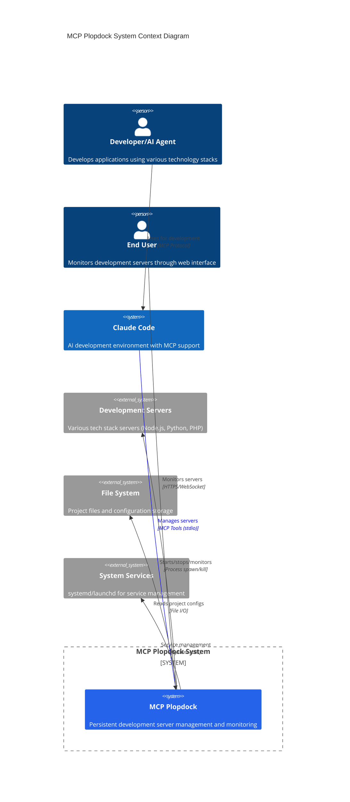
```mermaid
C4Context
  title MCP Plopdock System Context Diagram
  
  Person(developer, "Developer/AI Agent", "Develops applications using various technology stacks")
  Person(user, "End User", "Monitors development servers through web interface")
  
  System(claudeCode, "Claude Code", "AI development environment with MCP support")
  System_Boundary(mcpSystem, "MCP Plopdock System") {
    System(mcpPlopdock, "MCP Plopdock", "Persistent development server management and monitoring")
  }
  
  System_Ext(devServers, "Development Servers", "Various tech stack servers (Node.js, Python, PHP)")
  System_Ext(fileSystem, "File System", "Project files and configuration storage")
  System_Ext(systemServices, "System Services", "systemd/launchd for service management")
  
  Rel(developer, claudeCode, "Uses for development", "MCP Protocol")
  Rel(claudeCode, mcpPlopdock, "Manages servers", "MCP Tools (stdio)")
  Rel(user, mcpPlopdock, "Monitors servers", "HTTPS/WebSocket")
  Rel(mcpPlopdock, devServers, "Starts/stops/monitors", "Process spawn/kill")
  Rel(mcpPlopdock, fileSystem, "Reads project configs", "File I/O")
  Rel(mcpPlopdock, systemServices, "Service management", "System calls")
  
  UpdateElementStyle(mcpPlopdock, $fontColor="white", $bgColor="#2563eb")
  UpdateRelStyle(claudeCode, mcpPlopdock, $textColor="blue", $lineColor="blue")
```

#### Generic MCP Integration Context Template

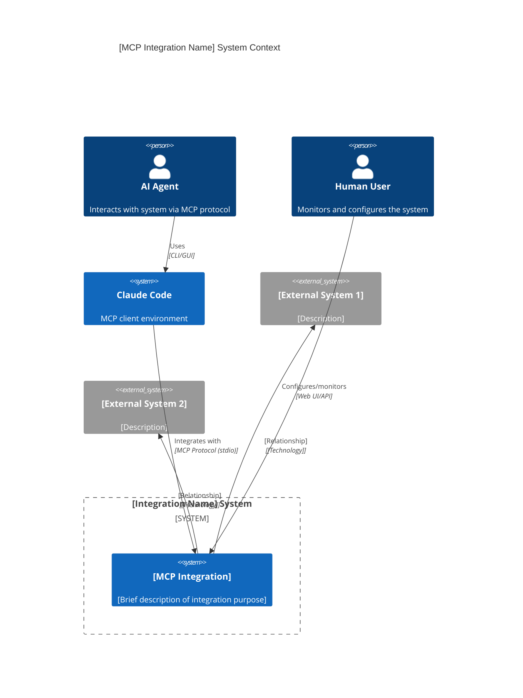
```mermaid
C4Context
  title [MCP Integration Name] System Context
  
  Person(aiAgent, "AI Agent", "Interacts with system via MCP protocol")
  Person(humanUser, "Human User", "Monitors and configures the system")
  
  System(claudeCode, "Claude Code", "MCP client environment")
  System_Boundary(mcpBoundary, "[Integration Name] System") {
    System(mcpIntegration, "[MCP Integration]", "[Brief description of integration purpose]")
  }
  
  System_Ext(externalSystem1, "[External System 1]", "[Description]")
  System_Ext(externalSystem2, "[External System 2]", "[Description]")
  
  Rel(aiAgent, claudeCode, "Uses", "CLI/GUI")
  Rel(claudeCode, mcpIntegration, "Integrates with", "MCP Protocol (stdio)")
  Rel(humanUser, mcpIntegration, "Configures/monitors", "Web UI/API")
  Rel(mcpIntegration, externalSystem1, "[Relationship]", "[Technology]")
  Rel(mcpIntegration, externalSystem2, "[Relationship]", "[Technology]")
```

### Level 2: Container Diagram

#### MCP Plopdock Container Architecture

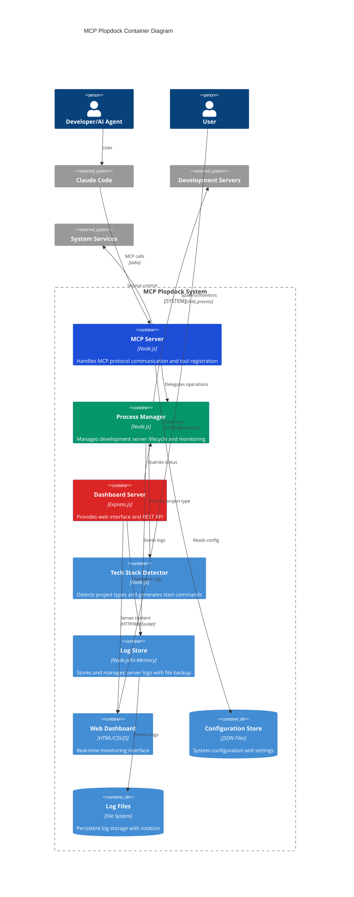
```mermaid
C4Container
  title MCP Plopdock Container Diagram
  
  Person(developer, "Developer/AI Agent")
  Person(user, "User")
  
  System_Boundary(mcpSystem, "MCP Plopdock System") {
    Container(mcpServer, "MCP Server", "Node.js", "Handles MCP protocol communication and tool registration")
    Container(processManager, "Process Manager", "Node.js", "Manages development server lifecycle and monitoring")
    Container(dashboardServer, "Dashboard Server", "Express.js", "Provides web interface and REST API")
    Container(techDetector, "Tech Stack Detector", "Node.js", "Detects project types and generates start commands")
    Container(logStore, "Log Store", "Node.js/In-Memory", "Stores and manages server logs with file backup")
    Container(webDashboard, "Web Dashboard", "HTML/CSS/JS", "Real-time monitoring interface")
    
    ContainerDb(configStore, "Configuration Store", "JSON Files", "System configuration and settings")
    ContainerDb(logFiles, "Log Files", "File System", "Persistent log storage with rotation")
  }
  
  System_Ext(claudeCode, "Claude Code")
  System_Ext(devServers, "Development Servers")
  System_Ext(systemServices, "System Services")
  
  Rel(developer, claudeCode, "Uses")
  Rel(claudeCode, mcpServer, "MCP calls", "stdio")
  Rel(user, webDashboard, "Views logs", "HTTPS/WebSocket")
  
  Rel(mcpServer, processManager, "Delegates operations")
  Rel(processManager, techDetector, "Detects project type")
  Rel(processManager, logStore, "Stores logs")
  Rel(processManager, devServers, "Spawns/monitors", "child_process")
  
  Rel(dashboardServer, processManager, "Queries status")
  Rel(dashboardServer, logStore, "Retrieves logs")
  Rel(dashboardServer, webDashboard, "Serves content", "HTTP/WebSocket")
  
  Rel(mcpServer, configStore, "Reads config")
  Rel(logStore, logFiles, "Persists logs")
  Rel(mcpServer, systemServices, "Service control")
  
  UpdateElementStyle(mcpServer, $fontColor="white", $bgColor="#1d4ed8")
  UpdateElementStyle(processManager, $fontColor="white", $bgColor="#059669")
  UpdateElementStyle(dashboardServer, $fontColor="white", $bgColor="#dc2626")
```

#### Generic MCP Container Template

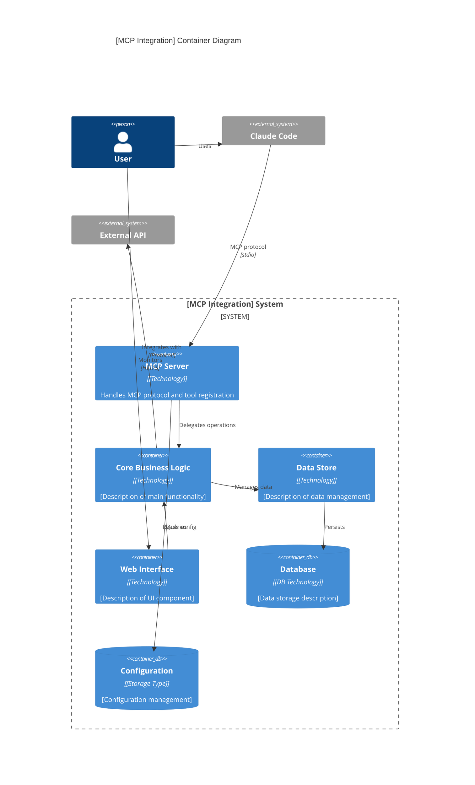
```mermaid
C4Container
  title [MCP Integration] Container Diagram
  
  Person(user, "User")
  System_Ext(claudeCode, "Claude Code")
  
  System_Boundary(integrationBoundary, "[MCP Integration] System") {
    Container(mcpServer, "MCP Server", "[Technology]", "Handles MCP protocol and tool registration")
    Container(coreLogic, "Core Business Logic", "[Technology]", "[Description of main functionality]")
    Container(dataStore, "Data Store", "[Technology]", "[Description of data management]")
    Container(webInterface, "Web Interface", "[Technology]", "[Description of UI component]")
    
    ContainerDb(database, "Database", "[DB Technology]", "[Data storage description]")
    ContainerDb(configStore, "Configuration", "[Storage Type]", "[Configuration management]")
  }
  
  System_Ext(externalAPI, "External API")
  
  Rel(user, claudeCode, "Uses")
  Rel(claudeCode, mcpServer, "MCP protocol", "stdio")
  Rel(mcpServer, coreLogic, "Delegates operations")
  Rel(coreLogic, dataStore, "Manages data")
  Rel(coreLogic, externalAPI, "Integrates with", "[Protocol]")
  Rel(user, webInterface, "Monitors", "HTTPS")
  Rel(webInterface, coreLogic, "Queries")
  Rel(dataStore, database, "Persists")
  Rel(mcpServer, configStore, "Reads config")
```

### Level 3: Component Diagram

#### Process Manager Component Architecture

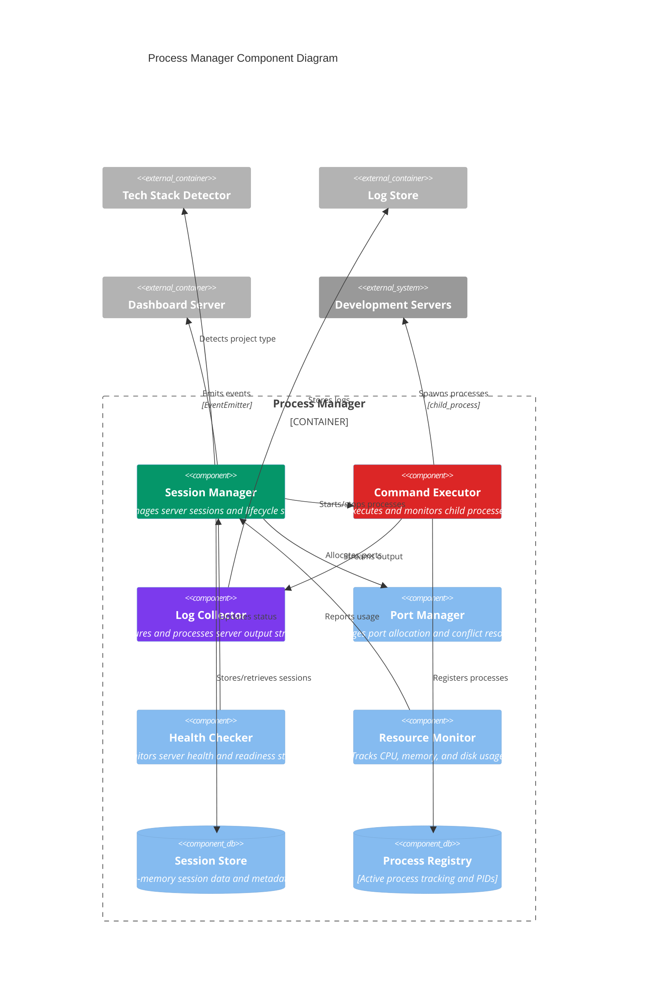
```mermaid
C4Component
  title Process Manager Component Diagram
  
  Container_Boundary(processManager, "Process Manager") {
    Component(sessionManager, "Session Manager", "Manages server sessions and lifecycle state")
    Component(commandExecutor, "Command Executor", "Executes and monitors child processes")
    Component(logCollector, "Log Collector", "Captures and processes server output streams")
    Component(portManager, "Port Manager", "Manages port allocation and conflict resolution")
    Component(healthChecker, "Health Checker", "Monitors server health and readiness status")
    Component(resourceMonitor, "Resource Monitor", "Tracks CPU, memory, and disk usage")
    
    ComponentDb(sessionStore, "Session Store", "In-memory session data and metadata")
    ComponentDb(processRegistry, "Process Registry", "Active process tracking and PIDs")
  }
  
  Container_Ext(techDetector, "Tech Stack Detector")
  Container_Ext(logStore, "Log Store")
  Container_Ext(dashboardServer, "Dashboard Server")
  System_Ext(devServers, "Development Servers")
  
  Rel(sessionManager, sessionStore, "Stores/retrieves sessions")
  Rel(sessionManager, commandExecutor, "Starts/stops processes")
  Rel(sessionManager, portManager, "Allocates ports")
  Rel(sessionManager, techDetector, "Detects project type")
  
  Rel(commandExecutor, processRegistry, "Registers processes")
  Rel(commandExecutor, devServers, "Spawns processes", "child_process")
  Rel(commandExecutor, logCollector, "Streams output")
  
  Rel(logCollector, logStore, "Stores logs")
  Rel(healthChecker, sessionManager, "Updates status")
  Rel(resourceMonitor, sessionManager, "Reports usage")
  
  Rel(sessionManager, dashboardServer, "Emits events", "EventEmitter")
  
  UpdateElementStyle(sessionManager, $fontColor="white", $bgColor="#059669")
  UpdateElementStyle(commandExecutor, $fontColor="white", $bgColor="#dc2626")
  UpdateElementStyle(logCollector, $fontColor="white", $bgColor="#7c3aed")
```

#### Generic Component Template

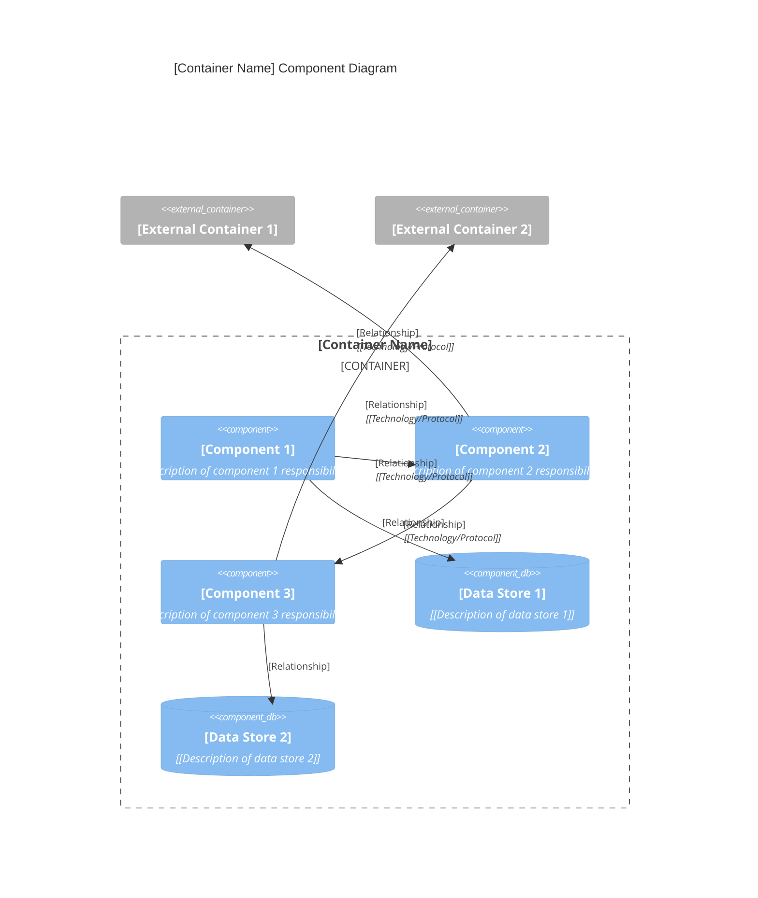
```mermaid
C4Component
  title [Container Name] Component Diagram
  
  Container_Boundary(containerBoundary, "[Container Name]") {
    Component(component1, "[Component 1]", "[Description of component 1 responsibilities]")
    Component(component2, "[Component 2]", "[Description of component 2 responsibilities]")
    Component(component3, "[Component 3]", "[Description of component 3 responsibilities]")
    
    ComponentDb(dataStore1, "[Data Store 1]", "[Description of data store 1]")
    ComponentDb(dataStore2, "[Data Store 2]", "[Description of data store 2]")
  }
  
  Container_Ext(externalContainer1, "[External Container 1]")
  Container_Ext(externalContainer2, "[External Container 2]")
  
  Rel(component1, component2, "[Relationship]", "[Technology/Protocol]")
  Rel(component2, component3, "[Relationship]", "[Technology/Protocol]")
  Rel(component1, dataStore1, "[Relationship]")
  Rel(component3, dataStore2, "[Relationship]")
  Rel(component2, externalContainer1, "[Relationship]", "[Technology/Protocol]")
  Rel(component3, externalContainer2, "[Relationship]", "[Technology/Protocol]")
```

## Sequence Diagrams

### MCP Server Start Sequence

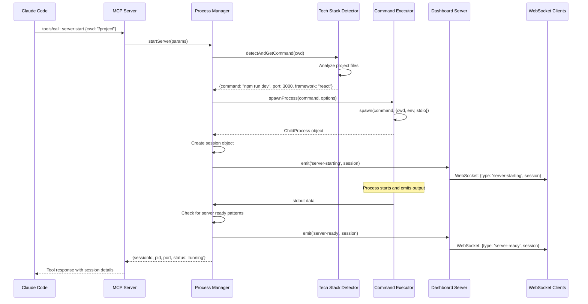
```mermaid
sequenceDiagram
  participant CC as Claude Code
  participant MCP as MCP Server
  participant PM as Process Manager
  participant TD as Tech Stack Detector
  participant CE as Command Executor
  participant DS as Dashboard Server
  participant WC as WebSocket Clients

  CC->>MCP: tools/call: server:start {cwd: "/project"}
  MCP->>PM: startServer(params)
  
  PM->>TD: detectAndGetCommand(cwd)
  TD->>TD: Analyze project files
  TD-->>PM: {command: "npm run dev", port: 3000, framework: "react"}
  
  PM->>CE: spawnProcess(command, options)
  CE->>CE: spawn(command, {cwd, env, stdio})
  CE-->>PM: ChildProcess object
  
  PM->>PM: Create session object
  PM->>DS: emit('server-starting', session)
  DS->>WC: WebSocket: {type: 'server-starting', session}
  
  Note over CE: Process starts and emits output
  CE->>PM: stdout data
  PM->>PM: Check for server ready patterns
  PM->>DS: emit('server-ready', session)
  DS->>WC: WebSocket: {type: 'server-ready', session}
  
  PM-->>MCP: {sessionId, pid, port, status: 'running'}
  MCP-->>CC: Tool response with session details
```

### Log Streaming Sequence

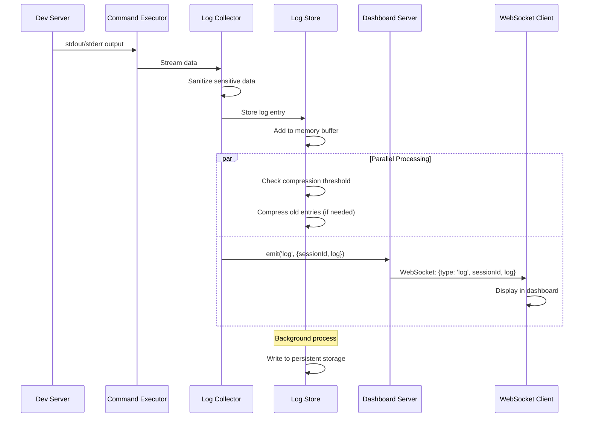
```mermaid
sequenceDiagram
  participant DS as Dev Server
  participant CE as Command Executor
  participant LC as Log Collector
  participant LS as Log Store
  participant DSrv as Dashboard Server
  participant WC as WebSocket Client

  DS->>CE: stdout/stderr output
  CE->>LC: Stream data
  LC->>LC: Sanitize sensitive data
  LC->>LS: Store log entry
  LS->>LS: Add to memory buffer
  
  par Parallel Processing
    LS->>LS: Check compression threshold
    LS->>LS: Compress old entries (if needed)
  and
    LC->>DSrv: emit('log', {sessionId, log})
    DSrv->>WC: WebSocket: {type: 'log', sessionId, log}
    WC->>WC: Display in dashboard
  end
  
  Note over LS: Background process
  LS->>LS: Write to persistent storage
```

### Error Handling Sequence

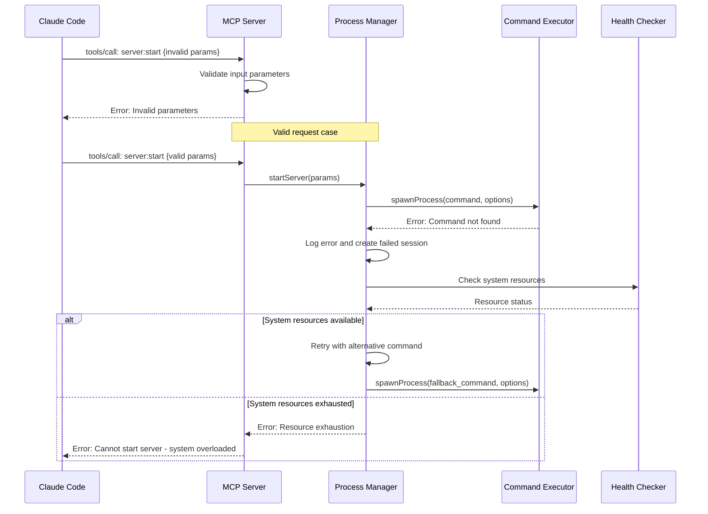
```mermaid
sequenceDiagram
  participant CC as Claude Code
  participant MCP as MCP Server
  participant PM as Process Manager
  participant CE as Command Executor
  participant HC as Health Checker

  CC->>MCP: tools/call: server:start {invalid params}
  MCP->>MCP: Validate input parameters
  MCP-->>CC: Error: Invalid parameters
  
  Note over MCP, PM: Valid request case
  CC->>MCP: tools/call: server:start {valid params}
  MCP->>PM: startServer(params)
  PM->>CE: spawnProcess(command, options)
  CE-->>PM: Error: Command not found
  
  PM->>PM: Log error and create failed session
  PM->>HC: Check system resources
  HC-->>PM: Resource status
  
  alt System resources available
    PM->>PM: Retry with alternative command
    PM->>CE: spawnProcess(fallback_command, options)
  else System resources exhausted
    PM-->>MCP: Error: Resource exhaustion
    MCP-->>CC: Error: Cannot start server - system overloaded
  end
```

## Data Flow Diagrams

### MCP Tool Request Processing

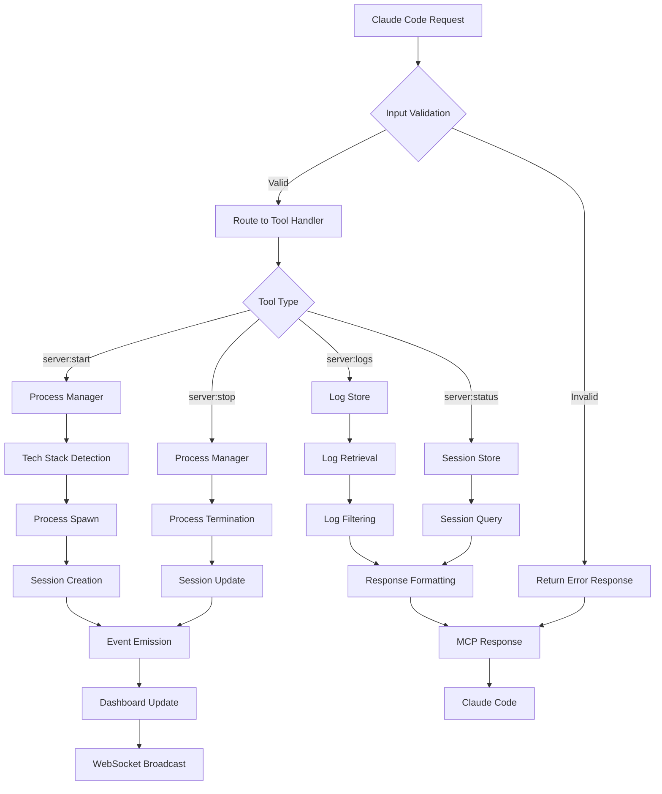
```mermaid
flowchart TD
  A[Claude Code Request] --> B{Input Validation}
  B -->|Valid| C[Route to Tool Handler]
  B -->|Invalid| D[Return Error Response]
  
  C --> E{Tool Type}
  E -->|server:start| F[Process Manager]
  E -->|server:stop| G[Process Manager]
  E -->|server:logs| H[Log Store]
  E -->|server:status| I[Session Store]
  
  F --> J[Tech Stack Detection]
  J --> K[Process Spawn]
  K --> L[Session Creation]
  L --> M[Event Emission]
  
  G --> N[Process Termination]
  N --> O[Session Update]
  O --> M
  
  H --> P[Log Retrieval]
  P --> Q[Log Filtering]
  Q --> R[Response Formatting]
  
  I --> S[Session Query]
  S --> R
  
  M --> T[Dashboard Update]
  T --> U[WebSocket Broadcast]
  
  R --> V[MCP Response]
  V --> W[Claude Code]
  
  D --> V
```

### Log Processing Pipeline

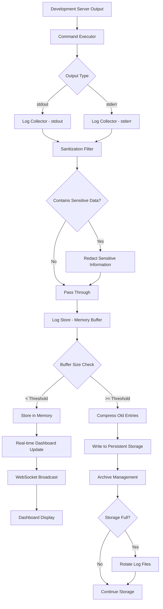
```mermaid
flowchart TD
  A[Development Server Output] --> B[Command Executor]
  B --> C{Output Type}
  C -->|stdout| D[Log Collector - stdout]
  C -->|stderr| E[Log Collector - stderr]
  
  D --> F[Sanitization Filter]
  E --> F
  F --> G{Contains Sensitive Data?}
  G -->|Yes| H[Redact Sensitive Information]
  G -->|No| I[Pass Through]
  H --> I
  
  I --> J[Log Store - Memory Buffer]
  J --> K{Buffer Size Check}
  K -->|< Threshold| L[Store in Memory]
  K -->|>= Threshold| M[Compress Old Entries]
  
  L --> N[Real-time Dashboard Update]
  M --> O[Write to Persistent Storage]
  O --> P[Archive Management]
  
  N --> Q[WebSocket Broadcast]
  Q --> R[Dashboard Display]
  
  P --> S{Storage Full?}
  S -->|Yes| T[Rotate Log Files]
  S -->|No| U[Continue Storage]
  T --> U
```

## Deployment Diagrams

### Single-Node Deployment

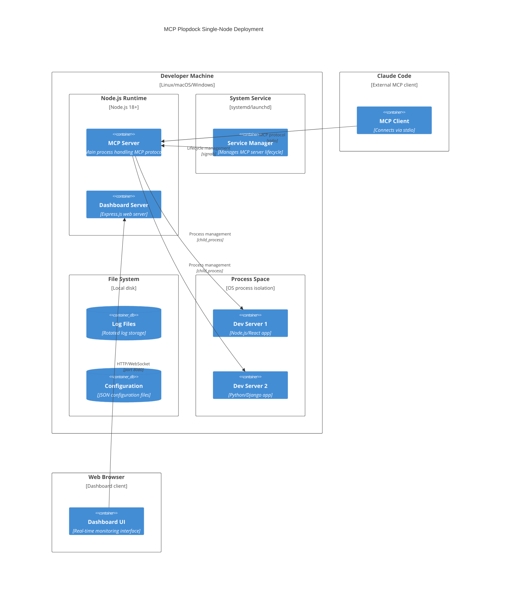
```mermaid
C4Deployment
  title MCP Plopdock Single-Node Deployment
  
  Deployment_Node(userMachine, "Developer Machine", "Linux/macOS/Windows") {
    Deployment_Node(nodeRuntime, "Node.js Runtime", "Node.js 18+") {
      Container(mcpServer, "MCP Server", "Main process handling MCP protocol")
      Container(dashboardServer, "Dashboard Server", "Express.js web server")
    }
    
    Deployment_Node(systemService, "System Service", "systemd/launchd") {
      Container(serviceWrapper, "Service Manager", "Manages MCP server lifecycle")
    }
    
    Deployment_Node(fileSystem, "File System", "Local disk") {
      ContainerDb(logs, "Log Files", "Rotated log storage")
      ContainerDb(config, "Configuration", "JSON configuration files")
    }
    
    Deployment_Node(processSpace, "Process Space", "OS process isolation") {
      Container(devServer1, "Dev Server 1", "Node.js/React app")
      Container(devServer2, "Dev Server 2", "Python/Django app")
    }
  }
  
  Deployment_Node(claudeCode, "Claude Code", "External MCP client") {
    Container(mcpClient, "MCP Client", "Connects via stdio")
  }
  
  Deployment_Node(browser, "Web Browser", "Dashboard client") {
    Container(dashboard, "Dashboard UI", "Real-time monitoring interface")
  }
  
  Rel(mcpClient, mcpServer, "MCP protocol", "stdio")
  Rel(dashboard, dashboardServer, "HTTP/WebSocket", "port 8080")
  Rel(mcpServer, devServer1, "Process management", "child_process")
  Rel(mcpServer, devServer2, "Process management", "child_process")
  Rel(serviceWrapper, mcpServer, "Lifecycle management", "signals")
```

### Container-Based Deployment

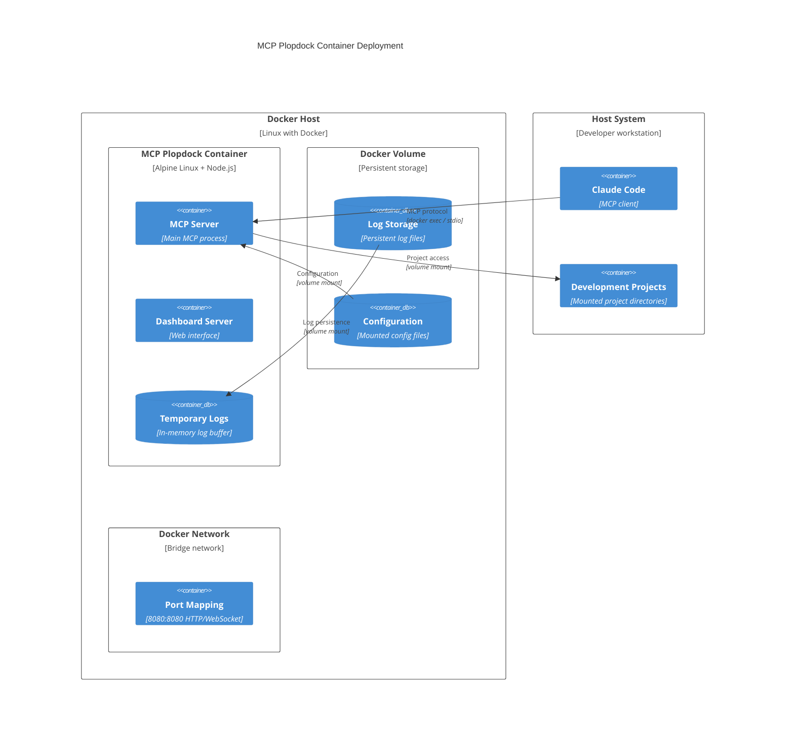
```mermaid
C4Deployment
  title MCP Plopdock Container Deployment
  
  Deployment_Node(dockerHost, "Docker Host", "Linux with Docker") {
    Deployment_Node(mcpContainer, "MCP Plopdock Container", "Alpine Linux + Node.js") {
      Container(mcpServer, "MCP Server", "Main MCP process")
      Container(dashboardServer, "Dashboard Server", "Web interface")
      ContainerDb(tempLogs, "Temporary Logs", "In-memory log buffer")
    }
    
    Deployment_Node(volumeMount, "Docker Volume", "Persistent storage") {
      ContainerDb(persistentLogs, "Log Storage", "Persistent log files")
      ContainerDb(configMount, "Configuration", "Mounted config files")
    }
    
    Deployment_Node(networkBridge, "Docker Network", "Bridge network") {
      Container(portMapping, "Port Mapping", "8080:8080 HTTP/WebSocket")
    }
  }
  
  Deployment_Node(hostSystem, "Host System", "Developer workstation") {
    Container(claudeCode, "Claude Code", "MCP client")
    Container(devProjects, "Development Projects", "Mounted project directories")
  }
  
  Rel(claudeCode, mcpServer, "MCP protocol", "docker exec / stdio")
  Rel(mcpServer, devProjects, "Project access", "volume mount")
  Rel(persistentLogs, tempLogs, "Log persistence", "volume mount")
  Rel(configMount, mcpServer, "Configuration", "volume mount")
```

### Kubernetes Deployment

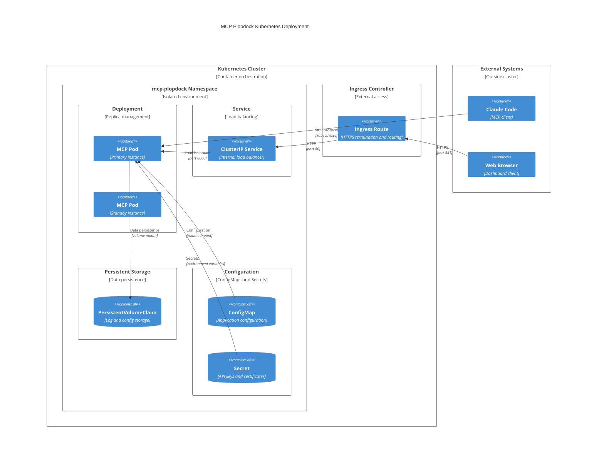
```mermaid
C4Deployment
  title MCP Plopdock Kubernetes Deployment
  
  Deployment_Node(k8sCluster, "Kubernetes Cluster", "Container orchestration") {
    Deployment_Node(namespace, "mcp-plopdock Namespace", "Isolated environment") {
      Deployment_Node(deployment, "Deployment", "Replica management") {
        Container(mcpPod1, "MCP Pod", "Primary instance")
        Container(mcpPod2, "MCP Pod", "Standby instance")
      }
      
      Deployment_Node(service, "Service", "Load balancing") {
        Container(loadBalancer, "ClusterIP Service", "Internal load balancer")
      }
      
      Deployment_Node(storage, "Persistent Storage", "Data persistence") {
        ContainerDb(pvc, "PersistentVolumeClaim", "Log and config storage")
      }
      
      Deployment_Node(config, "Configuration", "ConfigMaps and Secrets") {
        ContainerDb(configMap, "ConfigMap", "Application configuration")
        ContainerDb(secret, "Secret", "API keys and certificates")
      }
    }
    
    Deployment_Node(ingress, "Ingress Controller", "External access") {
      Container(ingressRoute, "Ingress Route", "HTTPS termination and routing")
    }
  }
  
  Deployment_Node(external, "External Systems", "Outside cluster") {
    Container(claudeCode, "Claude Code", "MCP client")
    Container(webBrowser, "Web Browser", "Dashboard client")
  }
  
  Rel(claudeCode, mcpPod1, "MCP protocol", "kubectl exec")
  Rel(webBrowser, ingressRoute, "HTTPS", "port 443")
  Rel(ingressRoute, loadBalancer, "HTTP", "port 80")
  Rel(loadBalancer, mcpPod1, "Load balanced", "port 8080")
  Rel(mcpPod1, pvc, "Data persistence", "volume mount")
  Rel(configMap, mcpPod1, "Configuration", "volume mount")
  Rel(secret, mcpPod1, "Secrets", "environment variables")
```

## Network Architecture Diagrams

### Security Zones and Trust Boundaries

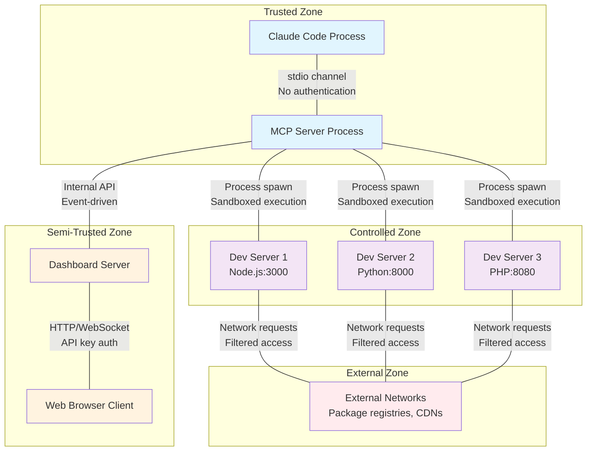
```mermaid
flowchart TB
  subgraph "Trusted Zone"
    direction TB
    CC[Claude Code Process]
    MCP[MCP Server Process]
    CC ---|stdio channel<br/>No authentication| MCP
  end
  
  subgraph "Semi-Trusted Zone"
    direction TB
    DS[Dashboard Server]
    WB[Web Browser Client]
    DS ---|HTTP/WebSocket<br/>API key auth| WB
  end
  
  subgraph "Controlled Zone"
    direction TB
    DEV1[Dev Server 1<br/>Node.js:3000]
    DEV2[Dev Server 2<br/>Python:8000]
    DEV3[Dev Server 3<br/>PHP:8080]
  end
  
  subgraph "External Zone"
    direction TB
    EXT[External Networks<br/>Package registries, CDNs]
  end
  
  MCP ---|Process spawn<br/>Sandboxed execution| DEV1
  MCP ---|Process spawn<br/>Sandboxed execution| DEV2
  MCP ---|Process spawn<br/>Sandboxed execution| DEV3
  
  MCP ---|Internal API<br/>Event-driven| DS
  
  DEV1 ---|Network requests<br/>Filtered access| EXT
  DEV2 ---|Network requests<br/>Filtered access| EXT
  DEV3 ---|Network requests<br/>Filtered access| EXT
  
  style CC fill:#e1f5fe
  style MCP fill:#e1f5fe
  style DS fill:#fff3e0
  style WB fill:#fff3e0
  style DEV1 fill:#f3e5f5
  style DEV2 fill:#f3e5f5
  style DEV3 fill:#f3e5f5
  style EXT fill:#ffebee
```

### Port Allocation and Network Flow

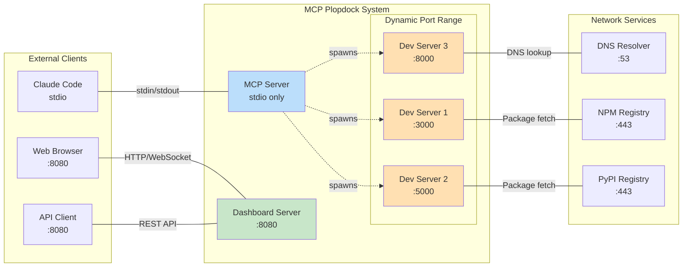
```mermaid
flowchart LR
  subgraph "MCP Plopdock System"
    direction TB
    MCP[MCP Server<br/>stdio only]
    DS[Dashboard Server<br/>:8080]
    
    subgraph "Dynamic Port Range"
      DEV1[Dev Server 1<br/>:3000]
      DEV2[Dev Server 2<br/>:5000]
      DEV3[Dev Server 3<br/>:8000]
    end
  end
  
  subgraph "External Clients"
    CC[Claude Code<br/>stdio]
    WB[Web Browser<br/>:8080]
    CURL[API Client<br/>:8080]
  end
  
  subgraph "Network Services"
    DNS[DNS Resolver<br/>:53]
    NPM[NPM Registry<br/>:443]
    PIP[PyPI Registry<br/>:443]
  end
  
  CC ---|stdin/stdout| MCP
  WB ---|HTTP/WebSocket| DS
  CURL ---|REST API| DS
  
  MCP -.->|spawns| DEV1
  MCP -.->|spawns| DEV2
  MCP -.->|spawns| DEV3
  
  DEV1 ---|Package fetch| NPM
  DEV2 ---|Package fetch| PIP
  DEV3 ---|DNS lookup| DNS
  
  style MCP fill:#bbdefb
  style DS fill:#c8e6c9
  style DEV1 fill:#ffe0b2
  style DEV2 fill:#ffe0b2
  style DEV3 fill:#ffe0b2
```

## Monitoring and Observability Diagrams

### Metrics Collection Architecture

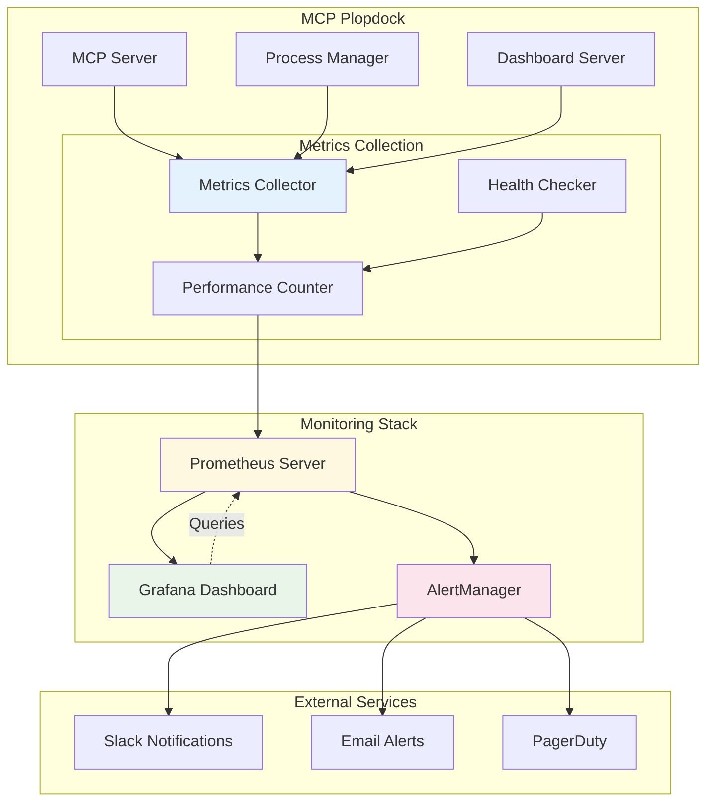
```mermaid
flowchart TD
  subgraph "MCP Plopdock"
    MCP[MCP Server]
    PM[Process Manager]
    DS[Dashboard Server]
    
    subgraph "Metrics Collection"
      MC[Metrics Collector]
      HC[Health Checker]
      PC[Performance Counter]
    end
  end
  
  subgraph "Monitoring Stack"
    PROM[Prometheus Server]
    GRAF[Grafana Dashboard]
    AM[AlertManager]
  end
  
  subgraph "External Services"
    SLACK[Slack Notifications]
    EMAIL[Email Alerts]
    PD[PagerDuty]
  end
  
  MCP --> MC
  PM --> MC
  DS --> MC
  
  MC --> PC
  HC --> PC
  PC --> PROM
  
  PROM --> GRAF
  PROM --> AM
  
  AM --> SLACK
  AM --> EMAIL
  AM --> PD
  
  GRAF -.->|Queries| PROM
  
  style MC fill:#e3f2fd
  style PROM fill:#fff8e1
  style GRAF fill:#e8f5e8
  style AM fill:#fce4ec
```

### Log Aggregation Flow

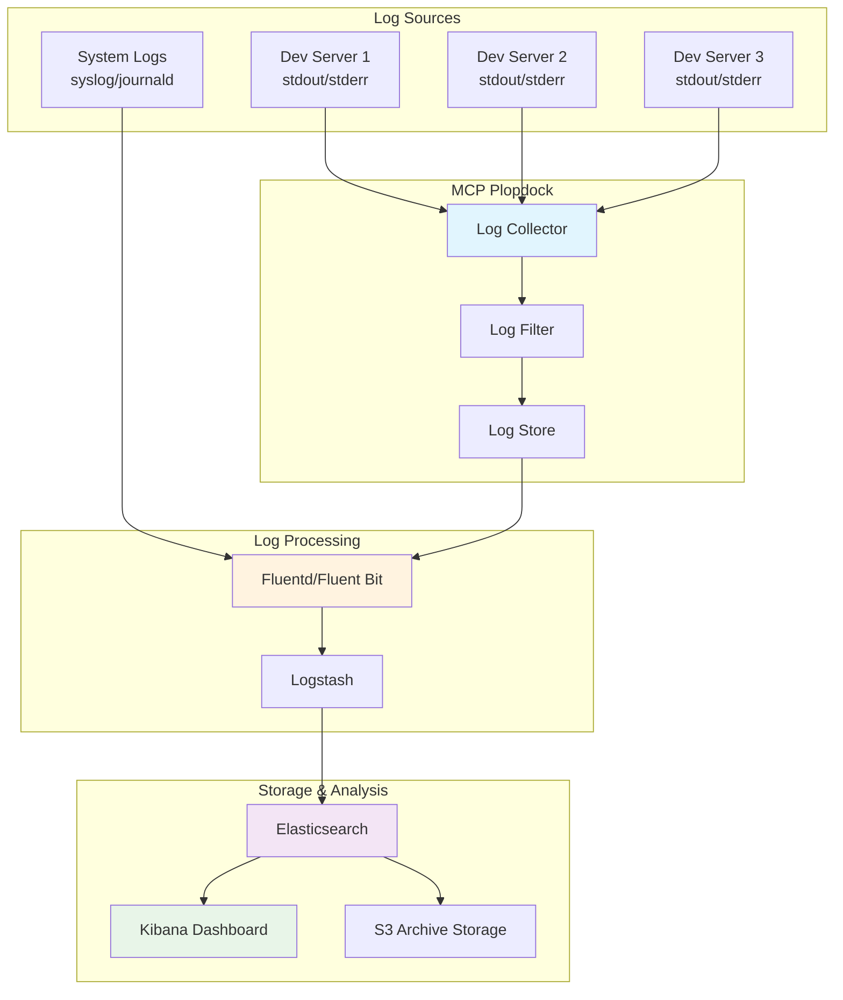
```mermaid
flowchart TB
  subgraph "Log Sources"
    DEV1[Dev Server 1<br/>stdout/stderr]
    DEV2[Dev Server 2<br/>stdout/stderr]
    DEV3[Dev Server 3<br/>stdout/stderr]
    SYS[System Logs<br/>syslog/journald]
  end
  
  subgraph "MCP Plopdock"
    LC[Log Collector]
    LS[Log Store]
    LF[Log Filter]
  end
  
  subgraph "Log Processing"
    direction TB
    FLUENTD[Fluentd/Fluent Bit]
    LOGSTASH[Logstash]
  end
  
  subgraph "Storage & Analysis"
    ES[Elasticsearch]
    KIBANA[Kibana Dashboard]
    S3[S3 Archive Storage]
  end
  
  DEV1 --> LC
  DEV2 --> LC
  DEV3 --> LC
  SYS --> FLUENTD
  
  LC --> LF
  LF --> LS
  LS --> FLUENTD
  
  FLUENTD --> LOGSTASH
  LOGSTASH --> ES
  
  ES --> KIBANA
  ES --> S3
  
  style LC fill:#e1f5fe
  style FLUENTD fill:#fff3e0
  style ES fill:#f3e5f5
  style KIBANA fill:#e8f5e8
```

## Template Usage Guidelines

### Creating New Architecture Diagrams

1. **Choose Appropriate Level**: Start with C4 Level 1 for system overview, drill down as needed
2. **Use Consistent Styling**: Apply color coding and styling consistently across related diagrams
3. **Include Context**: Always show external systems and user interactions
4. **Update Related Diagrams**: Ensure all levels remain synchronized when making changes

### Diagram Maintenance

1. **Version Control**: Store diagram source code in version control with meaningful commit messages
2. **Review Process**: Include architecture diagrams in code review process
3. **Update Frequency**: Review and update diagrams quarterly or after major changes
4. **Validation**: Verify diagrams match actual implementation

### Tool Recommendations

- **Mermaid**: For version-controlled, text-based diagrams
- **Draw.io/Lucidchart**: For collaborative editing and complex layouts  
- **PlantUML**: For programmatic diagram generation
- **Structurizr**: For C4 model-specific tooling

---

**Document Control**:
- **Version**: 1.0.0
- **Classification**: Internal Use  
- **Review Cycle**: Quarterly
- **Next Review**: 2025-11-01
- **Approver**: System Architect
- **Distribution**: Development Team, QA Team, DevOps Team