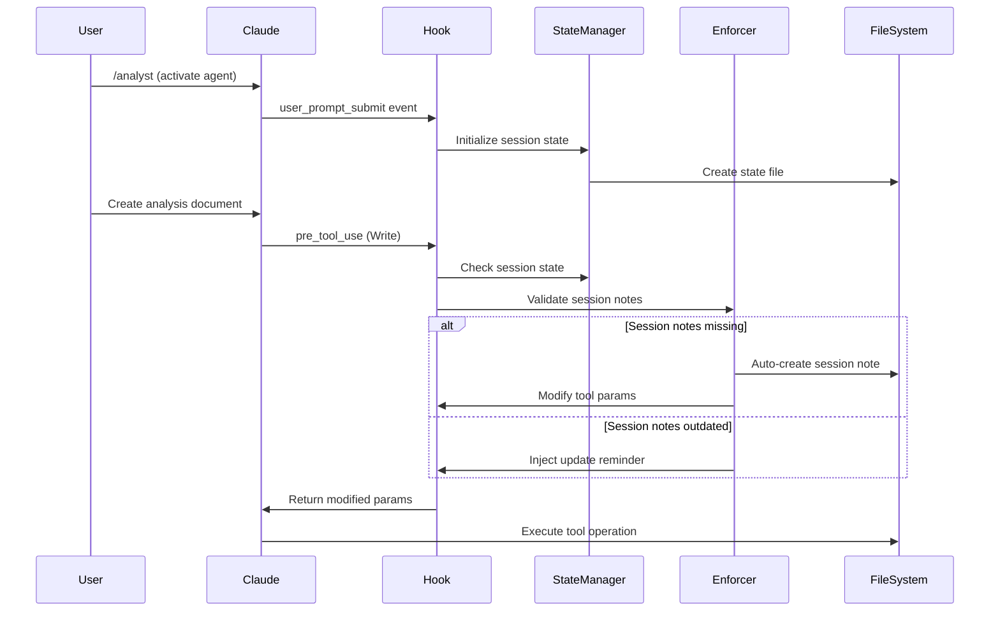

# Session Notes Enforcement Hook - Technical Architecture

**Document Type**: Technical Architecture Specification  
**Date**: 2025-08-14  
**Author**: APM Architect Agent  
**Status**: DRAFT v1.0  
**Implementation Target**: APM Framework v4.0.5  

---

## 🎯 Executive Summary

This document provides the complete technical architecture for implementing an automated Session Notes Enforcement Hook within the APM Framework. The design leverages proven patterns from the existing document location enforcer while introducing novel session state management capabilities.

**Key Architecture Decisions:**
- File-based session state persistence with JSON serialization
- Multi-signal agent detection with weighted scoring
- Non-blocking error handling (always exit 0)
- Registry-driven configuration for flexibility
- 70% code reuse from location enforcer pattern

---

## 📐 System Architecture

### High-Level Component Architecture

```
┌─────────────────────────────────────────────────────────────────┐
│                  Session Notes Enforcement System                │
├─────────────────────────────────────────────────────────────────┤
│                                                                   │
│  ┌─────────────────────────────────────────────────────────┐    │
│  │                  Hook Entry Points                       │    │
│  ├─────────────────────────────────────────────────────────┤    │
│  │ • user_prompt_submit → Agent activation detection       │    │
│  │ • pre_tool_use → Write/Edit operation interception      │    │
│  │ • post_tool_use → Validation and verification           │    │
│  │ • pre_compact → Archive before context loss             │    │
│  └─────────────────────────────────────────────────────────┘    │
│                               ↓                                  │
│  ┌─────────────────────────────────────────────────────────┐    │
│  │              Core Processing Engine                      │    │
│  ├─────────────────────────────────────────────────────────┤    │
│  │                                                          │    │
│  │  ┌──────────────┐  ┌──────────────┐  ┌──────────────┐ │    │
│  │  │ Agent        │  │ Session      │  │ Content      │ │    │
│  │  │ Detector     │  │ State        │  │ Validator    │ │    │
│  │  │              │  │ Manager      │  │              │ │    │
│  │  └──────────────┘  └──────────────┘  └──────────────┘ │    │
│  │                                                          │    │
│  │  ┌──────────────┐  ┌──────────────┐  ┌──────────────┐ │    │
│  │  │ Enforcement  │  │ Template     │  │ Audit        │ │    │
│  │  │ Engine       │  │ Generator    │  │ Logger       │ │    │
│  │  └──────────────┘  └──────────────┘  └──────────────┘ │    │
│  └─────────────────────────────────────────────────────────┘    │
│                               ↓                                  │
│  ┌─────────────────────────────────────────────────────────┐    │
│  │                  Data Persistence Layer                  │    │
│  ├─────────────────────────────────────────────────────────┤    │
│  │ • Session State Files (/tmp/claude_session_*.json)      │    │
│  │ • Configuration Registry (/.apm/config/*.json)          │    │
│  │ • Audit Logs (/.apm/logs/session_enforcement/)          │    │
│  │ • Session Notes (/.apm/session_notes/)                  │    │
│  └─────────────────────────────────────────────────────────┘    │
└─────────────────────────────────────────────────────────────────┘
```

### Component Interaction Flow



---

## 🔧 Core Components Specification

### 1. SessionNotesEnforcer Class

```python
class SessionNotesEnforcer:
    """Main enforcement engine for session notes compliance"""
    
    def __init__(self, config_path: str = None):
        self.config = self.load_config(config_path)
        self.state_manager = SessionStateManager()
        self.agent_detector = AgentDetector()
        self.content_validator = ContentValidator()
        self.template_generator = TemplateGenerator()
        self.audit_logger = AuditLogger()
        
    def process_hook(self, hook_type: str, params: dict, context: dict) -> dict:
        """Main entry point for all hook events"""
        try:
            if hook_type == 'user_prompt_submit':
                return self.handle_prompt_submit(params, context)
            elif hook_type == 'pre_tool_use':
                return self.handle_pre_tool_use(params, context)
            elif hook_type == 'post_tool_use':
                return self.handle_post_tool_use(params, context)
            elif hook_type == 'pre_compact':
                return self.handle_pre_compact(params, context)
        except Exception as e:
            self.audit_logger.log_error(f"Enforcement error: {e}")
            return params  # Non-blocking design
```

### 2. SessionStateManager Class

```python
class SessionStateManager:
    """Manages persistent session state across hook invocations"""
    
    STATE_DIR = "/tmp/claude_sessions"
    STATE_RETENTION_HOURS = 24
    
    def __init__(self):
        self.session_id = self.get_or_create_session_id()
        self.state_file = f"{self.STATE_DIR}/session_{self.session_id}.json"
        self.state = self.load_or_create_state()
        
    def load_or_create_state(self) -> dict:
        """Load existing state or create new with defaults"""
        if os.path.exists(self.state_file):
            with open(self.state_file, 'r') as f:
                state = json.load(f)
                # Validate and migrate if needed
                return self.validate_state(state)
        return self.create_default_state()
    
    def create_default_state(self) -> dict:
        return {
            "session_id": self.session_id,
            "created_at": datetime.now().isoformat(),
            "last_activity": datetime.now().isoformat(),
            "active_agent": None,
            "agent_history": [],
            "session_note_path": None,
            "last_note_update": None,
            "work_items": [],
            "update_reminders_sent": 0,
            "enforcement_stats": {
                "auto_creates": 0,
                "corrections": 0,
                "validations": 0,
                "reminders": 0
            }
        }
    
    def update_state(self, updates: dict):
        """Thread-safe state update with file locking"""
        with FileLock(f"{self.state_file}.lock"):
            self.state.update(updates)
            self.state["last_activity"] = datetime.now().isoformat()
            self.save_state()
    
    def cleanup_orphaned_sessions(self):
        """Remove stale session files older than retention period"""
        cutoff = datetime.now() - timedelta(hours=self.STATE_RETENTION_HOURS)
        for file in os.listdir(self.STATE_DIR):
            if file.startswith("session_"):
                filepath = os.path.join(self.STATE_DIR, file)
                if datetime.fromtimestamp(os.path.getmtime(filepath)) < cutoff:
                    os.remove(filepath)
```

### 3. AgentDetector Class

```python
class AgentDetector:
    """Multi-signal agent persona detection system"""
    
    COMMAND_PATTERNS = {
        'analyst': [r'/analyst', r'/Analyst', r'activate.*analyst'],
        'pm': [r'/pm', r'/PM', r'project.*manager'],
        'architect': [r'/architect', r'/Architect'],
        'developer': [r'/dev', r'/developer', r'/Developer'],
        'qa': [r'/qa', r'/QA', r'quality.*assurance'],
        'po': [r'/po', r'/PO', r'product.*owner'],
        'sm': [r'/sm', r'/SM', r'scrum.*master'],
        'orchestrator': [r'/ap_orchestrator', r'/ap', r'/orchestrator']
    }
    
    CONTENT_MARKERS = {
        'analyst': ['Requirements Analysis', 'Stakeholder Interview', 'Gap Analysis'],
        'pm': ['Project Timeline', 'Resource Allocation', 'Risk Matrix'],
        'architect': ['System Design', 'Architecture Decision', 'Component Diagram'],
        'developer': ['Implementation', 'Code Review', 'Unit Tests'],
        'qa': ['Test Plan', 'Test Results', 'Bug Report', 'Quality Metrics'],
        'po': ['User Story', 'Acceptance Criteria', 'Product Backlog'],
        'sm': ['Sprint Planning', 'Daily Standup', 'Retrospective']
    }
    
    def detect_agent(self, prompt: str = None, content: str = None, 
                    context: dict = None) -> tuple[str, float]:
        """
        Detect active agent using multi-signal approach
        Returns: (agent_name, confidence_score)
        """
        scores = {}
        
        # Signal 1: Direct command detection (highest weight)
        if prompt:
            for agent, patterns in self.COMMAND_PATTERNS.items():
                for pattern in patterns:
                    if re.search(pattern, prompt, re.IGNORECASE):
                        scores[agent] = scores.get(agent, 0) + 50
        
        # Signal 2: Content markers (medium weight)
        if content:
            for agent, markers in self.CONTENT_MARKERS.items():
                for marker in markers:
                    if marker.lower() in content.lower():
                        scores[agent] = scores.get(agent, 0) + 20
        
        # Signal 3: Context hints (lower weight)
        if context and 'agent_persona' in context:
            agent = context['agent_persona'].lower()
            if agent in scores:
                scores[agent] += 30
        
        # Return highest scoring agent
        if scores:
            best_agent = max(scores, key=scores.get)
            confidence = min(scores[best_agent], 100)
            return best_agent, confidence
        
        return None, 0
```

### 4. EnforcementEngine Class

```python
class EnforcementEngine:
    """Core enforcement logic for session notes"""
    
    UPDATE_INTERVAL_MINUTES = 15
    REQUIRED_SECTIONS = [
        "## Current Work",
        "## Key Decisions",
        "## Next Steps"
    ]
    
    def enforce_session_notes(self, tool_name: str, params: dict, 
                             state: dict, agent: str) -> dict:
        """Main enforcement logic"""
        
        # Check if this is a session note operation
        if self.is_session_note_operation(params):
            return self.validate_session_note_content(params)
        
        # Check if session notes need creation
        if not state.get('session_note_path'):
            return self.create_session_note(params, state, agent)
        
        # Check if update reminder needed
        if self.needs_update_reminder(state):
            return self.inject_update_reminder(params, state)
        
        return params
    
    def create_session_note(self, params: dict, state: dict, agent: str) -> dict:
        """Auto-create session note for active agent"""
        timestamp = datetime.now().strftime('%Y-%m-%d-%H-%M-%S')
        note_path = f"/.apm/session_notes/{timestamp}-{agent}-session.md"
        
        # Generate template content
        template = self.generate_session_template(agent, timestamp)
        
        # Modify params to create session note first
        if params.get('tool_name') == 'Write':
            # Store original operation for later
            state['pending_operation'] = params.copy()
            
            # Replace with session note creation
            params['file_path'] = note_path
            params['content'] = template
            params['_auto_created'] = True
            
            # Update state
            state['session_note_path'] = note_path
            state['last_note_update'] = datetime.now().isoformat()
            
            # Add audit message
            self.audit_logger.log_enforcement(
                f"Auto-created session note for {agent} agent"
            )
        
        return params
    
    def inject_update_reminder(self, params: dict, state: dict) -> dict:
        """Inject reminder to update session notes"""
        if params.get('tool_name') in ['Write', 'Edit']:
            content = params.get('content', '')
            reminder = (
                "\n\n---\n"
                "📝 **Session Note Reminder**: Your session notes haven't been "
                f"updated in {self.get_time_since_update(state)} minutes. "
                f"Consider updating: {state['session_note_path']}\n"
                "---\n\n"
            )
            params['content'] = reminder + content
            state['update_reminders_sent'] += 1
        
        return params
```

### 5. ContentValidator Class

```python
class ContentValidator:
    """Validates session note content completeness"""
    
    REQUIRED_SECTIONS = {
        'header': r'^#\s+.+Session.+$',
        'date': r'^\*\*Date\*\*:\s+\d{4}-\d{2}-\d{2}',
        'agent': r'^\*\*Agent\*\*:\s+\w+',
        'current_work': r'^##\s+Current Work',
        'key_decisions': r'^##\s+Key Decisions',
        'next_steps': r'^##\s+Next Steps'
    }
    
    def validate_content(self, content: str) -> dict:
        """Validate session note has required sections"""
        results = {
            'valid': True,
            'missing_sections': [],
            'completeness_score': 0
        }
        
        lines = content.split('\n')
        found_sections = set()
        
        for line in lines:
            for section, pattern in self.REQUIRED_SECTIONS.items():
                if re.match(pattern, line, re.MULTILINE):
                    found_sections.add(section)
        
        missing = set(self.REQUIRED_SECTIONS.keys()) - found_sections
        if missing:
            results['valid'] = False
            results['missing_sections'] = list(missing)
        
        results['completeness_score'] = (
            len(found_sections) / len(self.REQUIRED_SECTIONS) * 100
        )
        
        return results
```

---

## 🔌 Hook Integration Specifications

### Primary Hook: pre_tool_use

```python
def pre_tool_use_hook(tool_name: str, params: dict, context: dict = None) -> dict:
    """
    Primary enforcement point for session notes
    Intercepts Write, Edit, MultiEdit operations
    """
    try:
        # Skip non-relevant tools
        if tool_name not in ['Write', 'Edit', 'MultiEdit']:
            return params
        
        # Initialize enforcer (singleton pattern)
        enforcer = get_or_create_enforcer()
        
        # Process enforcement
        modified_params = enforcer.process_hook('pre_tool_use', params, context)
        
        # Add tracking metadata
        modified_params['_hook_processed'] = True
        modified_params['_processing_time'] = time.time()
        
        return modified_params
        
    except Exception as e:
        # Non-blocking error handling
        print(f"⚠️ Session enforcement error: {e}")
        return params  # Return original params unchanged
```

### Secondary Hook: user_prompt_submit

```python
def user_prompt_submit_hook(prompt: str, context: dict = None) -> dict:
    """
    Detects agent activation and initializes session tracking
    """
    try:
        enforcer = get_or_create_enforcer()
        
        # Detect agent activation
        agent, confidence = enforcer.agent_detector.detect_agent(
            prompt=prompt, context=context
        )
        
        if agent and confidence > 70:
            # Initialize session for new agent
            enforcer.state_manager.update_state({
                'active_agent': agent,
                'agent_activated_at': datetime.now().isoformat(),
                'activation_confidence': confidence
            })
            
            # Add to agent history
            history = enforcer.state_manager.state.get('agent_history', [])
            history.append({
                'agent': agent,
                'activated_at': datetime.now().isoformat(),
                'prompt': prompt[:100]  # Store first 100 chars
            })
            enforcer.state_manager.update_state({'agent_history': history})
        
        # Check for /wrap command
        if '/wrap' in prompt.lower():
            enforcer.archive_session_notes()
        
        return {'processed': True}
        
    except Exception as e:
        print(f"⚠️ Prompt processing error: {e}")
        return {'processed': False}
```

---

## 📝 Configuration Schema

### Registry Configuration (/.apm/config/session-enforcement.json)

```json
{
  "version": "1.0.0",
  "enforcement": {
    "enabled": true,
    "mode": "strict",
    "override_flag": "--skip-session-notes",
    "update_interval_minutes": 15,
    "auto_create": true,
    "inject_reminders": true,
    "max_reminders": 3
  },
  "agents": {
    "all": {
      "template": "default",
      "required_sections": ["current_work", "key_decisions", "next_steps"],
      "optional_sections": ["blockers", "questions", "resources"]
    },
    "analyst": {
      "template": "analyst",
      "required_sections": ["requirements", "analysis", "recommendations"]
    },
    "qa": {
      "template": "qa",
      "required_sections": ["test_coverage", "defects", "quality_metrics"]
    }
  },
  "templates": {
    "default": "/.apm/templates/session-note-default.md",
    "analyst": "/.apm/templates/session-note-analyst.md",
    "qa": "/.apm/templates/session-note-qa.md"
  },
  "persistence": {
    "state_directory": "/tmp/claude_sessions",
    "retention_hours": 24,
    "cleanup_interval_hours": 6,
    "backup_enabled": true,
    "backup_directory": "/.apm/session_backups"
  },
  "audit": {
    "enabled": true,
    "log_directory": "/.apm/logs/session_enforcement",
    "log_level": "INFO",
    "max_log_size_mb": 50,
    "log_rotation_count": 5
  }
}
```

### Template Structure (/.apm/templates/session-note-default.md)

```markdown
# {{AGENT}} Agent Session Notes

**Date**: {{DATE}}  
**Time**: {{TIME}}  
**Agent**: {{AGENT}}  
**Session ID**: {{SESSION_ID}}  

---

## Session Summary

[Brief overview of session objectives and context]

## Current Work

### Active Tasks
- [ ] Task 1
- [ ] Task 2

### In Progress
- Item 1
- Item 2

## Key Decisions

1. **Decision 1**: [Rationale]
2. **Decision 2**: [Rationale]

## Technical Details

[Any relevant technical information]

## Next Steps

1. Next action item
2. Follow-up task

## Notes

[Additional observations or comments]

---

*Last Updated: {{TIMESTAMP}}*
```

---

## 🔄 State Management & Recovery

### Session State Persistence

```python
class SessionRecoveryManager:
    """Handles session recovery and orphan detection"""
    
    def recover_session(self, session_id: str = None) -> dict:
        """Recover from Claude restart or crash"""
        if session_id:
            # Direct recovery with known ID
            state_file = f"/tmp/claude_sessions/session_{session_id}.json"
            if os.path.exists(state_file):
                return json.load(open(state_file))
        
        # Scan for recent orphaned sessions
        orphans = self.find_orphaned_sessions()
        if orphans:
            # Use most recent orphan
            return self.adopt_orphan_session(orphans[0])
        
        # No recovery possible, start fresh
        return None
    
    def find_orphaned_sessions(self) -> list:
        """Find sessions without recent activity"""
        orphan_threshold = datetime.now() - timedelta(minutes=30)
        orphans = []
        
        for file in os.listdir("/tmp/claude_sessions"):
            if file.startswith("session_"):
                filepath = os.path.join("/tmp/claude_sessions", file)
                state = json.load(open(filepath))
                last_activity = datetime.fromisoformat(state['last_activity'])
                
                if last_activity < orphan_threshold:
                    orphans.append({
                        'session_id': state['session_id'],
                        'last_activity': last_activity,
                        'agent': state.get('active_agent'),
                        'file': filepath
                    })
        
        return sorted(orphans, key=lambda x: x['last_activity'], reverse=True)
```

### Error Recovery Patterns

```python
def safe_execution_wrapper(func):
    """Decorator for safe execution with fallbacks"""
    def wrapper(*args, **kwargs):
        try:
            return func(*args, **kwargs)
        except FileNotFoundError:
            # Handle missing files gracefully
            return create_default_response()
        except json.JSONDecodeError:
            # Handle corrupted state files
            reinitialize_state()
            return func(*args, **kwargs)
        except Exception as e:
            # Log and continue
            log_error(e)
            return args[0] if args else {}
    return wrapper
```

---

## 🚀 Implementation Plan

### Phase 1: Foundation (Hours 1-2)
1. **Core Classes Implementation**
   - SessionNotesEnforcer main class
   - SessionStateManager with file persistence
   - Basic AgentDetector with command patterns
   - Simple AuditLogger

2. **Hook Integration**
   - pre_tool_use hook setup
   - user_prompt_submit hook setup
   - Basic parameter modification

### Phase 2: Intelligence (Hours 2-3)
1. **Advanced Detection**
   - Multi-signal agent detection
   - Content marker analysis
   - Context hint processing

2. **Template System**
   - Template generator implementation
   - Agent-specific templates
   - Dynamic content injection

### Phase 3: Robustness (Hours 3-4)
1. **Error Handling**
   - Recovery mechanisms
   - Orphan detection
   - State validation

2. **Testing & Validation**
   - Unit tests for core components
   - Integration tests with APM
   - Edge case handling

---

## 🎯 Success Metrics

### Technical Metrics
- **Hook Execution Time**: <100ms average
- **State File Size**: <10KB per session
- **Memory Usage**: <50MB overhead
- **Error Rate**: <0.1% of operations
- **Recovery Success**: >95% of orphaned sessions

### Business Metrics
- **Compliance Rate**: 100% session note creation
- **Update Frequency**: Every 15 minutes minimum
- **Content Completeness**: >90% required sections
- **User Transparency**: Zero workflow disruption
- **Audit Coverage**: 100% of enforcements logged

---

## 🔒 Security Considerations

### Access Control
- State files use secure temp directory
- File permissions set to user-only (600)
- No sensitive data in state files

### Data Privacy
- No user content stored in state
- Only metadata and references tracked
- Audit logs sanitized of PII

### Attack Mitigation
- Path traversal prevention
- JSON injection protection
- File lock timeout mechanisms

---

## 📚 Appendices

### A. Code Reuse from Location Enforcer

**Reusable Components** (Lines from pre_tool_use_location_enforcer.py):
- Registry loading logic (lines 45-120)
- Path correction engine (lines 230-340)
- Audit logging system (lines 450-520)
- Error handling patterns (lines 750-846)

### B. Testing Strategy

```python
# Test cases for comprehensive coverage
test_scenarios = [
    "New agent activation",
    "Session note creation",
    "Update reminder injection",
    "Content validation",
    "Session recovery",
    "Orphan adoption",
    "Error handling",
    "Performance benchmarks"
]
```

### C. Installation Instructions

```bash
# 1. Copy hook file
cp session_notes_enforcer.py ~/.claude/hooks/pre_tool_use_session_notes.py

# 2. Update settings.json
{
  "hooks": {
    "pre_tool_use": "~/.claude/hooks/pre_tool_use_session_notes.py"
  }
}

# 3. Create config directory
mkdir -p ~/.apm/config
cp session-enforcement.json ~/.apm/config/

# 4. Initialize templates
cp -r templates/* ~/.apm/templates/
```

---

**Architecture Status**: ✅ COMPLETE  
**Ready for**: Implementation Phase  
**Confidence Level**: HIGH  
**Estimated Implementation**: 4 hours  

---

*Prepared by: APM Architect Agent*  
*For: Session Notes Enforcement Hook Implementation*  
*Version: 1.0.0*