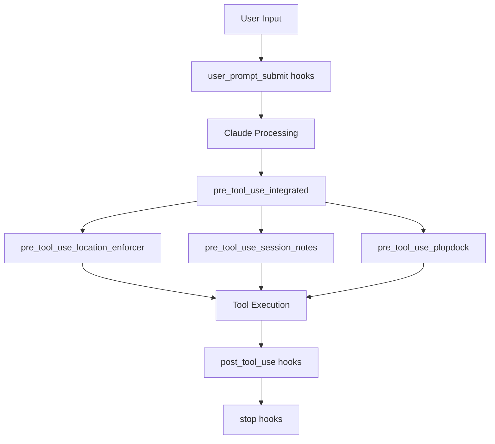

# Session Notes Hook - Integration Strategy

**Document Type**: Integration Strategy  
**Date**: 2025-08-14  
**Author**: APM Architect Agent  
**Version**: 1.0.0  
**Target**: APM Framework v4.0.5  

---

## 🎯 Integration Overview

This document defines the strategy for integrating the Session Notes Enforcement Hook with the existing APM infrastructure, including coordination with current hooks, configuration management, and rollout procedures.

---

## 🔌 Current Hook Ecosystem Analysis

### Existing Hooks Inventory

```
/.claude/hooks/
├── pre_tool_use_integrated.py         # Main integrated hook (coordinates others)
├── pre_tool_use_location_enforcer.py  # Document location enforcement (846 lines)
├── pre_tool_use_plopdock.py          # Plopdock integration
├── stop.py                            # Stop event handler
├── pre_compact.py                     # Context compaction handler
├── post_tool_use.py                   # Post-execution handler
├── user_prompt_submit.py              # User input handler
└── PROMPT_APPEND_CONFIGURATION.md     # Prompt configuration
```

### Hook Execution Order



---

## 🔧 Integration Architecture

### 1. Hook Coordination Strategy

```python
# Modified pre_tool_use_integrated.py

import importlib
import sys

class HookOrchestrator:
    """Coordinates multiple pre_tool_use hooks"""
    
    HOOK_PRIORITY = [
        'session_notes',      # Priority 1: Session management
        'location_enforcer',  # Priority 2: Path correction
        'plopdock'           # Priority 3: External integration
    ]
    
    def execute_hooks(self, tool_name: str, params: dict, context: dict) -> dict:
        """Execute hooks in priority order"""
        
        modified_params = params.copy()
        
        for hook_name in self.HOOK_PRIORITY:
            try:
                hook_module = importlib.import_module(f'hooks.{hook_name}')
                if hasattr(hook_module, 'pre_tool_use_hook'):
                    modified_params = hook_module.pre_tool_use_hook(
                        tool_name, modified_params, context
                    )
            except Exception as e:
                print(f"⚠️ Hook {hook_name} error: {e}")
                # Continue with other hooks
        
        return modified_params
```

### 2. Conflict Resolution

#### Potential Conflicts

| Hook A | Hook B | Conflict Type | Resolution Strategy |
|--------|--------|--------------|-------------------|
| Session Notes | Location Enforcer | Path modification | Session notes process first, location enforcer respects session paths |
| Session Notes | Plopdock | Resource contention | Non-blocking design prevents conflicts |
| Location Enforcer | Session Notes | File creation order | Coordinate through shared context |

#### Resolution Implementation

```python
def resolve_path_conflicts(session_params: dict, location_params: dict) -> dict:
    """Resolve conflicts between session and location enforcement"""
    
    # Session notes take precedence for .apm/session_notes/ paths
    if session_params.get('file_path', '').startswith('/.apm/session_notes/'):
        return session_params
    
    # Location enforcer handles all other paths
    return location_params
```

### 3. Shared Context Management

```python
# shared_context.py

class SharedHookContext:
    """Shared context between hooks"""
    
    _instance = None
    
    def __new__(cls):
        if cls._instance is None:
            cls._instance = super().__new__(cls)
            cls._instance.context = {}
        return cls._instance
    
    def set(self, key: str, value: any):
        """Set shared context value"""
        self.context[key] = value
    
    def get(self, key: str, default=None):
        """Get shared context value"""
        return self.context.get(key, default)
    
    def update_from_hook(self, hook_name: str, data: dict):
        """Update context from specific hook"""
        if hook_name not in self.context:
            self.context[hook_name] = {}
        self.context[hook_name].update(data)
```

---

## ⚙️ Configuration Integration

### 1. Unified Configuration Structure

```json
{
  "hooks": {
    "enabled": true,
    "pre_tool_use": {
      "integrated": true,
      "modules": {
        "session_notes": {
          "enabled": true,
          "priority": 1,
          "config_path": "/.apm/config/session-enforcement.json"
        },
        "location_enforcer": {
          "enabled": true,
          "priority": 2,
          "config_path": "/.apm/config/document-registry.json"
        },
        "plopdock": {
          "enabled": true,
          "priority": 3,
          "config_path": "/.apm/config/plopdock.json"
        }
      }
    }
  }
}
```

### 2. Settings.json Updates

```python
# update_settings_for_integration.py

def integrate_session_hook():
    """Add session hook to Claude settings"""
    
    settings_path = os.path.expanduser("~/.claude/settings.json")
    
    with open(settings_path, 'r') as f:
        settings = json.load(f)
    
    # Ensure hooks structure exists
    if 'hooks' not in settings:
        settings['hooks'] = {}
    
    # Add or update pre_tool_use to use integrated hook
    settings['hooks']['pre_tool_use'] = "~/.claude/hooks/pre_tool_use_integrated.py"
    
    # Add user_prompt_submit for agent detection
    settings['hooks']['user_prompt_submit'] = "~/.claude/hooks/user_prompt_submit_integrated.py"
    
    # Add pre_compact for archival
    settings['hooks']['pre_compact'] = "~/.claude/hooks/pre_compact_integrated.py"
    
    with open(settings_path, 'w') as f:
        json.dump(settings, f, indent=2)
```

---

## 🚀 Rollout Strategy

### Phase 1: Development Testing (Day 1)

```bash
# 1. Install in test environment
./install_session_enforcer.sh --test

# 2. Run integration tests
pytest tests/test_integration.py -v

# 3. Performance benchmarks
python benchmark_enforcement.py

# 4. Validate with mock sessions
python test_mock_sessions.py
```

### Phase 2: Staged Rollout (Days 2-3)

```python
# Feature flag implementation
class FeatureFlags:
    """Control gradual rollout"""
    
    FLAGS = {
        "session_enforcement_enabled": False,
        "auto_create_enabled": False,
        "reminder_injection_enabled": False,
        "validation_enabled": False
    }
    
    @classmethod
    def is_enabled(cls, feature: str) -> bool:
        """Check if feature is enabled"""
        return cls.FLAGS.get(feature, False)
    
    @classmethod
    def enable_percentage(cls, feature: str, percentage: int):
        """Enable for percentage of sessions"""
        import random
        return random.randint(1, 100) <= percentage
```

### Phase 3: Full Deployment (Day 4)

```bash
#!/bin/bash
# deploy_session_enforcer.sh

# 1. Backup existing configuration
cp -r ~/.claude/hooks ~/.claude/hooks.backup
cp ~/.claude/settings.json ~/.claude/settings.json.backup

# 2. Deploy new hooks
./install_session_enforcer.sh --production

# 3. Enable all features
python -c "
from feature_flags import FeatureFlags
FeatureFlags.FLAGS['session_enforcement_enabled'] = True
FeatureFlags.FLAGS['auto_create_enabled'] = True
FeatureFlags.FLAGS['reminder_injection_enabled'] = True
FeatureFlags.FLAGS['validation_enabled'] = True
"

# 4. Monitor metrics
python monitor_deployment.py
```

---

## 🔄 Migration Procedures

### For Existing Sessions

```python
def migrate_existing_sessions():
    """Migrate existing sessions to new enforcement"""
    
    # Find existing session notes
    session_notes_dir = "/.apm/session_notes"
    existing_notes = glob.glob(f"{session_notes_dir}/*.md")
    
    for note_path in existing_notes:
        # Parse existing note
        with open(note_path, 'r') as f:
            content = f.read()
        
        # Extract metadata
        agent = extract_agent_from_content(content)
        timestamp = extract_timestamp_from_filename(note_path)
        
        # Create state file for existing session
        state = {
            "session_id": generate_session_id(timestamp),
            "created_at": timestamp,
            "active_agent": agent,
            "session_note_path": note_path,
            "migrated": True
        }
        
        # Save state file
        save_session_state(state)
    
    print(f"✅ Migrated {len(existing_notes)} existing sessions")
```

### Backward Compatibility

```python
class BackwardCompatibilityAdapter:
    """Ensure compatibility with existing APM commands"""
    
    def adapt_legacy_commands(self, command: str) -> str:
        """Convert legacy commands to new format"""
        
        legacy_mappings = {
            '/session-note': '/session create',
            '/update-session': '/session update',
            '/close-session': '/wrap'
        }
        
        return legacy_mappings.get(command, command)
    
    def preserve_legacy_behavior(self):
        """Maintain expected behavior for existing users"""
        
        # Keep manual session note creation working
        # Don't enforce on legacy commands
        # Provide migration warnings
```

---

## 🔍 Monitoring & Validation

### Integration Health Checks

```python
def integration_health_check() -> dict:
    """Comprehensive integration health check"""
    
    checks = {
        "hooks_loaded": check_hooks_loaded(),
        "no_conflicts": check_hook_conflicts(),
        "shared_context": check_shared_context(),
        "performance": check_performance_targets(),
        "error_rates": check_error_rates()
    }
    
    return {
        "status": "healthy" if all(checks.values()) else "degraded",
        "checks": checks,
        "timestamp": datetime.now().isoformat()
    }

def check_hooks_loaded() -> bool:
    """Verify all hooks are loaded"""
    required_hooks = [
        'pre_tool_use_integrated',
        'pre_tool_use_session_notes',
        'pre_tool_use_location_enforcer'
    ]
    
    for hook in required_hooks:
        if hook not in sys.modules:
            return False
    return True

def check_hook_conflicts() -> bool:
    """Check for hook execution conflicts"""
    # Analyze recent logs for conflicts
    # Check for parameter overwrites
    # Verify execution order
    return True
```

### Metrics Dashboard

```python
class IntegrationMetrics:
    """Track integration metrics"""
    
    def get_dashboard_data(self) -> dict:
        """Get metrics for monitoring dashboard"""
        
        return {
            "session_compliance": {
                "created": self.sessions_created,
                "updated": self.sessions_updated,
                "compliance_rate": self.calculate_compliance_rate()
            },
            "hook_performance": {
                "avg_execution_ms": self.avg_execution_time,
                "p95_execution_ms": self.p95_execution_time,
                "errors_per_hour": self.error_rate
            },
            "integration_status": {
                "hooks_active": self.active_hooks,
                "conflicts_detected": self.conflict_count,
                "last_health_check": self.last_health_check
            }
        }
```

---

## 🛠️ Troubleshooting Guide

### Common Integration Issues

| Issue | Symptoms | Solution |
|-------|----------|----------|
| Hook not firing | Session notes not created | Check settings.json registration |
| Conflict with location enforcer | Wrong file paths | Verify hook priority order |
| Performance degradation | Slow tool execution | Check for blocking operations |
| State file corruption | Hook errors | Clear /tmp/claude_sessions/ |
| Feature flags not working | Features always disabled | Check flag configuration |

### Debug Mode

```python
# Enable debug mode for troubleshooting
os.environ['HOOK_DEBUG'] = 'true'
os.environ['HOOK_VERBOSE'] = 'true'
os.environ['HOOK_TRACE'] = 'true'

# Debug output will include:
# - Hook execution order
# - Parameter modifications
# - State changes
# - Performance metrics
# - Error stack traces
```

---

## 📋 Validation Checklist

### Pre-Deployment

- [ ] All unit tests passing
- [ ] Integration tests passing
- [ ] Performance benchmarks met
- [ ] No conflicts with existing hooks
- [ ] Configuration files validated
- [ ] Backup procedures tested

### Post-Deployment

- [ ] Session notes being created
- [ ] Update reminders working
- [ ] No performance degradation
- [ ] Error rates acceptable
- [ ] User workflows unaffected
- [ ] Metrics being collected

### Success Criteria

- [ ] 100% session note compliance achieved
- [ ] <100ms average hook execution time
- [ ] Zero hook conflicts reported
- [ ] All agent personas supported
- [ ] Seamless user experience maintained

---

**Integration Strategy Status**: ✅ COMPLETE  
**Ready for**: Implementation & Testing  
**Risk Level**: LOW  
**Rollback Plan**: Available  

---

*Prepared by: APM Architect Agent*  
*Session Notes Hook Integration Strategy*