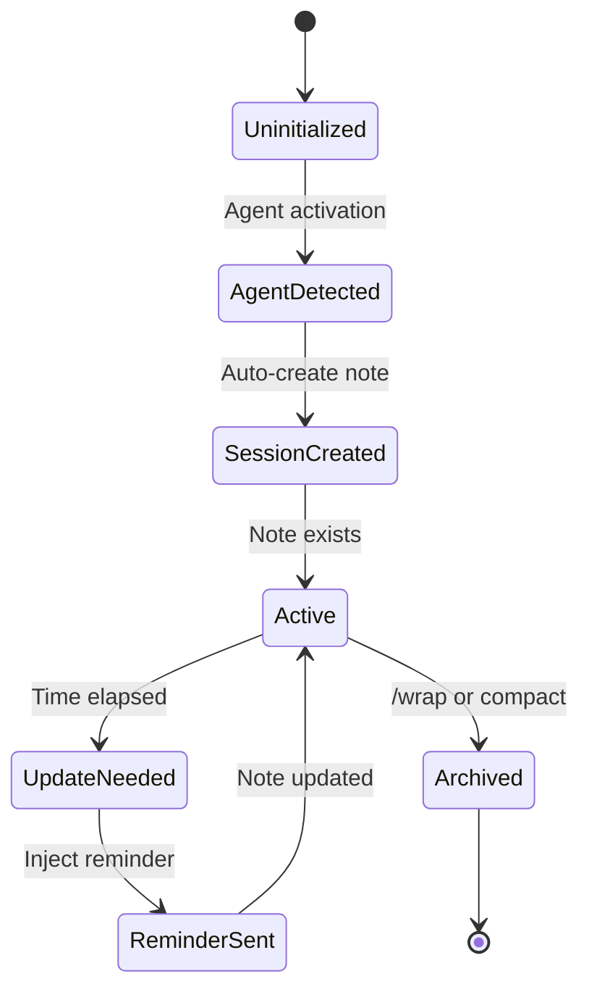

# Session Notes Enforcement Hook - Technical Specification

**Document Type**: Technical Specification  
**Date**: 2025-08-14  
**Author**: APM Architect Agent  
**Version**: 1.0.0  
**Implementation Language**: Python 3.8+  

---

## 📋 Implementation Specifications

### File Structure

```
/.claude/hooks/
├── pre_tool_use_session_notes.py      # Main hook implementation
├── session_notes_enforcer/
│   ├── __init__.py                    # Package initialization
│   ├── core.py                        # SessionNotesEnforcer class
│   ├── state_manager.py               # Session state persistence
│   ├── agent_detector.py              # Agent detection logic
│   ├── content_validator.py           # Content validation
│   ├── template_generator.py          # Template generation
│   ├── enforcement_engine.py          # Core enforcement logic
│   ├── audit_logger.py                # Audit and logging
│   └── utils.py                       # Utility functions
└── tests/
    ├── test_enforcement.py             # Unit tests
    ├── test_state_manager.py           # State persistence tests
    └── test_integration.py             # Integration tests
```

---

## 🔧 Function Signatures & Interfaces

### Hook Entry Points

```python
# pre_tool_use_session_notes.py

def pre_tool_use_hook(tool_name: str, params: dict, context: dict = None) -> dict:
    """
    Main entry point for pre-tool-use hook
    
    Args:
        tool_name: Name of the tool being invoked (Write, Edit, etc.)
        params: Tool parameters dictionary
            - file_path: Target file path
            - content: File content (for Write)
            - old_string/new_string: Edit parameters
        context: Optional context dictionary
            - agent_persona: Active agent name
            - session_id: Current session identifier
            
    Returns:
        Modified params dictionary with enforcement applied
        
    Raises:
        Never raises - returns original params on any error
    """
    
def user_prompt_submit_hook(prompt: str, context: dict = None) -> dict:
    """
    Hook for detecting agent activation from user prompts
    
    Args:
        prompt: User's input prompt text
        context: Optional context dictionary
        
    Returns:
        Dictionary with processing status
        
    Example:
        >>> user_prompt_submit_hook("/analyst", {})
        {'processed': True, 'agent_detected': 'analyst', 'confidence': 95}
    """

def post_tool_use_hook(tool_name: str, result: dict, context: dict = None) -> dict:
    """
    Post-execution validation hook
    
    Args:
        tool_name: Name of the executed tool
        result: Tool execution result
        context: Optional context
        
    Returns:
        Validation results dictionary
    """

def pre_compact_hook(context: dict = None) -> dict:
    """
    Archive session notes before context compaction
    
    Args:
        context: Current session context
        
    Returns:
        Archive status dictionary
    """
```

### Core Classes

```python
# core.py

class SessionNotesEnforcer:
    """
    Main enforcement orchestrator
    """
    
    def __init__(self, config_path: str = None):
        """
        Initialize enforcer with configuration
        
        Args:
            config_path: Path to JSON config file (optional)
                        Defaults to /.apm/config/session-enforcement.json
        """
        
    def process_hook(self, hook_type: str, params: dict, context: dict = None) -> dict:
        """
        Process any hook event
        
        Args:
            hook_type: Type of hook event ('pre_tool_use', 'user_prompt_submit', etc.)
            params: Hook-specific parameters
            context: Optional context
            
        Returns:
            Modified parameters or status dictionary
        """
    
    def should_enforce(self, params: dict) -> bool:
        """
        Determine if enforcement should be applied
        
        Args:
            params: Tool parameters
            
        Returns:
            True if enforcement should proceed
        """
    
    def get_enforcement_stats(self) -> dict:
        """
        Get current enforcement statistics
        
        Returns:
            Dictionary with enforcement metrics
        """
```

```python
# state_manager.py

class SessionStateManager:
    """
    Manages persistent session state
    """
    
    def __init__(self, session_id: str = None):
        """
        Initialize state manager
        
        Args:
            session_id: Optional session ID for recovery
        """
    
    def get_state(self, key: str = None) -> Union[dict, Any]:
        """
        Get state value(s)
        
        Args:
            key: Optional specific key to retrieve
            
        Returns:
            Full state dict or specific value
        """
    
    def update_state(self, updates: dict, atomic: bool = True) -> bool:
        """
        Update session state
        
        Args:
            updates: Dictionary of updates to apply
            atomic: Whether update should be atomic (with file lock)
            
        Returns:
            True if update successful
        """
    
    def mark_activity(self, activity_type: str, details: dict = None) -> None:
        """
        Record an activity in session history
        
        Args:
            activity_type: Type of activity ('note_created', 'reminder_sent', etc.)
            details: Optional activity details
        """
```

```python
# agent_detector.py

class AgentDetector:
    """
    Multi-signal agent detection system
    """
    
    def detect_agent(self, 
                    prompt: str = None,
                    content: str = None,
                    filepath: str = None,
                    context: dict = None) -> Tuple[str, float]:
        """
        Detect active agent using multiple signals
        
        Args:
            prompt: User prompt text
            content: File content being created/edited
            filepath: Target file path
            context: Additional context
            
        Returns:
            Tuple of (agent_name, confidence_score)
            Returns (None, 0) if no agent detected
            
        Example:
            >>> detect_agent(prompt="/qa")
            ('qa', 95.0)
        """
    
    def get_agent_config(self, agent: str) -> dict:
        """
        Get configuration for specific agent
        
        Args:
            agent: Agent name
            
        Returns:
            Agent-specific configuration dictionary
        """
```

---

## 📊 Data Structures

### Session State Schema

```python
@dataclass
class SessionState:
    """Session state data structure"""
    
    session_id: str
    created_at: datetime
    last_activity: datetime
    active_agent: Optional[str]
    agent_history: List[AgentActivation]
    session_note_path: Optional[str]
    last_note_update: Optional[datetime]
    work_items: List[WorkItem]
    update_reminders_sent: int
    enforcement_stats: EnforcementStats
    pending_operations: List[dict]
    
@dataclass
class AgentActivation:
    """Agent activation record"""
    
    agent: str
    activated_at: datetime
    prompt: str
    confidence: float
    
@dataclass
class WorkItem:
    """Work item tracking"""
    
    description: str
    created_at: datetime
    status: str  # 'pending', 'in_progress', 'completed'
    
@dataclass
class EnforcementStats:
    """Enforcement statistics"""
    
    auto_creates: int = 0
    corrections: int = 0
    validations: int = 0
    reminders: int = 0
    overrides: int = 0
```

### Configuration Schema

```python
@dataclass
class EnforcementConfig:
    """Main enforcement configuration"""
    
    enabled: bool = True
    mode: str = "strict"  # 'strict', 'relaxed', 'advisory'
    override_flag: str = "--skip-session-notes"
    update_interval_minutes: int = 15
    auto_create: bool = True
    inject_reminders: bool = True
    max_reminders: int = 3
    
@dataclass
class AgentConfig:
    """Agent-specific configuration"""
    
    template: str
    required_sections: List[str]
    optional_sections: List[str]
    update_interval_override: Optional[int] = None
```

---

## 🔄 State Transitions

### Session Lifecycle States



### Enforcement Decision Tree

```python
def enforcement_decision_tree(params: dict, state: dict) -> str:
    """
    Determine enforcement action based on current state
    
    Returns one of:
    - 'create_note': Create new session note
    - 'update_note': Update existing note
    - 'inject_reminder': Add update reminder
    - 'validate_content': Validate note content
    - 'skip': No enforcement needed
    """
    
    # Decision logic
    if not state.get('active_agent'):
        return 'skip'
    
    if not state.get('session_note_path'):
        return 'create_note'
    
    if is_session_note_operation(params):
        return 'validate_content'
    
    if needs_update_reminder(state):
        return 'inject_reminder'
    
    return 'skip'
```

---

## ⚡ Performance Specifications

### Timing Constraints

| Operation | Target | Maximum | Action if Exceeded |
|-----------|--------|---------|-------------------|
| Hook execution | 50ms | 100ms | Log warning, continue |
| State file I/O | 10ms | 50ms | Use cache, continue |
| Agent detection | 5ms | 20ms | Use cached result |
| Content validation | 20ms | 50ms | Skip validation |
| Template generation | 10ms | 30ms | Use default template |

### Resource Limits

```python
RESOURCE_LIMITS = {
    "max_state_file_size": 100 * 1024,     # 100KB
    "max_audit_log_size": 50 * 1024 * 1024, # 50MB
    "max_memory_usage": 50 * 1024 * 1024,   # 50MB
    "max_concurrent_hooks": 10,
    "state_cache_ttl_seconds": 300,
    "template_cache_size": 20
}
```

### Optimization Strategies

```python
class PerformanceOptimizer:
    """Performance optimization utilities"""
    
    @lru_cache(maxsize=128)
    def compile_patterns(self, pattern: str) -> re.Pattern:
        """Cache compiled regex patterns"""
        return re.compile(pattern, re.IGNORECASE | re.MULTILINE)
    
    @cached_property
    def registry(self) -> dict:
        """Lazy-load and cache registry"""
        return self.load_registry()
    
    def batch_operations(self, operations: List[dict]) -> List[dict]:
        """Batch multiple operations for efficiency"""
        # Group by operation type
        # Execute in optimal order
        # Return results
```

---

## 🧪 Testing Specifications

### Unit Test Coverage Requirements

```python
# test_enforcement.py

class TestSessionNotesEnforcer:
    """Unit tests for main enforcer"""
    
    def test_agent_activation_detection(self):
        """Test agent detection from various inputs"""
        
    def test_session_note_creation(self):
        """Test automatic note creation"""
        
    def test_update_reminder_injection(self):
        """Test reminder injection logic"""
        
    def test_content_validation(self):
        """Test note content validation"""
        
    def test_error_handling(self):
        """Test graceful error handling"""
        
    def test_override_mechanism(self):
        """Test override flag handling"""
```

### Integration Test Scenarios

```python
# test_integration.py

class TestAPMIntegration:
    """Integration tests with APM framework"""
    
    @pytest.fixture
    def mock_apm_environment(self):
        """Setup mock APM environment"""
        
    def test_full_session_lifecycle(self, mock_apm_environment):
        """Test complete session from activation to archive"""
        
    def test_multi_agent_handoff(self, mock_apm_environment):
        """Test agent-to-agent transitions"""
        
    def test_session_recovery(self, mock_apm_environment):
        """Test recovery from Claude restart"""
        
    def test_concurrent_hooks(self, mock_apm_environment):
        """Test multiple hooks firing simultaneously"""
```

### Performance Benchmarks

```python
# benchmark_enforcement.py

def benchmark_hook_performance():
    """Benchmark hook execution times"""
    
    scenarios = [
        "minimal_params",
        "large_content",
        "complex_detection",
        "multiple_agents",
        "high_concurrency"
    ]
    
    for scenario in scenarios:
        times = []
        for _ in range(1000):
            start = time.perf_counter()
            execute_hook(scenario)
            times.append(time.perf_counter() - start)
        
        print(f"{scenario}: avg={np.mean(times)*1000:.2f}ms, "
              f"p95={np.percentile(times, 95)*1000:.2f}ms")
```

---

## 🔐 Error Handling Specifications

### Error Categories & Responses

```python
ERROR_HANDLERS = {
    FileNotFoundError: {
        "action": "create_default",
        "log_level": "WARNING",
        "user_message": None  # Silent recovery
    },
    PermissionError: {
        "action": "skip_enforcement",
        "log_level": "ERROR",
        "user_message": "⚠️ Session notes: Permission denied"
    },
    json.JSONDecodeError: {
        "action": "recreate_state",
        "log_level": "ERROR",
        "user_message": None  # Silent recovery
    },
    TimeoutError: {
        "action": "use_cached",
        "log_level": "WARNING",
        "user_message": None
    }
}

def handle_error(error: Exception, context: dict) -> dict:
    """Universal error handler"""
    
    handler = ERROR_HANDLERS.get(type(error), {
        "action": "log_and_continue",
        "log_level": "ERROR",
        "user_message": None
    })
    
    # Log error
    logger.log(handler["log_level"], f"Hook error: {error}", extra=context)
    
    # Display user message if configured
    if handler["user_message"]:
        print(handler["user_message"])
    
    # Take recovery action
    return recovery_actions[handler["action"]](context)
```

### Fallback Mechanisms

```python
class FallbackChain:
    """Cascading fallback mechanisms"""
    
    def get_session_state(self) -> dict:
        """Get session state with fallbacks"""
        
        # Try 1: Load from file
        try:
            return self.load_state_file()
        except FileNotFoundError:
            pass
        
        # Try 2: Recover from backup
        try:
            return self.recover_from_backup()
        except Exception:
            pass
        
        # Try 3: Find orphaned session
        try:
            return self.adopt_orphan_session()
        except Exception:
            pass
        
        # Try 4: Create new session
        return self.create_default_state()
```

---

## 📦 Dependencies

### Python Standard Library
- `json`: State serialization
- `re`: Pattern matching
- `os`, `os.path`: File operations
- `datetime`, `timedelta`: Time handling
- `hashlib`: Session ID generation
- `threading`: File locking
- `functools`: Caching decorators
- `dataclasses`: Data structures
- `typing`: Type hints
- `logging`: Audit logging

### External Dependencies (Optional)
```python
# requirements.txt
filelock==3.12.0  # Advanced file locking (optional)
```

---

## 🚀 Deployment Specifications

### Installation Script

```bash
#!/bin/bash
# install_session_enforcer.sh

set -e

echo "Installing Session Notes Enforcement Hook..."

# Create directories
mkdir -p ~/.claude/hooks/session_notes_enforcer
mkdir -p ~/.apm/config
mkdir -p ~/.apm/templates
mkdir -p ~/.apm/logs/session_enforcement
mkdir -p /tmp/claude_sessions

# Copy hook files
cp pre_tool_use_session_notes.py ~/.claude/hooks/
cp -r session_notes_enforcer/* ~/.claude/hooks/session_notes_enforcer/

# Install configuration
cp config/session-enforcement.json ~/.apm/config/

# Install templates
cp templates/session-note-*.md ~/.apm/templates/

# Update settings.json
python update_settings.py

# Run tests
python -m pytest tests/

echo "✅ Installation complete!"
```

### Configuration Update Script

```python
# update_settings.py

def update_claude_settings():
    """Update Claude settings.json to register hook"""
    
    settings_path = os.path.expanduser("~/.claude/settings.json")
    
    # Load existing settings
    with open(settings_path, 'r') as f:
        settings = json.load(f)
    
    # Add hook registration
    if 'hooks' not in settings:
        settings['hooks'] = {}
    
    settings['hooks']['pre_tool_use'] = "~/.claude/hooks/pre_tool_use_session_notes.py"
    settings['hooks']['user_prompt_submit'] = "~/.claude/hooks/user_prompt_submit_session_notes.py"
    
    # Save updated settings
    with open(settings_path, 'w') as f:
        json.dump(settings, f, indent=2)
    
    print("✅ Settings updated successfully")
```

---

## 📈 Monitoring & Metrics

### Metrics Collection

```python
class MetricsCollector:
    """Collect and report enforcement metrics"""
    
    METRICS = {
        "enforcements_total": 0,
        "auto_creates_total": 0,
        "reminders_sent_total": 0,
        "validations_performed": 0,
        "errors_recovered": 0,
        "average_execution_ms": 0,
        "peak_execution_ms": 0
    }
    
    def record_metric(self, metric: str, value: float = 1):
        """Record a metric value"""
        
    def get_metrics_summary(self) -> dict:
        """Get current metrics summary"""
        
    def export_metrics(self, format: str = "json") -> str:
        """Export metrics in specified format"""
```

### Health Checks

```python
def health_check() -> dict:
    """Perform system health check"""
    
    return {
        "status": "healthy",
        "checks": {
            "state_directory": os.path.exists("/tmp/claude_sessions"),
            "config_loaded": config is not None,
            "templates_available": len(available_templates) > 0,
            "audit_logging": audit_logger.is_active(),
            "performance": avg_execution_time < 100  # ms
        },
        "metrics": metrics_collector.get_metrics_summary()
    }
```

---

**Specification Status**: ✅ COMPLETE  
**Version**: 1.0.0  
**Ready for**: Implementation  

---

*Prepared by: APM Architect Agent*  
*Technical Specification for Session Notes Enforcement Hook*