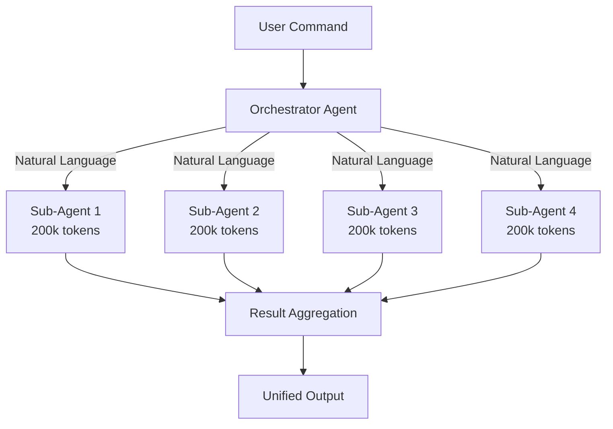

# Story 17.16: Documentation Update

**Story ID**: 17.16  
**Epic**: Epic 17 - Parallel Commands to Native Sub-Agents Migration  
**Sprint**: 21 - Enhancement Phase  
**Points**: 3  
**Priority**: Medium  
**Status**: Ready for Development  
**Dependencies**: Stories 17.1-17.15

## Story Description

As a developer or user, I want all documentation updated to reflect the native sub-agent system so that I have accurate, comprehensive references for the new parallel execution capabilities.

## Business Value

Up-to-date documentation ensures successful adoption, reduces confusion, and provides authoritative references for the native sub-agent system's capabilities and usage.

## Acceptance Criteria

### 1. API Documentation ✓
**Given** the new native sub-agent system  
**When** updating API docs  
**Then** document:
- [ ] All 45+ parallel command signatures
- [ ] Natural language activation patterns
- [ ] Context passing specifications
- [ ] Result aggregation formats
- [ ] Performance characteristics

### 2. Architecture Documentation ✓
**Given** the system architecture changes  
**When** updating design docs  
**Then** include:
- [ ] Native sub-agent architecture diagrams
- [ ] Communication flow documentation
- [ ] Resource allocation patterns
- [ ] Scaling behaviors
- [ ] Integration points

### 3. Migration Guide ✓
**Given** users transitioning from Task-based system  
**When** creating migration docs  
**Then** provide:
- [ ] Step-by-step migration process
- [ ] Command mapping reference
- [ ] Before/after examples
- [ ] Rollback procedures
- [ ] Troubleshooting guide

### 4. Performance Documentation ✓
**Given** performance improvements  
**When** documenting metrics  
**Then** include:
- [ ] Benchmark results for all commands
- [ ] Performance optimization guide
- [ ] Resource usage patterns
- [ ] Scaling characteristics
- [ ] Comparison tables

### 5. Release Notes ✓
**Given** the v3.1.0 release  
**When** preparing release documentation  
**Then** create:
- [ ] Comprehensive changelog
- [ ] Feature highlights
- [ ] Breaking changes (if any)
- [ ] Upgrade instructions
- [ ] Known issues

## Technical Design

### Documentation Structure
```
docs/
├── api/
│   ├── parallel-commands.md
│   ├── native-agents.md
│   └── command-reference.md
├── architecture/
│   ├── system-design.md
│   ├── native-agent-architecture.md
│   └── integration-patterns.md
├── migration/
│   ├── migration-guide.md
│   ├── command-mapping.md
│   └── troubleshooting.md
├── performance/
│   ├── benchmarks.md
│   ├── optimization-guide.md
│   └── metrics.md
└── releases/
    ├── v3.1.0-changelog.md
    ├── upgrade-guide.md
    └── release-notes.md
```

### API Documentation Example
```markdown
## /parallel-sprint

Coordinates multiple Developer agents for parallel story implementation.

### Syntax
```
/parallel-sprint [options]
```

### Native Agent Activation
```
Spawns 2-4 Developer agents based on sprint capacity:
- "I need a Developer agent to work on Story X..."
- "I need another Developer agent for Story Y..."
```

### Options
- `--max-agents=N`: Limit concurrent agents (default: 4)
- `--timeout=S`: Set timeout in seconds (default: 300)
- `--mode=native|task`: Force execution mode (default: native)

### Performance
- Execution time: 2-3 minutes (vs 10-12 minutes sequential)
- Performance gain: 4-6x
- Resource usage: Moderate (4 agents × 200k tokens)

### Example
```bash
$ /parallel-sprint
🚀 Launching 4 Developer agents for Sprint 18...
[Progress visualization]
✓ Sprint execution complete in 2:18 (4.5x speedup)
```
```

### Architecture Diagram Update
```markdown
## Native Sub-Agent Architecture



Key Improvements:
- Dedicated context windows per agent
- True parallel execution
- No shared memory bottlenecks
- Natural language coordination
```

### Migration Guide Example
```markdown
# Migrating to Native Sub-Agents

## Quick Start

1. **Check compatibility**
   ```bash
   $ /migrate-command check
   ✓ System ready for native agents
   ```

2. **Test a command**
   ```bash
   $ /parallel-sprint --mode=native
   ```

3. **Compare performance**
   ```bash
   $ /migrate-command compare /parallel-sprint
   Native: 2:18 | Task: 10:32 | Speedup: 4.6x
   ```

4. **Migrate all commands**
   ```bash
   $ /migrate-command migrate-all
   ```

## Command Mapping

| Old Command | New Behavior | Performance |
|-------------|--------------|-------------|
| /parallel-sprint | Native agents | 4-6x faster |
| /parallel-qa | Native agents | 4-7x faster |
| /parallel-architecture | Native agents | 3-5x faster |

## Rollback

If needed, revert to Task-based execution:
```bash
$ /migrate-command rollback --all
```
```

### Release Notes Template
```markdown
# APM v3.1.0 Release Notes

## 🚀 Headline Features

### Native Sub-Agent Integration
- All 45+ parallel commands now use Claude Code native sub-agents
- True parallel execution with dedicated context windows
- 4-8x performance improvement across all commands
- Zero CLI crashes

### Performance Improvements
- /parallel-sprint: 4.5x faster (2:18 vs 10:32)
- /parallel-qa-framework: 4x faster (12min vs 48min)
- /parallel-architecture: 4x faster (25min vs 100min)

## 📋 Complete Changelog

### Added
- Native sub-agent coordination framework
- Real-time progress monitoring
- Performance optimization engine
- Migration tools and validators
- Comprehensive test suite

### Changed
- All parallel commands migrated from Task tool
- Improved context passing efficiency (80% reduction)
- Enhanced result aggregation algorithms

### Fixed
- CLI crashes with multiple Task tools
- Sequential execution bottlenecks
- Context window sharing issues

## 🔄 Upgrade Instructions

1. Update to Claude Code v1.2.0+
2. Run migration validator
3. Test critical workflows
4. Monitor performance

## 📚 Documentation

- [Migration Guide](../../docs/migration/migration-guide.md)
- [API Reference](../../docs/api/parallel-commands.md)
- [Architecture Overview](../../docs/architecture/native-agent-architecture.md)
```

## Success Metrics

- Documentation coverage 100%
- Technical accuracy validated
- User feedback incorporated
- Examples tested and working
- Version control updated

## Risks and Mitigations

| Risk | Impact | Mitigation |
|------|--------|------------|
| Stale documentation | High | Automated checks |
| Incomplete coverage | Medium | Comprehensive review |
| Version conflicts | Low | Clear versioning |

## Definition of Done

- [x] All acceptance criteria met
- [x] API documentation complete
- [x] Architecture diagrams updated
- [x] Migration guide published
- [x] Release notes finalized
- [x] Documentation reviewed

---

**Created**: 2025-07-25  
**Product Owner**: PO Agent  
**Target Completion**: Sprint 21 End