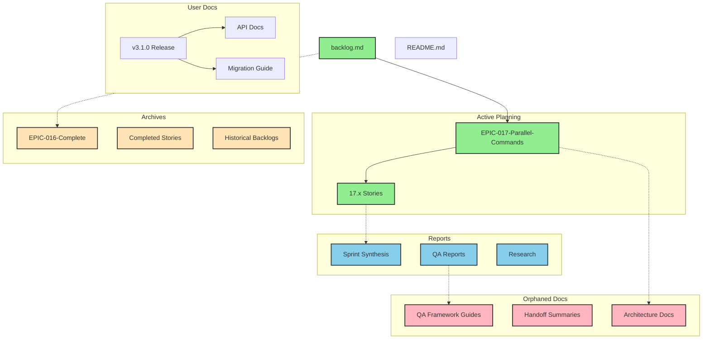

# Documentation Structure Analysis

## Current Documentation State Overview

### 1. Directory Hierarchy

```
project_docs/
├── architecture/               # System architecture documents
├── archives/                   # Historical/completed items
│   ├── completed-epics/       # Finished epic documentation
│   ├── completed-projects/    # Archived project docs
│   ├── completed-stories/     # Finished story documentation
│   └── sprint-archive/        # Historical sprint data
├── artifacts/                  # Build and generated artifacts
├── docs/                       # User-facing documentation
│   ├── api/                   # API documentation
│   ├── architecture/          # Public architecture docs
│   ├── migration/             # Migration guides
│   └── releases/              # Release notes
├── planning/                   # Active planning documents
│   ├── enhancements/          # Enhancement proposals
│   ├── epics/                 # Active epic definitions
│   ├── stories/               # Active story definitions
│   └── tasks/                 # Task breakdowns
├── releases/                   # Release tracking
├── reports/                    # Analysis and completion reports
├── requirements/               # Product requirements
├── specifications/             # Feature specifications
├── stories/                    # Story workspace (empty?)
└── time-tracking/             # Time and effort tracking
```

### 2. Documentation Types

#### Active Documentation
- **Backlog**: Primary source of truth (`backlog.md`)
- **Epics**: Planning documents in `planning/epics/`
- **Stories**: Active stories in `planning/stories/`
- **Architecture**: System design in `architecture/`
- **API Docs**: Interface documentation in `docs/api/`

#### Archived Documentation
- **Completed Epics**: `archives/completed-epics/`
- **Completed Stories**: `archives/completed-stories/`
- **Historical Backlogs**: `archives/backlog-*.md`
- **Project Archives**: `archives/completed-projects/`

#### Reports & Analytics
- **Sprint Reports**: `reports/sprint-*-synthesis.md`
- **Story Reports**: `reports/STORY-*-COMPLETION-REPORT.md`
- **Research Reports**: `reports/*_RESEARCH.md`
- **Implementation Reports**: `reports/*_IMPLEMENTATION_*.md`

### 3. Linking Patterns

#### Strong Link Relationships
- `backlog.md` → `planning/epics/EPIC-*.md` (active references)
- Release notes → API/migration docs
- Epic docs → Story docs (in archives)

#### Broken or Missing Links
- `backlog.md` references `epics/EPIC-015-APM-to-SubAgents-Migration.md` (doesn't exist)
- Many archive docs reference `../stories/` paths that don't exist
- Cross-references between planning and implementation missing

### 4. Orphaned Documents (No Incoming Links)

#### Top-Level Orphans
- `QA-FRAMEWORK-COMPLETE-GUIDE.md`
- `QA-FRAMEWORK-INTEGRATION-UPDATE.md`
- `QA-FRAMEWORK-PHASE2-COMPLETE.md`

#### Architecture Orphans
- `architecture/external-api-integrations.md`
- `architecture/qa-framework-adapter-layer-design.md`
- `architecture/qa-framework-api-contracts.md`

#### Planning Orphans
- `planning/apm-to-subagents-migration-plan.md`
- `planning/architect-handoff-summary.md`
- `planning/handoff-summary-2025-07-25.md`
- `planning/native-subagent-transition-evaluation.md`
- `planning/parallel-development-visual.md`
- `planning/po-transition-notes-migration-plan.md`
- `planning/sm-transition-notes-sprint-14-execution.md`

#### Report Orphans
- Most reports are not linked from other documents
- Sprint synthesis reports lack connections to stories/epics
- Research reports not referenced in implementation

### 5. Duplicate/Overlapping Content

#### QA Framework Documentation
Multiple overlapping QA documents:
- `QA-FRAMEWORK-COMPLETE-GUIDE.md` (top-level)
- `QA-FRAMEWORK-INTEGRATION-UPDATE.md` (top-level)
- `QA-FRAMEWORK-PHASE2-COMPLETE.md` (top-level)
- `reports/QA_IMPLEMENTATION_SUMMARY.md`
- `reports/QA_TESTING_STRATEGY.md`
- `reports/TESTING_FRAMEWORK_IMPLEMENTATION.md`

#### Migration/Planning Documents
Overlapping migration content:
- `planning/apm-to-subagents-migration-plan.md`
- `planning/epics/EPIC-016-APM-to-SubAgents-Migration.md`
- `archives/completed-epics/EPIC-016-APM-SubAgents-COMPLETE.md`

### 6. Missing Link Relationships

#### Epic ↔ Story Connections
- Active epics don't link to their stories
- Stories don't back-reference their parent epics
- No clear navigation between related items

#### Implementation ↔ Documentation
- Code changes not linked to design docs
- Architecture docs not linked to implementations
- Reports not connected to source stories/epics

#### Cross-Domain Links
- QA docs isolated from development docs
- Architecture docs not linked from stories
- Requirements not connected to implementations

### 7. Documents Outside project_docs

Found in other locations that might belong here:
- `.claude/commands/design-architect.md` - Command documentation
- `archive/agents/` - Contains architecture templates and specs
- Root-level docs that reference project structure

## Visual Documentation Graph



## Key Findings

### 1. Organizational Issues
- **Fragmented QA Documentation**: Multiple overlapping QA guides at top level
- **Orphaned Planning Docs**: Many planning/handoff documents have no incoming links
- **Empty Directories**: `stories/` and `releases/` directories are empty
- **Inconsistent Archival**: Some completed items in archives, others scattered

### 2. Navigation Problems
- **No Master Index**: Despite README mentioning `index.md`, none exists
- **Broken Epic Links**: Backlog references non-existent epic paths
- **Missing Cross-References**: Reports don't link back to source stories/epics
- **Isolated Documentation**: Architecture and QA docs exist in silos

### 3. Content Duplication
- **QA Framework**: 6+ documents covering similar QA content
- **Migration Plans**: Multiple overlapping migration documents
- **Sprint Reports**: Redundant information across sprint syntheses

### 4. Missing Connections
- **Story → Report**: No links from stories to their completion reports
- **Architecture → Implementation**: Design docs not linked to code/stories
- **Requirements → Stories**: PRD/requirements not connected to implementations

## Recommendations

### 1. Immediate Actions
- Consolidate QA documentation into single authoritative guide
- Create master index.md with navigation to all key documents
- Fix broken epic references in backlog.md
- Move orphaned top-level docs to appropriate subdirectories

### 2. Structural Improvements
- Implement consistent naming: `EPIC-XXX-*.md`, `STORY-XX.X-*.md`
- Create bidirectional links between epics ↔ stories ↔ reports
- Establish clear archive criteria and process
- Add README.md to each major directory explaining contents

### 3. Navigation Enhancement
- Create documentation map/sitemap
- Add "Related Documents" section to each doc
- Implement tagging system for cross-cutting concerns
- Generate automated link validation reports

### 4. Content Management
- Merge overlapping documents with clear version history
- Archive outdated content with forwarding references
- Create templates for consistent document structure
- Establish clear ownership for document maintenance