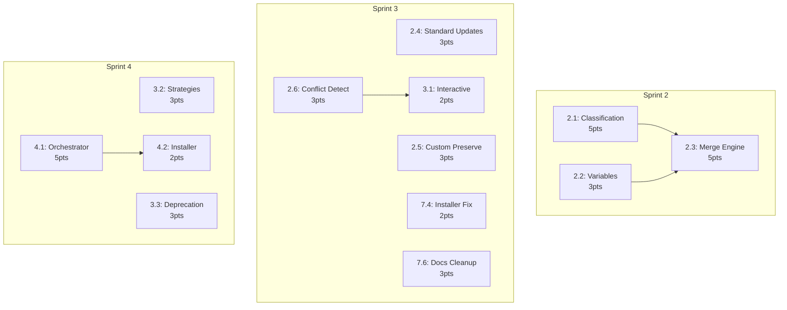

# Parallel Development Visual Timeline

## Sprint Execution Visualization

### Traditional Sequential Approach (14 days)
```
Sprint 1: [===========] Day 1-2   (Complete ✓)
Sprint 2: [===========] Day 3-4   
Sprint 3: [===========] Day 5-6   
Sprint 4: [===========] Day 7-8   
Sprint 5: [===========] Day 9-10  
Sprint 6: [===========] Day 11-12 
Sprint 7: [=====]       Day 13-14 
```

### Parallel Execution Approach (8.1 days)
```
Sprint 1: [===========] Day 1-2     (Complete ✓)
Sprint 2: [=======]     Day 3-4.2   ⚡ 40% faster
Sprint 3: [========]    Day 4.2-5.5 ⚡ 35% faster  
Sprint 4: [=======]     Day 5.5-6.7 ⚡ 40% faster
Sprint 5: [========]    Day 6.7-8.1 ⚡ 30% faster
Sprint 6: [=====]       Day 8.1-9.1 ⚡ 50% faster
Sprint 7: [===]         Day 9.1-9.7 ⚡ 40% faster
```

## Developer Stream Visualization

### Sprint 2 Parallel Streams
```
Time →
Dev 1: [Story 2.1: Section Classification (5pts)========]
Dev 2: [Story 2.2: Variable Engine (3pts)=====]         
Dev 3:                                        [Story 2.3: Merge Engine (5pts)====]
                                              ↑ Integration Point
```

### Sprint 3 Parallel Streams  
```
Time →
Dev 1: [Story 2.4 (3pts)===][Story 2.5 (3pts)===]
Dev 2: [Story 2.6: Conflict Detection (3pts)=====]
Dev 3:                      [Story 3.1 (2pts)==]  
Dev 4: [Story 7.4 (2pts)==][Story 7.6: Docs (3pts)===]
```

### Sprint 4 Parallel Streams
```
Time →
Dev 1: [Story 3.2: Merge Strategies (3pts)=====]
Dev 2: [Story 3.3: Deprecation (3pts)=====]     
Dev 3: [Story 4.1: Main Orchestrator (5pts)=========]
Dev 4:                                      [4.2 (2pts)=]
                                            ↑ Depends on 4.1
```

## Dependency Flow Diagram



## Resource Utilization Chart

### Sequential Model (1 Developer)
```
Utilization: [████████████████████] 100% (but slow)
Duration:    14 days
```

### Parallel Model (4 Developers)
```
Dev 1: [████████████░░░░░░░] 65%
Dev 2: [████████████░░░░░░░] 65%  
Dev 3: [██████████████░░░░░] 70%
Dev 4: [██████████░░░░░░░░░] 55%
Duration: 8.1 days (42% faster)
```

## Integration Points & Coordination

### Critical Integration Windows
1. **Sprint 2, Day 3.8**: Merge 2.1 & 2.2 → 2.3
2. **Sprint 3, Day 5.0**: Merge 2.6 → 3.1  
3. **Sprint 4, Day 6.5**: Merge all → 4.1
4. **Sprint 5, Day 7.5**: Test framework → Test suites

### Scrum Master Coordination Points
```
Day 3.0: /parallel-sprint --sprint 2
Day 3.8: Integration checkpoint
Day 4.2: /parallel-sprint --sprint 3  
Day 5.5: /parallel-sprint --sprint 4
Day 6.7: /parallel-sprint --sprint 5
Day 8.1: /parallel-sprint --sprint 6
Day 9.1: /parallel-sprint --sprint 7
```

## Value Delivery Timeline

### Sequential Delivery
```
Week 1: □□□□□□□□□□ 0% value delivered
Week 2: ████████░░ 80% value delivered  
Week 3: ██████████ 100% value delivered
```

### Parallel Delivery  
```
Week 1: ████████░░ 80% value delivered
Week 2: ██████████ 100% value delivered (5 days early!)
Week 3: [Already in production, gathering feedback]
```

## Risk Heat Map

### Integration Risk by Sprint
```
Sprint 2: 🟨 Medium (2.3 depends on 2.1 & 2.2)
Sprint 3: 🟩 Low (mostly independent)
Sprint 4: 🟨 Medium (4.1 integrates everything)  
Sprint 5: 🟩 Low (test framework independent)
Sprint 6: 🟩 Low (optimization phase)
Sprint 7: 🟩 Low (all independent)
```

## Success Metrics Dashboard

```
┌─────────────────────────────────────┐
│        PARALLEL SPRINT METRICS       │
├─────────────────────────────────────┤
│ Time Saved:        5.9 days (42%)  │
│ Velocity:          Maintained       │
│ Quality:           No degradation   │
│ Integration Bugs:  Target: 0        │
│ Test Coverage:     Target: 100%     │
│ Developer Utils:   65% average      │
└─────────────────────────────────────┘
```

---
*This visual guide complements the parallel development plan*